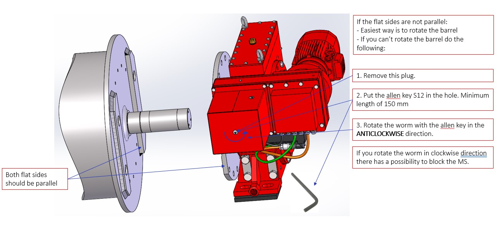

==========
test page
==========

Go wild
==========

.. figure:: installation/img/installation-on-existing-hoist-01.jpg
	:scale: 75 %
	:align: center
	:class: with-border

	General view

.. list-table:: 
   :widths: 5 95
   :header-rows: 1
   :class: instruction-table
  
   * - Step
     - Description
   * - **1**
     - Remove plug (1)
   * - **2**
     - | **Rotate the release mode dial to E (self-timer mode).**
       | |image0xx|
       | more blabla
       | and again	
   * - **3**
     - | **Frame the photograph and focus.**
       | |image0xx|
       | stop. 	
	     | drop.
   * - **4**
     - C7 – Resolver connector

.. note:: 
	kafkaesque!

.. list-table::
  :widths: 30 10 30
  :header-rows: 1
  
  * - Number
    - Image
    - Description
  * - 1
    - 
    - Prior to removing the existing plummer block, make one rotation and find by comparator the 2 points on the barrel side flange that are on the same axial plane on the diameter of the future pin and bolts diameter. These two points will receive the bolt holes.
  * - 2
    - 
    - Remove the existing plummer block.
  * - 3
    - 
    - Put the transmission flange on the barrel shaft (fitted assembly) and use the holes to counter-drill holes on the barrel side flange.
  * - 4
    - 
    - Mount the transmission flange on the MS wheel (bolts, pins).
  * - 5
    - 
    - Assemble the flanged MS to the side flange of the barrel. The washers create a gap which allows the MS to be strictly aligned with the barrel (shaft) axis. The MS wheel and flange are fitted to the existing barrel shaft so the MS is strictly concentric to the barrel.
