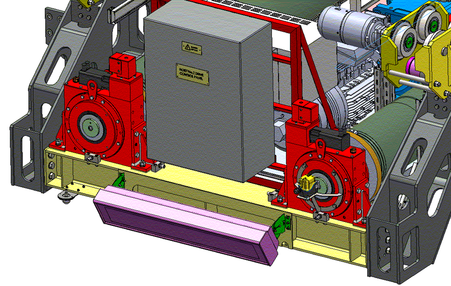

=======================
MotoSuiveur technology 
=======================

.. note::
    answer to "how does it work" questions that users have. 
    Explores how fail-safety is achieved by combining unfailing systems.

.. note::
	Source: :download:`User Manual-7.4.doc`

Why MotoSuiveur
=================

The Motosuiveur® is designed to protect winches against risks of control loss on the handled load, and this in every case of electrical or mechanical failure.

It also allows emergency operation of the hoist using the recovery facility, in case of electrical or mechanical failure.

Moreover, it offers the possibility to check the parameters, to test the securities of the program by modifying some parameters.

    Example of MotoSuiveur Solution implementation

Functioning principle MSF
=========================

The wheel is connected to the drum through a splined shaft or a torque transmission flange (connected with dowels). 
The worm screw is rotated by a small motor (servo-motor), controlled by the duplicate of the command signals delivered to the motor brake of the winch. 
Thus, the worm screw accompanies the movement of the wheel / drum set (assembly). 
In this configuration, the worm screw does not oppose to the movement of the wheel / drum set. 
At shutdown, the load is maintained by the service brake.

Any accident will generate a rupture in the accompaniment of the movement of the wheel / drum set, 
which results in a blocking of the last one (and thus the blocking of the load) by the worm screw. 
In such a case, the Motosuiveur®® stops the load in a distance depending on the hoist inertias and torque, 
by friction of the internal disks of the friction absorber inside the MS wheel.

As option, a torque limiter can be added between the main motor and the gear box in order to smooth the static and dynamic overloads.

The Motosuiveur® interprets and executes the same commands as the main system, but independently of this one. 
Due to the irreversibility of the wheel/worm screw couple, it limits the immediate speed of the winch to a speed 
slightly superior to the theoretical speed. This principle of «mechanical follow-up» is the "intrinsic" part of safety that the Motosuiveur® provides.

The system also works in accordance with the principle of the comparison between the planned speed and the real speed. 
The real speed and the position, resulting from a direct measure, are constantly compared with the value of the order 
( slope included) coming from the control panel. Then they are analysed by the computer. When the limits are reached, 
the Motosuiveur® activates the safety procedure.

Functioning principle of a Hydraulic Motosuiveur®
==================================================

A hydraulic Motosuiveur® absorbs fall energy inside a hydraulic chamber. 
Its capacity to absorb energy is limited to the fall direction, this is why it is not reversible.

Friction absorber
==================

The friction absorber is a compact energy absorber fitted inside the wheel. 
It is composed of disks alternatively linked to the wheel and to the shaft that are pressed together 
at the desire pressure through a number of spring washers defined at the factory to meet the defined blocking torque. 
The friction absorber equips mainly the Friction Motosuiveur® but it is not theoretically limited to it and could be installed on a Hydraulic Motosuiveur®.

Recovery principle (option)
============================

The recovery is performed by engaging a clutch on the screw in order to let a motor more powerful than the servo-motor drive the screw.
The recovery motor power is calculated to allow the hoisting up and down of the maximum load plus the brakes resistance, 
supposing the latter cannot be released for whatever reasons, at a speed that is 1/10 to 1/100 of the minimum hoisting speed. 
Since power is directly proportional to torque and rotation speed, the recovery motor can be up to a hundred times smaller than the hoisting motor.
This leads to a very compact solution.
