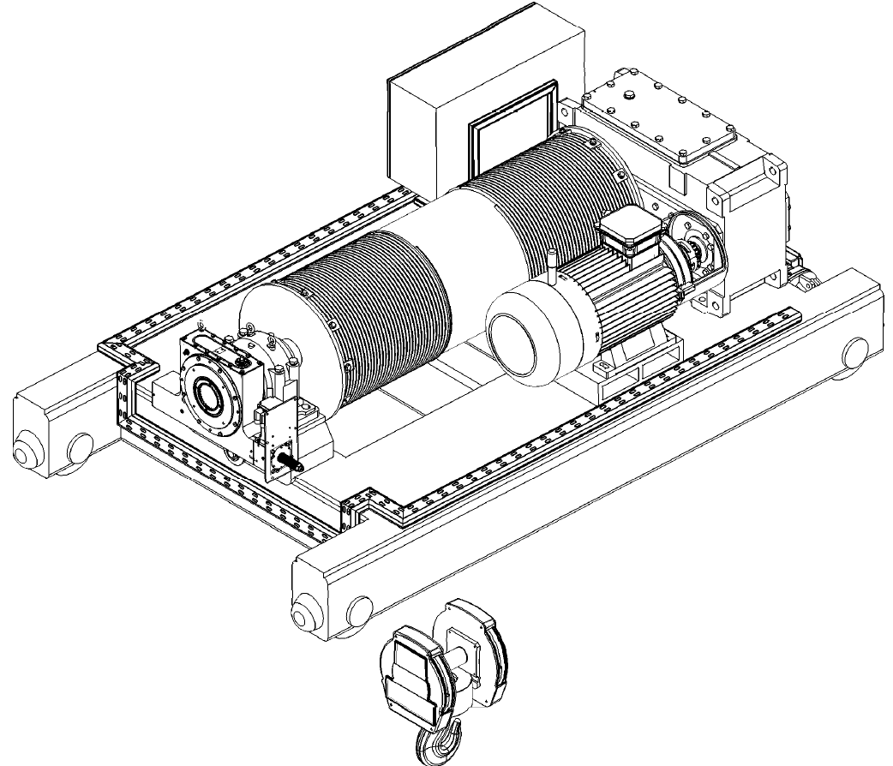
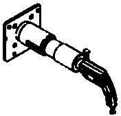
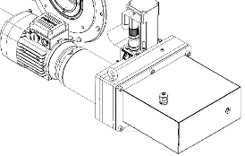
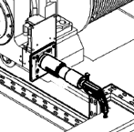

=========================================================
Using the MS load recovery capabilities 02_reviewed.docx
=========================================================

.. note::
   | From docx:
   | `Using the MS load recovery capabilities 02_reviewed.docx <https://siguren.sharepoint.com/:w:/s/Processdesign/Eep-13E9C_9Nt9Ftomm2D7QBYeRqKE168oA5JOZUCT9s2Q?e=OSP1Yh>`_

The MS will never allow a load drop. It will arrest the hoist drum
whenever the hoist brake is unable to do so. However, the MS can be used
as a gearbox to lower and even raise the load. Notе that the MS is
irreversible – meaning that load drop is impossible even when the MS
alone is used for recovering the load. This allows the user to use the
weight of the load without fearing a load drop.

This said, three main methods can be used (and combined) to recover the
load, depending on how the hoist brake and the MS can be accessed and
used in the emergency situation that requires the recovery.

Forced MS recovery
==================

| With the brake open and the MS holding the load, rotate the MS worm
  shaft with considerable torque. In this situation the MS moves the
  load.
| This way, a very high amount of torque must be applied on the MS shaft
  (approximately 1/8 of the barrel torque).

| Using the following hardware:
| - Portable Recovery Tool for sizes MS4 – MS7, or

- Handheld Recovery Tool for sizes MS0 – MS3

For MS with Integrated Remote Recovery the hardware is integrated and is
remotely operated.

|A drawing of a machine Description automatically generated|

Brake

|A black and white drawing of a gas pump Description automatically
generated|

| Handheld / Portable
| Recovery Tool

| Integrated
| Remote Recovery

|image1|

Forced MS recovery

-  Open the Brake

-  Rotate the Worm Shaft with the following torque to lower the SWL
   (maximum values)

+------------+------+------+------+------+------+------+------+------+
| MS size    | MS0  | MS1  | MS2  | MS3  | MS4  | MS5  | MS6  | MS7  |
+============+======+======+======+======+======+======+======+======+
| Torque, Nm | 100  | 250  | 500  | 850  | 1350 | 2000 | 3950 | 6800 |
+------------+------+------+------+------+------+------+------+------+

Indicative barrel speed: 0.1 – 0.3 rpm

MS followed gravity lowering
============================

Step lowering:
--------------

**This method can be used only with Hydraulic Damping MS**

| Pulse the brake (manually or electrically) to lower the load a few
  centimeters. The MS worm will shift toward the damping chamber. The
  electrical or brake lever pulse must be short enough to not allow the
  worm to reach the elastomer at the bottom of the damping chamber. Then
  it is possible to return the worm shaft to its “centered” position by
  hand. Repeat this until the load reaches the floor.
| This way, very low torque applied on the MS shaft will be needed
  (approximately 1/5000 of the barrel torque). Using handwheel / crank
  handle or standard ratchet handle.

The MS can automatically follow if switched to Backup Mode. This negates
the need of manual operation at the worm shaft. In case of power outage,
the MS can be UPS/battery operated.

Furthermore, the MS can control the brake opening / closing, thus making
the gravity load recovery automated.

|A drawing of a machine Description automatically generated|

1

2

| MS followed gravity lowering
| 2a) Hydraulic Damping MS, step lowering

-  Pulse the Brake to achieve less than 30 degrees barrel rotation by
   gravity

-  Rotate the Worm Shaft by hand few rotations to centralize it

-  Repeat

Indicative mean barrel speed: 0.5 rpm

Backup Mode gravity lowering:
-----------------------------

Switch the MS to Backup Mode and demand lowering. Progressively release
the motor brake using the provided Brake Release Tool, until the load
starts to rotate the barrel. Use the tool to regulate and maintain the
speed below the specified safe speed. A buzzer will sound when the safe
speed is close.

The MS will arrest the barrel if:

-  lowering order is removed or

-  overspeed is reached

After such arrest, the worm shaft can be returned to its “centered”
position by using a standard wrench.

In case of power outage, the MS can be UPS/battery operated.

|A drawing of a machine Description automatically generated|

Brake Release Tool

MS in Backup Mode

| MS followed gravity lowering
| 2b) Backup Mode gravity lowering

-  Switch the MS to Backup Mode and order lowering

-  Progressively un-tight the motor brake, using the Brake Release Tool,
   until the load starts to rotate the barrel. Use the tool to regulate
   and maintain the speed below the specified safe speed. A buzzer will
   sound when the safe speed is close.

Indicative barrel speed: 2 - 5 rpm

MS assisted gravity lowering
============================

| Apply moderate torque to the MS shaft. Progressively release the motor
  brake, using the provided Brake Release Tool, until the load starts to
  rotate the barrel. The barrel stops when no torque is applied to the
  MS shaft.
| In this scenario, only moderate torque is to be applied to the MS
  shaft (approximately 1/250 of the barrel torque).

| Using the following hardware:
| - Handheld Recovery Tool for MS sizes above MS4
| - handwheel / crank handle or standard ratchet handle for sizes MS0 –
  MS3

|A drawing of a machine Description automatically generated|

Brake Release Tool

| Crank Handle
| (for small MS)

Handheld Recovery Tool

|A black and white drawing of a machine Description automatically
generated|

1) MS assisted gravity lowering

-  Apply moderate torque to the MS shaft, using the appropriate method,

-  Progressively release the motor brake, using the provided Brake
   Release Tool, until the load starts to rotate the barrel (as long as
   moderate torque is applied to the MS shaft)

-  Rotate the MS worm shaft to lower the load. Use the Brake Release
   Tool to maintain the torque to be applied to on the worm shaft inside
   the specified limits

+-----------------+-----+-----+--------+------+----+----+----+----+
| MS size         | MS0 | MS1 | MS2    | MS3  | M  | M  | M  | M  |
|                 |     |     |        |      | S4 | S5 | S6 | S7 |
+=================+=====+=====+========+======+====+====+====+====+
| Method          | Cr  |     | R      |      | Ha |    |    |    |
|                 | ank |     | atchet |      | nd |    |    |    |
|                 | Han |     | Handle |      | he |    |    |    |
|                 | dle |     |        |      | ld |    |    |    |
|                 |     |     |        |      | Re |    |    |    |
|                 |     |     |        |      | co |    |    |    |
|                 |     |     |        |      | ve |    |    |    |
|                 |     |     |        |      | ry |    |    |    |
|                 |     |     |        |      | To |    |    |    |
|                 |     |     |        |      | ol |    |    |    |
+-----------------+-----+-----+--------+------+----+----+----+----+
| Torque, Nm      | 5   | 10  | 30     | 50   | 80 | 1  | 2  | 4  |
|                 |     |     |        |      |    | 20 | 40 | 00 |
+-----------------+-----+-----+--------+------+----+----+----+----+
| Indicative      | 1   |     | 0.2    |      | 0  |    |    |    |
| barrel speed    | rpm |     | rpm    |      | .1 |    |    |    |
|                 |     |     |        |      | –  |    |    |    |
|                 |     |     |        |      | 0  |    |    |    |
|                 |     |     |        |      | .2 |    |    |    |
|                 |     |     |        |      | r  |    |    |    |
|                 |     |     |        |      | pm |    |    |    |
+-----------------+-----+-----+--------+------+----+----+----+----+

