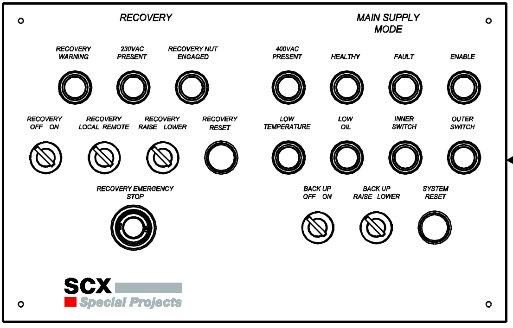

==============
Control panel
==============

.. note::
	the control panel can be on the door of the control cabinet, but can also be located in the operator's cabin for example.

(Front) panel layout
======================

.. note::
	Source is :doc:`49104-15-001 Operation  Maintenance Manual Issue D (1).pdf`

The Front Panel is the main source for power and recovery functions.

The operator has the facility to use the controls on the HMI and the controls on the Recovery and Main Supply Panel as shown on below.

.. _Control cabinet:

	Control panel layout SCX

The panel allows the operator to do the following:

- :doc:`Reset the system <system-reset.rst>`
- Utilise the :doc:`recovery functions <recovery-operation.rst>`
- Utilise the :doc:`Backup system <backup-recovery-mode.rst>`
- Monitor the status of the MotoSuiveurs supply, health, switch, temperature and oil levels
- Provide emergency stop operation if required

Component description
======================

Indication lamps and controls
------------------------------

Indication lamps and local controls are shown on figure 3. They are located on front door of control cabinet. 

Indication lamps indicate:
	- MotoSuiveur status - figure 3, items 2, 8;
	- allowed movement direction of hoist - figure 3, items 1, 3, 9;
	- recovery mode status - figure 3, items 10, 11.
  
Local controls are used for:
	- reset of MotoSuiveur - figure 3, item 7;
	- overrides MotoSuiveur enable signal (override ON signal) - figure 3, item 6;
	- enable and control MotoSuiveur Backup/ Recovery mode - figure 3 items 4, 5, 10, 11.

.. _General view of MotoSuiveur control panel:
.. figure:: ../../_img/control-panel-02.png
	:align: center

	General view of MotoSuiveur control panel

.. _Control panel legend:
.. csv-table:: Control panel legend
   :file: ../../_tables/control-panel-legend.csv
   :delim: ;
   :header-rows: 1
   :widths: 10, 30, 20, 40
   :class: tight-table
   :align: center

:numref:`Control signals between hoist and MotoSuiveur` shows schematically the control signals between hoist and MotoSuiveur. 
 
.. _Control signals between hoist and MotoSuiveur:
.. figure:: ../../_img/controlSignals.png
	:align: center

	Control signals between hoist and MotoSuiveur

.. warning::
 	Local control commands can be duplicated with remotes!
	Please, check electrical circuit diagram!

Hoist enabled
^^^^^^^^^^^^^^

:guilabel:`🟢 Hoist enabled lamp` indicate that the MotoSuiveur authorizes hoist movements. (figure 5).

Hoist enabled signal will be **ON** only in case if **ON** signal from hoist is **ON**.

Hoist enabled signal will be **ON** when :doc:`../operating-instructions/self-test` procedure passes successfully and **ON** signal is available.
Then :guilabel:`🟢 Hoist enabled lamp` and :guilabel:`⚪ Healthy lamp` are **ON**. 
The signals are indicating ``system ready`` (``MotoSuiveur ready``).

Fault 
^^^^^^

:guilabel:`🔴 Fault lamp` (figure 3, item 2) indicates three different types of faults:

	- MotoSuiveur controller internal errors, described in section 7.1;
	- MotoSuiveur faults (further called flt_num), described in section 7.2;
	- MotoSuiveur warnings (further called wrn_num), described in section 7.2;

MotoSuiveur :term:`controller` internal errors are related to MotoSuiveur controller internal hardware, firmware, and MotoSuiveur motor. 
This type of errors are with highest priority. 
If MotoSuiveur controller internal fault appear further operation is prohibited.
	
.. note::	
 	:guilabel:`🔴 Fault lamp` is **ON** during MotoSuiveur self-test.

.. warning:: 
	The system displays only last MotoSuiveur warning (``wrn_num``) or MotoSuiveur fault (``flt_num``) occurred.

Faults and warnings are displayed on MotoSuiveur 7-segment controller. 
The display indicates all types of MotoSuiveur warnings/faults and MotoSuiveur controller internal errors. 
Indication is a combination of letters and numbers.
MotoSuiveur controller internal faults are indicated with blinked combination of |image035|, number and finish with symbol |image039|.

MotoSuiveur faults are displayed with combination of |image036| and number. 
MotoSuiveur warnings are displayed with combination of |image035| and number. 

.. rubric:: Displaying messages on MotoSuiveur controller 7 - segment display

On :numref:`MotoSuiveur controller internal error E01` is shown example for internal MotoSuiveur controller fault. 
On :numref:`MotoSuiveur warning number 10 (wrn_num = 10)` is shown example for MotoSuiveur warning.

.. _MotoSuiveur controller internal error E01:
.. figure:: ../../_img/MotoSuiveurcontrollerInternalErrorE01.png
	:align: center

	MotoSuiveur controller internal error E01 

.. _MotoSuiveur warning number 10 (wrn_num = 10):
.. figure:: ../../_img/MotoSuiveurwarningNumber10.png
	:align: center

	MotoSuiveur warning number 10 (wrn_num = 10) 

.. note::		
 	After ``MotoSuiveur reset``, all types of faults are cleared. Before ``MotoSuiveur reset``, fault should be resolved.

Upward enable/Downward enable 
^^^^^^^^^^^^^^^^^^^^^^^^^^^^^

:guilabel:`🟢 Upward enable lamp` / :guilabel:`🟢 Downward enable lamp` are indicators for authorized direction of hoist movement. 
If one of the two directions is forbidden to move, it is necessary to move the hoist 
in the opposite direction in order to reset the system mechanically.

Movements upward and downward of hoist correspond to the **SCREWING** and **UNSCREWING** movement of MotoSuiveur worm. 
Movement directions of worm correspond to clock directions. 

**SCREWING** direction is clockwise, **UNSCREWING** direction is anticlockwise, viewed from cam part of the screw shaft as shown 
on :numref:`MotoSuiveur Worm rotating directions`.
 
.. _MotoSuiveur Worm rotating directions:
.. figure:: ../../_img/MotoSuiveurwormrotatingDirections.png
	:figwidth: 600 px
	:align: center

	MotoSuiveur Worm rotating directions 

.. line-block::
	1 - **SCREWING** direction
	2 - **UNSCREWING** direction

.. warning::
 	After **MotoSuiveur RESET** or **MANUAL CENTERING** of the worm and **MotoSuiveur RESTART**, 
	if no movement is performed or faults appear, 
	please contact SIGUREN technologies at support@siguren.com

Backup/Recovery Off/On; Backup/Recovery Down/Up
^^^^^^^^^^^^^^^^^^^^^^^^^^^^^^^^^^^^^^^^^^^^^^^^^^

Backup function allows the load to be lowered down, by using minimal functionalities when MotoSuiveur is in Following operation mode. 
Backup function ignore all settings related with nominal following operation mode and allows movement of the hoist with limited speed.

Recovery function is used when the main hoisting chain is faulty (for example a damaged brake of the hoist motor). 
Recovery system allows lowering load safely to the ground.

Enable Override
^^^^^^^^^^^^^^^^

Enable override can be used if it is necessary to override Hoist enabled. This allows 
small movements for MotoSuiveur mechanically reset.

Lamp states
-------------

Combination of active (ON) and inactive (OFF) signal lams gives current status of MotoSuiveur. 
In Appendix Table 1 signal combinations are presented and described.

Selection guidelines
======================