========
MotoSuiveur HMI
========

.. include:: ../equipment/_img/substitutions.rst

The MotoSuiveur HMI (MSHMI) is a Schneider Magelis/Harmony HMI STU 655/855 color graphic touchscreen terminal 
programmed with the MotoSuiveurHMI firmware by Siguren technologies. 
MotoSuiveur HMI communicates with the MotoSuiveur controller via MODBUS RTU 485 protocol.

MSHMI significantly expands the capabilities of MotoSuiveur system by allowing:

- Monitoring of actual MotoSuiveur system status
- Displayng value of oddometer 
- Displayng value of  brake counter
- Displayng warning and fault messages and guidance on how to solve them
- Displaying log of events. Last 10 events are stored in memory after MSHMI reset or power off
- Change the MotoSuiveur configuration. Configuration has a secure access code at different levels
- Display maintenance information of MotoSuiveur

.. _MotoSuiveur HMI view:
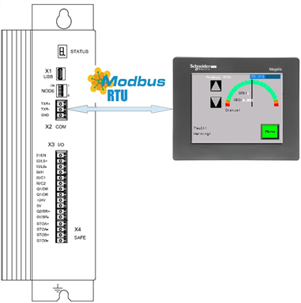

	MotoSuiveur HMI 

.. note::
    MotoSuiveurHMI is not part of standard MotoSuiveur equipment and can be ordered additionally.

MSHMI Touch Screen Operations
=============================

The functions of MSHMI presented above are organized in screens. 
Each screen has a set of functions and/ or indicators and a button to return to the previous screen (one level up).

.. _Menu Screen Components:
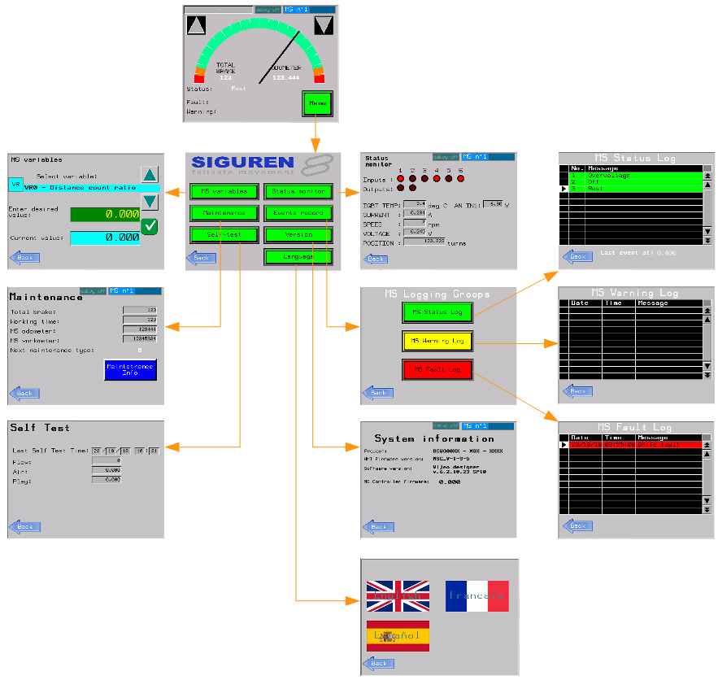

Main Screen
------------
.. _Main Screen Components:
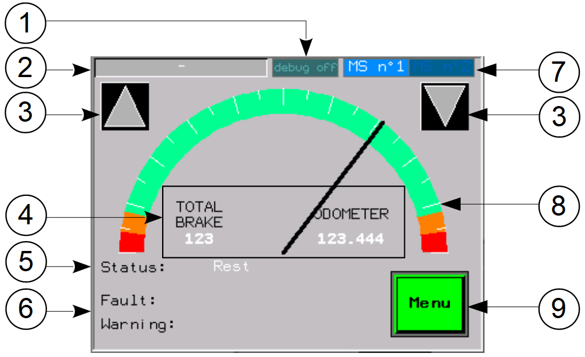

	Main screen components

.. csv-table:: Main screen
   :file: ../../_tables/HMI/main.csv
   :delim: ;
   :header-rows: 1
   :widths: auto
   :class: tight-table
   :align: left

Menu Screen
------------

.. _Menu Screen Components:
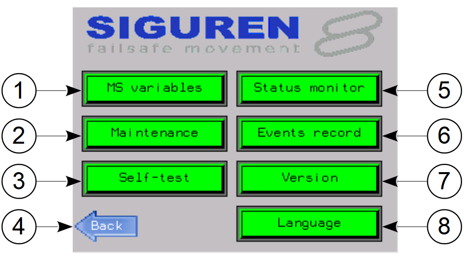

	Menu screen components

.. csv-table:: Menu screen
   :file: ../../_tables/HMI/menu.csv
   :delim: ;
   :header-rows: 1
   :widths: auto
   :class: tight-table
   :align: left

MS variables Screen
-------------------

.. _MS variables Screen:
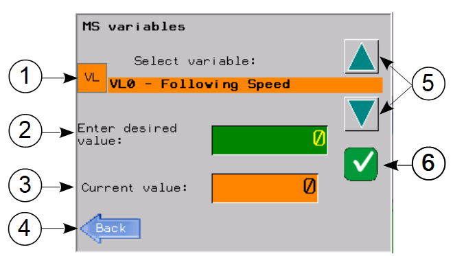

	Ms variables screen components

.. csv-table:: MS variables screen
   :file: ../../_tables/HMI/variables.csv
   :delim: ;
   :header-rows: 1
   :widths: auto
   :class: tight-table
   :align: left

Navigation to MS variables screen and change value of variable

1. On Main screen tap Menu button.
2. On Menu screen tap on MS variables button.
3. To exit from MS variables screen, tap on Back button.
4. Select type of variable (VR or VL0) by tap on VR/VL button.
5. Select variable by tap on arrows 🔼 🔽
6. Entere desired value by tap on *Enter desired value* field 🟩
7. On screen numlock pad appears
8. Eneter desired value and tap on *Enter* button. To exit from numpad without changes tap on *Esc* button
9. To set current value becomes equal to desired, tap on green tick button ✅

.. _Navigation to MS variables Screen:
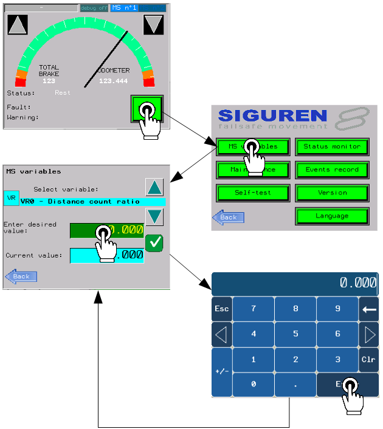

Maintenance Screen
-------------------

.. _Maintenance Screen:
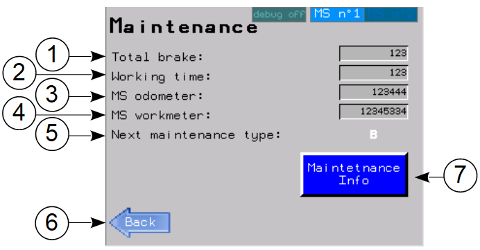

	Maintenance screen components

.. csv-table:: Maintenance screen
   :file: ../../_tables/HMI/maintenance.csv
   :delim: ;
   :header-rows: 1
   :widths: auto
   :class: tight-table
   :align: left

.. _Maintenance info:
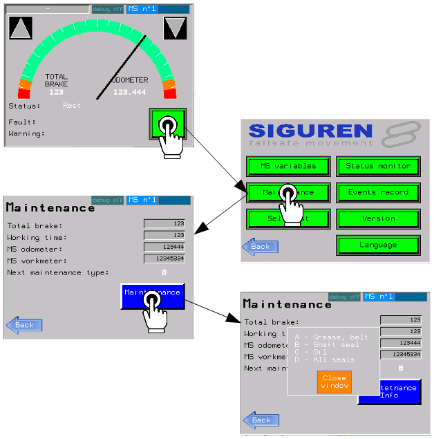

	Maintenance info pop up window

Self-test Screen
-------------------

.. _Self-test Screen:
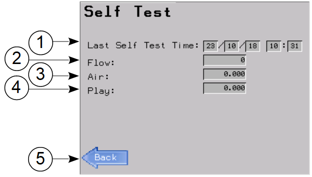

	Self-test screen components

.. csv-table:: Self-test screen
   :file: ../../_tables/HMI/self-test.csv
   :delim: ;
   :header-rows: 1
   :widths: auto
   :class: tight-table
   :align: left

Event record Screen
-------------------

.. _Event record Screen:
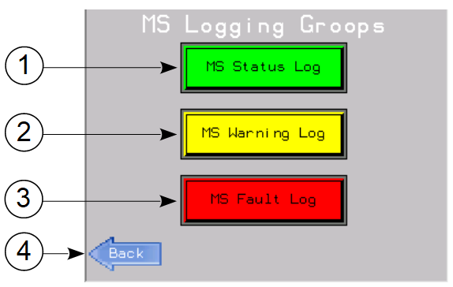

	Event record screen components

.. csv-table:: Event record screen
   :file: ../../_tables/HMI/event-record.csv
   :delim: ;
   :header-rows: 1
   :widths: auto
   :class: tight-table
   :align: left

.. _MS status log Screen:
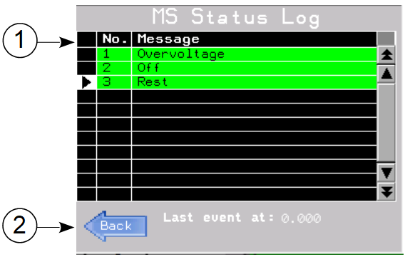

	MS status log screen components

.. _MS warning log Screen:
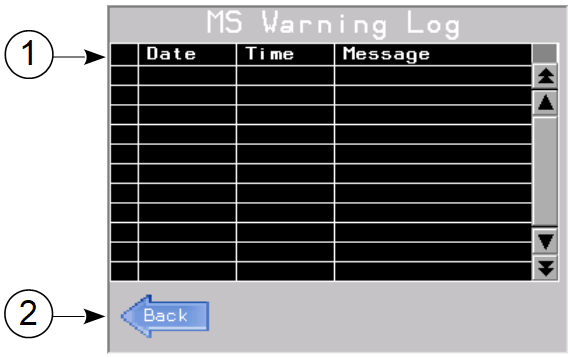

	MS warning log screen components

.. _MS fault log Screen:
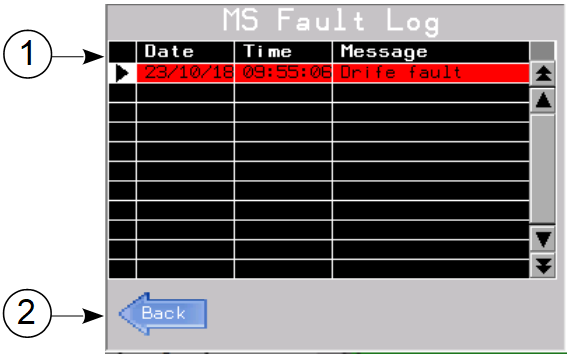

	MS fault log screen components

.. csv-table:: Log screens 
   :file: ../../_tables/HMI/log-components.csv
   :delim: ;
   :header-rows: 1
   :widths: auto
   :class: tight-table
   :align: left

Version Screen
-------------------

.. _Version Screen:
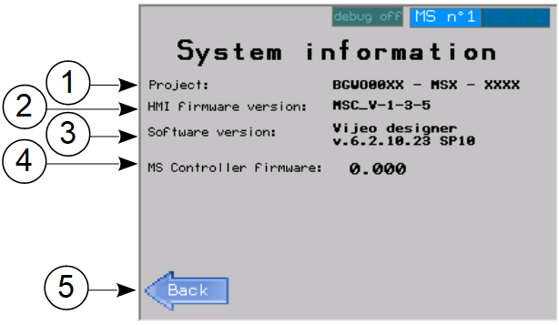

	Version screen components

.. csv-table:: Version screen 
   :file: ../../_tables/HMI/system-information.csv
   :delim: ;
   :header-rows: 1
   :widths: auto
   :class: tight-table
   :align: left

Language Screen
-------------------

.. _Language Screen:
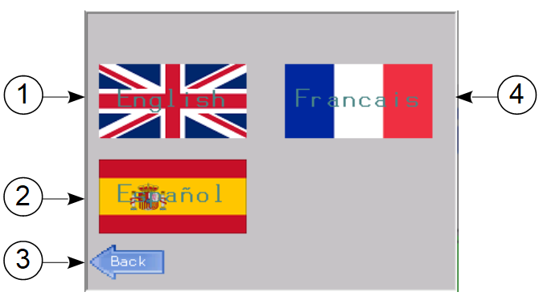

	Language screen components

.. csv-table:: Language screen 
   :file: ../../_tables/HMI/language.csv
   :delim: ;
   :header-rows: 1
   :widths: auto
   :class: tight-table
   :align: left

