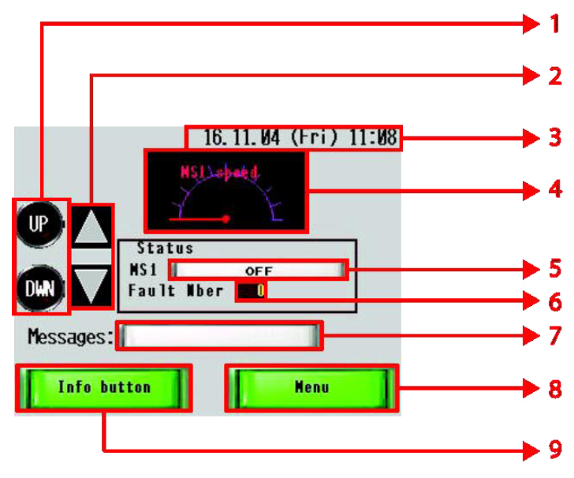
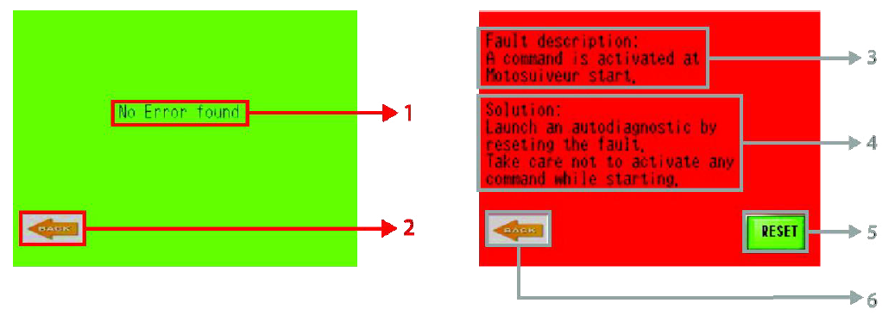
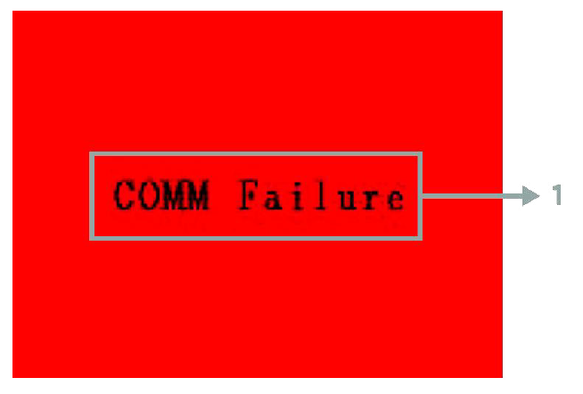
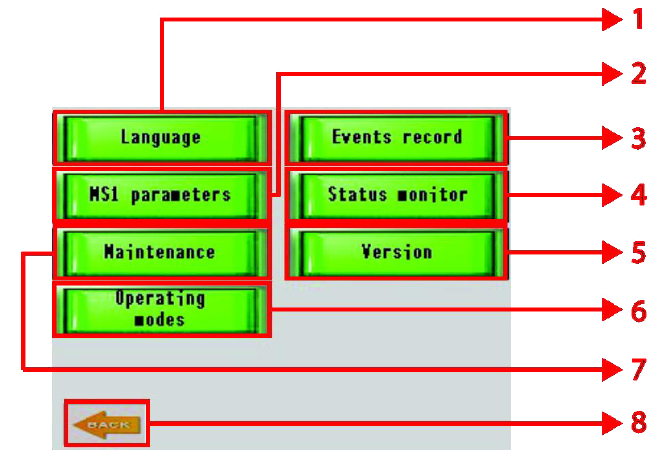
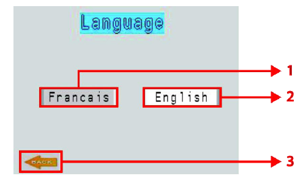
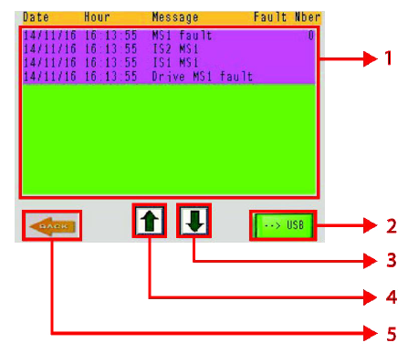
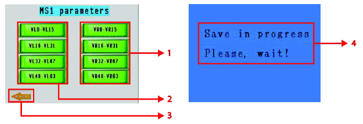
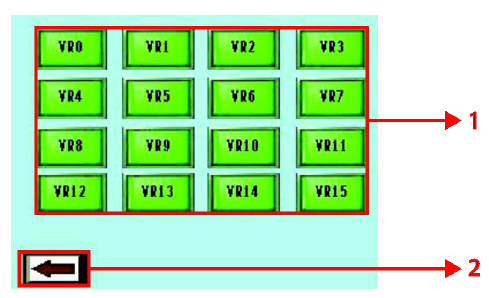
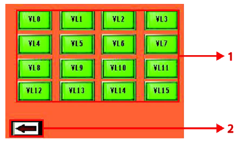
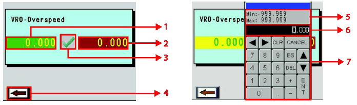

========
MS HMI
========

.. note::
    "What is the HMI screen useful for?" Describes all screens of GUI and the elements in each of them. 
    Describes what the HMI can and cannot do. Presents GUI as the window that makes visible what you cannot see in the MS. 
    - Log of events. 
    - Planned maintenance.
    - Changing values of variables.  
    - What messages appear on screen according to what is happening on the hoist.

The MS HMI is a Schneider Magelis HMI STU 655/855 color graphic touchscreen terminal 
programmed with the MSHMI firmware by Siguren technologies. 
MS HMI communicates with the MS controller via MODBUS RTU protocol.

.. _MS HMI view:
.. figure:: img/ms-hmi-01.png
	:scale: 100 %
	:align: center

	MS HMI 

Advantages of using MSHMI to operate with MotoSuiveur are:

	- Display MotoSuiveur status information in the form of messages, event listings, graphics and numerical values;
	- Change the MotoSuiveur configuration. Configuration has a secure access code at different levels;
	- Change operating mode of MotoSuiveur;
	- Display maintenance information of MotoSuiveur.

.. note::
    MSHMI is not part of standard MS equipment and can be ordered additionally.

HMI Touch Screen Operations
=============================

.. note::
	Source is :doc:`49104-15-001 Operation  Maintenance Manual Issue D (1).pdf`

Main Screen
------------

The Motosuiveur® control system uses a touchscreen attached to the logics controller.

.. _Main Screen Components:

	Main Screen Components

.. list-table:: Main Screen Components
  :width: 600 px
  :widths: 5 25 70
  :header-rows: 1
  
  * - Number
    - Function
    - Description
  * - 1
    - UP/DOWN buttons
    - When the system is in Backup or Recovery mode pressing one of the buttons drives the motor respectively in UP and DOWN directions.
  * - 2
    - | UP/DOWN motor
      | status indicator
    - Shows actual motor's status based on Arrow illumination.(See table 6-5)
  * - 3
    - Date/Day/Time
    - Shows actual date, day of week and time.
  * - 4
    - Speed indicator
    - Displays actual motor speed.
  * - 5
    - Status indicator
    - Displays system status (See Status Table 6-2 1-3).
  * - 6
    - Fault number indicator
    - Displays fault number (See Fault Table 6.2 1-5).
  * - 7
    - Messages bar
    - Displays warning messages (See Warning Table 6.2 1-2).
  * - 8
    - Menu button
    - Redirects to Menu screen.
  * - 9
    - Info button
    - Redirects to Fault text window with further clarification of received fault and possible solution.

.. list-table:: Warning Table
  :width: 600 px
  :widths: 5 25 70
  :header-rows: 1

  * - Number
    - Title
    - Description
  * - 0
    - OFF
    - No warning
  * - 4
    - Simultaneous
    - Both 'Raise' and 'Lower' signals are on
  * - 5
    - Power output off
    - The MS controller power stage is off
  * - 10
    - Blocked Unsuccessful centering
    - (worm not free at the end of the movement)
  * - 11
    - Inner switch not centered
    - Inner switch not correctly set
  * - 12
    - Outer switch not centered
    - Outer switch not correctly set
  * - 13
    - No inner switch
    - Inner switch not responding
  * - 14
    - No outer switch
    - Outer switch not responding
  * - 28
    - Check Sum
    - Unexpected variable change
  * - 40
    - Slope too long
    - The hoist motor deceleration slope is too long
  * - 41
    - Power Loss
    - Power loss during movement
  * - 42
    - Movement Stopped
    - ON signal turned off during movement

.. list-table:: Status Table
  :width: 600 px
  :widths: 5 25 70
  :header-rows: 1

  * - Value
    - Text Displayed
    - Description
  * - 0
    - OFF 
    - OFF, I1
  * - 1
    - Self Check A
    - Soft self check
  * - 2
    - Self Check B
    - Electrical self check
  * - 3
    - Self Check C
    - Damping self check
  * - 4
    - Self Check D
    - Air self check
  * - 5
    - Self Check E
    - Play self check
  * - 6
    - Ready
    - Ready
  * - 7
    - Fault
    - Fault
  * - 8
    - Backup
    - 
  * - 9
    - Recovery
    - 

.. list-table:: Arrow Colour
  :width: 600 px
  :widths: 25 75
  :header-rows: 1

  * - Colour
    - Status
  * - Grey 
    - Resting
  * - Grey 
    - Other
  * - Green 
    - Executing
  * - Yellow 
    - Waiting
  * - Orange 
    - Stopping
  * - Red 
    - Inversing
  * - Brown 
    - Impossible
  * - Black 
    - Impossible

.. list-table:: Fault Table
  :width: 600 px
  :widths: 5 25 70
  :header-rows: 1

  * - Number
    - Title
    - Description
  * - 0
    - OFF
    - No fault
  * - 15
    - Play too big
    - Worm backlash too big detected
  * - 17
    - Play too small
    - Worm backlash too small detected
  * - 20
    - Air detected
    - Air in the damping chamber detected
  * - 22
    - Damping too soft
    - Hydraulic resistance out of tolerance (too small)
  * - 23
    - Damping too hard
    - Hydraulic resistance out of tolerance (too big)
  * - 25
    - Piston not in place
    - Hydraulic piston stuck in the bottom
  * - 27
    - Transmission lost
    - Motor to worm transmission broken
  * - 33
    - Unscrewing Overspeed
    - 'overspeed' detected during lowering
  * - 34
    - Screwing Overspeed
    - 'overspeed' detected during raising
  * - 35
    - Unscrewing Underspeed
    - 'underspeed' detected during lowering
  * - 36
    - Screwing Underspeed
    - 'underspeed' detected during raising
  * - 39
    - Abnormal movement
    - Movement won't start (starting timeout detected)
  * - 44
    - Sudden Stop
    - MS physical activation detected

.. =====================================================================================================

Fault screen
-------------

The fault screen shows status of fault once :guilabel:`‘Info’ button` has been pressed.

.. _Fault Screen Components:

	Fault Screen Components

.. list-table:: Fault Screen Components
  :width: 600 px
  :widths: 5 25 70
  :header-rows: 1

  * - Number
    - Function
    - Description
  * - 1
    - No error message
    - Indicates absence of fault.
  * - 2, 6
    - Back button
    - Returns to previous screen.
  * - 3
    - Fault description field
    - Describes generated fault.
  * - 4
    - Solution field
    - Describes possible solutions to remove generated fault.
  * - 5
    - Reset button
    - | Pressing the key sends request to the PLC unit for Reset of the PLC unit. 
      | If the PLC unit returns acknowledge it will reset itself.

.. =====================================================================================================

Communication Failure Screen
------------------------------

.. _Communication Failure Screen:

	Communication Failure Screen

.. list-table:: Communication Failure Screen Components
  :width: 600 px
  :widths: 5 25 70
  :header-rows: 1

  * - Number
    - Function
    - Description
  * - 1
    - COMM Failure message
    - | If the communication between PLC unit and HMI display is lost the Communication failure screen pop-ups automatically. 
      | Once the cause is removed the screen hides itself automatically.

.. =====================================================================================================

Menu Screen
-------------

.. _Menu Screen Components:

	Menu Screen Components

.. list-table:: Menu Screen Components
  :width: 600 px
  :widths: 5 25 70
  :header-rows: 1

  * - Number
    - Function
    - Description
  * - 1
    - Language button
    - Redirects to the screen for language selection.
  * - 2
    - Events record
    - Redirects to the screen with history event records.
  * - 3
    - MS1 parameters button
    - Redirects to the screen for selection a group of parameters for changing.
  * - 4
    - Status monitor button
    - Redirects to the screen Status monitor.
  * - 5
    - Maintenance button
    - Redirects to the screen with additional maintenance information.
  * - 6
    - Version button
    - Redirects to the screen with information about current firmware and software versions.
  * - 7
    - Operating modes button
    - Redirects to the screen for operating mode selection.
  * - 8
    - Back button
    - Returns to the previous screen.

.. note::
    All re-directions use the internal Pro-face3 logic.

.. =====================================================================================================

Language Selection Screen
-------------

.. _Language Selection Screen Components:

	Language Selection Screen Components

.. list-table:: Language Selection Screen Components
  :width: 600 px
  :widths: 5 25 70
  :header-rows: 1

  * - Number
    - Function
    - Description
  * - 1
    - French selection button
    - Button to select French language. ( Not selected in Fig.6.2.5-1)
  * - 2
    - English selection button
    - Button to select English language. Selected in Fig 6.2.5-1
  * - 3
    - Back button
    - Returns to the previous screen.

.. =====================================================================================================

Event Records Screen
-------------

.. _Event Records Screen Components:

	Event Records Screen Components

.. list-table:: Event Records Screen Components
  :width: 600 px
  :widths: 5 25 70
  :header-rows: 1

  * - Number
    - Function
    - Description
  * - 1
    - Screen
    - Fault description
  * - 2
    - USB
    - Export to USB.
  * - 3
    - Scroll down
    - Scroll down
  * - 4
    - Scroll up
    - Scroll up
  * - 5
    - Back button
    - Returns to previous

.. note::
    All MotoSuiveur faults are logged in the event record.

.. =====================================================================================================

MS1 Parameters Screen
-------------

.. _MS1 Parameters Screen Components:

	MS1 Parameters Screen Components

.. list-table:: MS1 Parameters Screen Components
  :width: 600 px
  :widths: 5 25 70
  :header-rows: 1

  * - Number
    - Function
    - Description
  * - 1
    - VR buttons group
    - | Buttons group for editing VR parameters respectively:
      | - VR0-VR15 – from VR0 to VR15;
      | - VR16-VR31 – from VR16 to VR31;
      | - VR32-VR47 – from VR32 to VR47;
      | - VR48-VR63 – from VR48 to VR63;
  * - 2
    - VL buttons group
    - | Buttons group for editing VL parameters respectively:
      | - VL0-VL15 – from VL0 to VL15;
      | - VL16-VL31 – from VL16 to VL31;
      | - VL32-VL47 – from VL32 to VL47;
      | - VL48-VL63 – from VL48 to VL63;
  * - 3
    - Back button
    - Returns to previous screen and set request save flag.
  * - 4
    - Save in progress message
    - Once the PLC unit returns acknowledge the Save in progress screen (right picture in Fig. 6-7) pop-ups and hides itself automatically when the saving process finished.

.. note::
    The term “MS1” is not related to the MS size.

.. =====================================================================================================

MS1 VR Parameters Screen
-------------

.. _MS1 VR Parameters Screen Components:

	MS1 VR Parameters Screen Components

.. list-table:: MS1 VR Parameters Screen Components
  :width: 600 px
  :widths: 5 25 70
  :header-rows: 1

  * - Number
    - Function
    - Description
  * - 1
    - VR buttons group for range 0-15
    - Buttons group for editing VR parameters respectively from 0 to 15.
  * - 2
    - Back button
    - Returns to previous screen.

.. note::
    The following description is also valid for ranges of parameters VR16-VR31, VR32-VR47 and VR48-VR63 with respect to their values.

.. =====================================================================================================

Maintenance Screen
-------------

.. _Maintenance Screen Components:

	Maintenance Screen Components

.. list-table:: Maintenance Screen Components
  :width: 600 px
  :widths: 5 25 70
  :header-rows: 1

  * - Number
    - Function
    - Description
  * - 1
    - Total brake counter
    - Shows total brakes.
  * - 2
    - Working time
    - Shows total working time.
  * - 3
    - MS odometer
    - Shows overall distance travelled by the motor.
  * - 4
    - MS workmeter
    - Shows overall performed work.
  * - 5
    - Next maintenance type
    - Currently not used.
  * - 6
    - Next maintenance date
    - Currently not used.
  * - 7
    - Back button
    - Returns to previous screen.

.. =====================================================================================================

Version Screen
-------------

.. _Version Screen Components:

	Version Screen Components

.. list-table:: Version Screen Components
  :width: 600 px
  :widths: 5 25 70
  :header-rows: 1

  * - Number
    - Function
    - Description
  * - 1
    - Firmware version field
    - Shows current project firmware version.
  * - 2
    - Software version field
    - Shows current GP-PRO software version.
  * - 3
    - Back button
    - Returns to previous screen.
