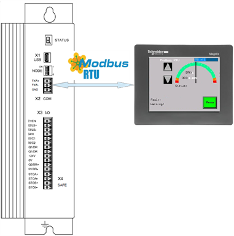

========
MS HMI
========

.. note::
    "What is the HMI screen useful for?" Describes all screens of GUI and the elements in each of them. 
    Describes what the HMI can and cannot do. Presents GUI as the window that makes visible what you cannot see in the MS. 
    - Log of events. 
    - Planned maintenance.
    - Changing values of variables.  
    - What messages appear on screen according to what is happening on the hoist.

The MS HMI is a Schneider Magelis HMI STU 655/855 color graphic touchscreen terminal 
programmed with the MSHMI firmware by Siguren technologies. 
MS HMI communicates with the MS controller via MODBUS RTU protocol.

.. _MS HMI view:

	MS HMI 

Advantages of using MSHMI to operate with MotoSuiveur are:

	- Display MotoSuiveur status information in the form of messages, event listings, graphics and numerical values;
	- Change the MotoSuiveur configuration. Configuration has a secure access code at different levels;
	- Change operating mode of MotoSuiveur;
	- Display maintenance information of MotoSuiveur.

.. note::
    MSHMI is not part of standard MS equipment and can be ordered additionally.

HMI Touch Screen Operations
=============================

.. note::
	Source is :doc:`49104-15-001 Operation  Maintenance Manual Issue D (1).pdf`

Main Screen
------------

The Motosuiveur® control system uses a touchscreen attached to the logics controller.

.. _Main Screen Components:

	Main Screen Components

.. list-table:: Main Screen Components
  :widths: 5 25 70
  :header-rows: 1
  
  * - Number
    - Function
    - Description
  * - 1
    - UP/DOWN buttons
    - When the system is in Backup or Recovery mode pressing one of the buttons drives the motor respectively in UP and DOWN directions.
  * - 2
    - | UP/DOWN motor
      | status indicator
    - Shows actual motor's status based on Arrow illumination.(See table 6-5)
  * - 3
    - Date/Day/Time
    - Shows actual date, day of week and time.
  * - 4
    - Speed indicator
    - Displays actual motor speed.
  * - 5
    - Status indicator
    - Displays system status (See Status Table 6-2 1-3).
  * - 6
    - Fault number indicator
    - Displays fault number (See Fault Table 6.2 1-5).
  * - 7
    - Messages bar
    - Displays warning messages (See Warning Table 6.2 1-2).
  * - 8
    - Menu button
    - Redirects to Menu screen.
  * - 9
    - Info button
    - Redirects to Fault text window with further clarification of received fault and possible solution.

.. list-table:: Warning Table
  :widths: 5 25 70
  :header-rows: 1

  * - Number
  - Title
  - Description
  * - 0
  - OFF
  - No warning
  * - 4
  - Simultaneous
  - Both 'Raise' and 'Lower' signals are on
  * - 5
  - Power output off
  - The MS controller power stage is off
  * - 10
  - Blocked Unsuccessful centering
  - (worm not free at the end of the movement)
  * - 11
  - Inner switch not centered
  - Inner switch not correctly set
  * - 12
  - Outer switch not centered
  - Outer switch not correctly set
  * - 13
  - No inner switch
  - Inner switch not responding
  * - 14
  - No outer switch
  - Outer switch not responding
  * - 28
  - Check Sum
  - Unexpected variable change
  * - 40
  - Slope too long
  - The hoist motor deceleration slope is too long
  * - 41
  - Power Loss
  - Power loss during movement
  * - 42
  - Movement Stopped
  - ON signal turned off during movement
