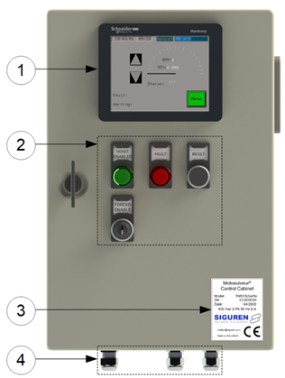
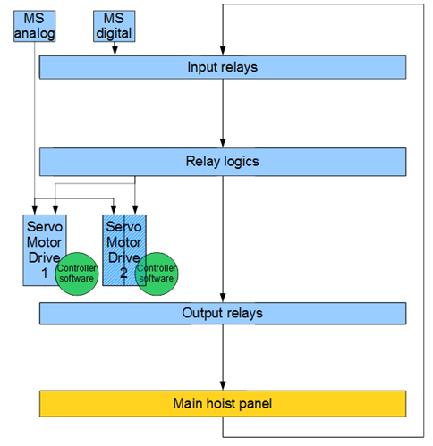
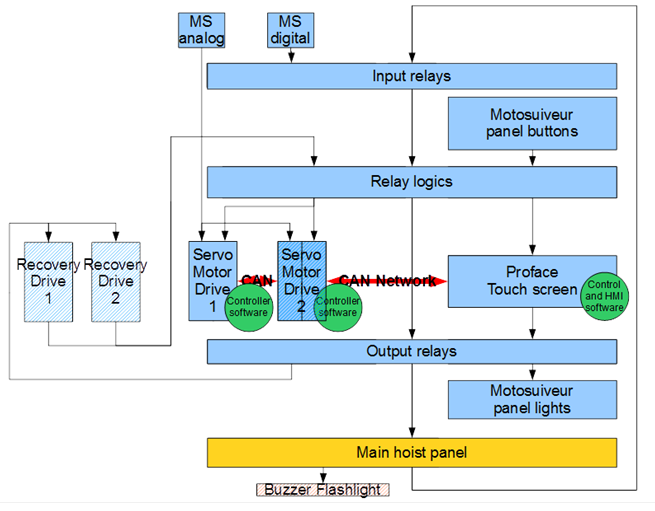
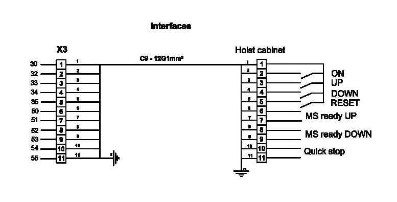
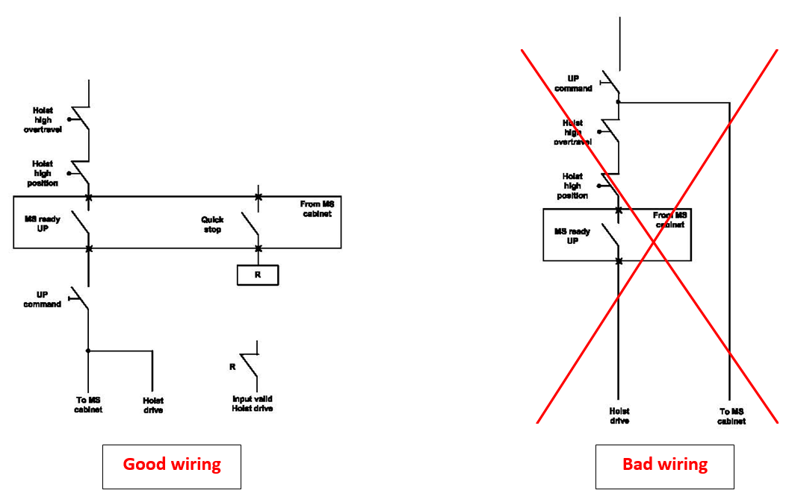
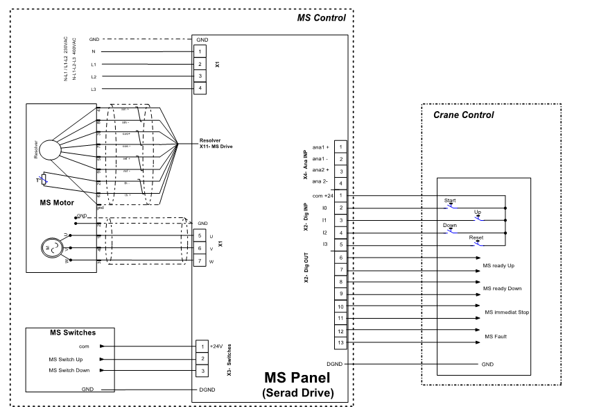
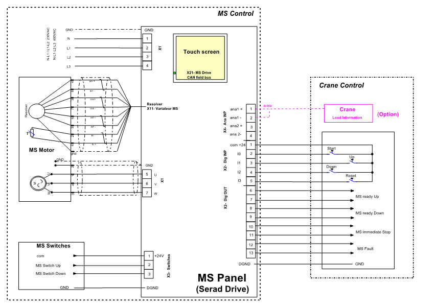
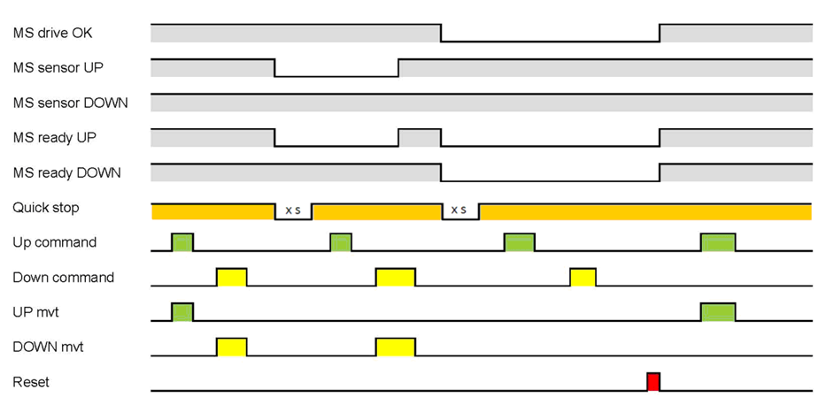

===========================
MotoSuiveur Control cabinet
===========================
..
 .. note::
	Describes what standard MotoSuiveur electrical panel is like. I/O, components, connectors, options…
..
 .. note::
	Source: :download:`User Manual-7.4.doc`
..
 About the MotoSuiveur control system
 =====================================
..
 The MotoSuiveur control system comes with different architectures to meet the installation requirements.
..
 The MotoSuiveur has been designed to be integrated almost stand-alone on hoisting system and basically requires 
 only the servo-motor controller to be connected to the main hoist panel. However, most of the time, 
 the MotoSuiveur is integrated in the control system with its own control system.
..
 All configurations integrate the very same servo-motor controller software.

MotoSuiveur control cabinet (picture below) is built according to the configuration of the MS control diagram_. 
Control cabinet and MS Controller have nameplates indicating voltage (power requirements), serial number, date (Nameplates).

    

.. csv-table:: MotoSuiveur control cabinet overview
   :file: ../../_tables/control-cabinet-overview.csv
   :delim: ;
   :header-rows: 1
   :class: tight-table
   :align: left
   :widths: auto

Description
=============

Servo-motor controller
------------------------

Each MotoSuiveur is fitted with a servo-motor that adapts the rotation of the worm screw to the orders given to the hoist motor. 
The servo-motor is controlled by a controller that embeds a software especially developed by the MotoSuiveur manufacturer.

The servo-motor controller is connected directly to the servo-motor through a dedicated cable 
that controls the servo-motor and sends position data back to the controller.

Nameplate
----------

Architecture of a *standalone* MotoSuiveur Solution
======================================================

.. _Architecture of a standalone MotoSuiveur Solution:

	Architecture of a standalone MotoSuiveur Solution

In the standalone architecture, the MotoSuiveur servo-motor controller receives only inputs from the Main hoist control panel, 
basically [⬆️ Up] and [⬇️ Down] and potentially analog and digital inputs from the MotoSuiveur sensors.

Worm screw positions coming from digital sensors are sent to the Main hoist control panel.

Integration of the MotoSuiveur in the control system
=======================================================
.. _diagram: 
.. _Integration of the MotoSuiveur in the control system

	Integration of the MotoSuiveur in the control system

Hoist interfaces
=================

.. note::
	Source: :download:`User Manual-7.4.doc`

	Hoist interface

Inputs for MS control cabinet
---------------------------------

- ON 	: hoist drive ready
- UP 	: command for UP movement
- DOWN	: command for DOWN movement
- RESET: must be used after a MotoSuiveur drive fault (not for MotoSuiveur sensors)

Outputs for MS control cabinet
---------------------------------

- MotoSuiveur ready UP 	    : Up movement is available
- MotoSuiveur ready DOWN: Down movement is available
- Quick stop: 
  - After a MotoSuiveur fault (drive or sensor), immediate stop of hoist drive, without ramp.
  - After quick stop delay time, adjustable on HMI, with a sensor fault, it's possible to start in the opposite direction. With a MotoSuiveur drive fault, it's necessary to push RESET button after hoist state control.

Example for wiring of MotoSuiveur interfaces
-----------------------------------------------

	Example for wiring of MotoSuiveur interfaces

Basic line
------------

.. note::
	Source: :download:`catalog_MS_2018__00-draft.docx`

.. _Basic line:

	Basic line

Touch screen line
-------------------

.. _Touch screen line:

	Touch screen line

Recovery line
---------------

.. _Recovery line:

	Recovery line

Chronograph
-------------

	Chronograph
