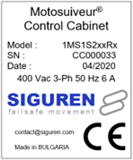
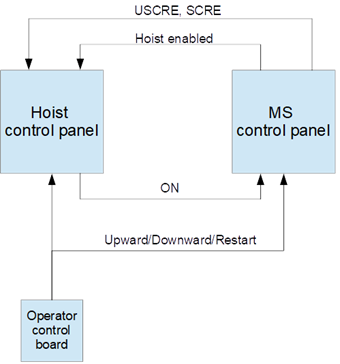
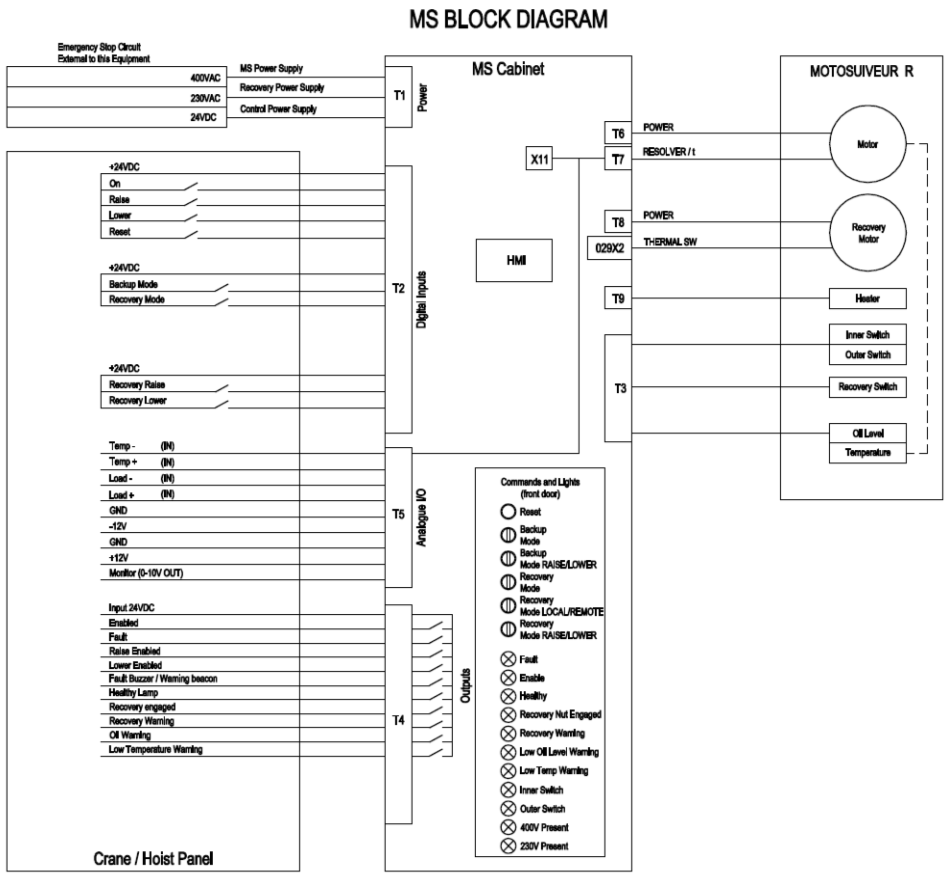

===========================
MotoSuiveur Control cabinet
===========================

MotoSuiveur control cabinet (picture below) is built according to the configuration of the MS control diagram_. 
Control cabinet have nameplate_ located on front side of the door indicating input power (voltage, frequency, current), serial number, date.

.. figure:: ../../_img/Control-Cabinet/Control-cabinet-overview.png
   :figwidth: 800 px
   :align: right  
    

.. csv-table:: MotoSuiveur control cabinet overview
   :file: ../../_tables/control-cabinet-overview.csv
   :delim: ;
   :header-rows: 1
   :class: tight-table
   :align: left
   :widths: auto

.. _nameplate:
Nameplate
----------

The nameplate of the MS Control Cabinet indicates model, serial number, date of production, voltage / power requirements.
Exemplary general appearance of control cabinet nameplate shown on figure below.

Architecture of a *standalone* MotoSuiveur system
======================================================

In the standalone architecture, the MotoSuiveur controller receives only inputs from the main hoist control panel, 
basically [🔼 Up] and [🔽 Down] on terminal T2. 

Terminal block T4 is a set of digital outputs (relays) providing MotoSuiveur status information, as well as an enable signal for operation, 
enabling upward and downward movement signals.

Terminal blocks T3, T5\*\, T6, T7 and T8 are analog and digital inputs for MotoSuiveur standalone system.

On figure below is presented the architecture of the standalone MotoSuiveur Solution.

\*\ *T5 is not shown on figure below*

.. figure:: ../../_img/Peter/generalViewConnectionsMS-MSCC.png
	:figwidth: 600 px
	:align: center

Integration of the MotoSuiveur in the control system
=======================================================

The integration of the MS into the control system of a new or existing crane is done by pre-configuring the MotoSuiveur I/O interface. 
All electrical parameters and iterfaces are specified by the pre-configuration diagram.

.. _diagram:

	Integration of the MotoSuiveur in hoist control system

**For more details:** :doc:`../../equipment/control-interface/control-panel`