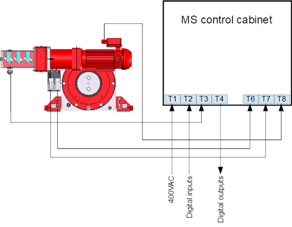

===========================
MotoSuiveur Control cabinet
===========================
..
 .. note::
	Describes what standard MotoSuiveur electrical panel is like. I/O, components, connectors, options…
..
 .. note::
	Source: :download:`User Manual-7.4.doc`
..
 About the MotoSuiveur control system
 =====================================
..
 The MotoSuiveur control system comes with different architectures to meet the installation requirements.
..
 The MotoSuiveur has been designed to be integrated almost stand-alone on hoisting system and basically requires 
 only the servo-motor controller to be connected to the main hoist panel. However, most of the time, 
 the MotoSuiveur is integrated in the control system with its own control system.
..
 All configurations integrate the very same servo-motor controller software.

MotoSuiveur control cabinet (picture below) is built according to the configuration of the MS control diagram_. 
Control cabinet have nameplate_ located on front side of the door indicating input power (voltage, frequency, current), serial number, date.

.. figure:: ../../_img/Control-Cabinet/Control-cabinet-overview.png
   :figwidth: 800 px
   :align: right  
    

.. csv-table:: MotoSuiveur control cabinet overview
   :file: ../../_tables/control-cabinet-overview.csv
   :delim: ;
   :header-rows: 1
   :class: tight-table
   :align: left
   :widths: auto

..
 Description
 =============
..
 Servo-motor controller
 ------------------------
..
 Each MotoSuiveur is fitted with a servo-motor that adapts the rotation of the worm screw to the orders given to the hoist motor. 
 The servo-motor is controlled by a controller that embeds a software especially developed by the MotoSuiveur manufacturer.
..
 The servo-motor controller is connected directly to the servo-motor through a dedicated cable 
 that controls the servo-motor and sends position data back to the controller.

.. ---------------------------------------------------------------------------------------------------------------------------------

.. _nameplate:
Nameplate
----------

The nameplate of the MS Control Cabinet indicates model, serial number, date of production, voltage / power requirements.
Exemplary general appearance of control cabinet nameplate shown on figure below.

.. figure:: ../../_img/Control-Cabinet/control-cabinet-nameplate.png
	:figwidth: 800 px
	:align: center

.. ---------------------------------------------------------------------------------------------------------------------------------

Architecture of a *standalone* MotoSuiveur system
======================================================

.. figure:: ../../_img/controlSignals.png
	:figwidth: 600 px
	:align: center

In the standalone architecture, the MotoSuiveur controller receives only inputs from the main hoist control panel, 
basically [⬆️ Up] and [⬇️ Down] on terminal T2. 

Terminal block T4 is a set of digital outputs (relays) providing MotoSuiveur status information, as well as an enable signal for operation, 
enabling upward and downward movement signals.

Terminal blocks T3, *T5*, T6, T7 and T8 are analog and digital inputs for MotoSuiveur standalone system.

On figure below is presented the architecture of the standalone MotoSuiveur Solution.

*T5 is not shown on figure below*

.. Worm screw positions coming from digital sensors are sent to the Main hoist control panel.

.. ---------------------------------------------------------------------------------------------------------------------------------

Integration of the MotoSuiveur in the control system
=======================================================

The integration of the MS into the control system of a new or existing crane is done by pre-configuring the MotoSuiveur I/O interface. 
All electrical parameters and iterfaces are determined by the pre-configuration diagram.

.. _diagram:
.. figure:: ../../_img/Control-Cabinet/control-cabinet-configuration.png
	:figwidth: 800 px
	:align: center

	Integration of the MotoSuiveur in the control system

.. ---------------------------------------------------------------------------------------------------------------------------------

**For more details:** :doc:`../../equipment/control-interface/control-panel`