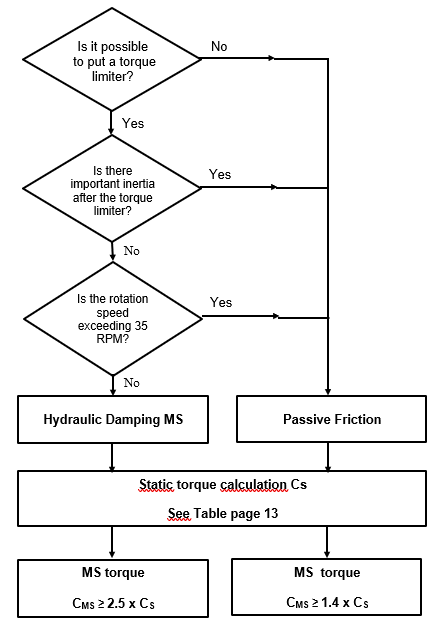
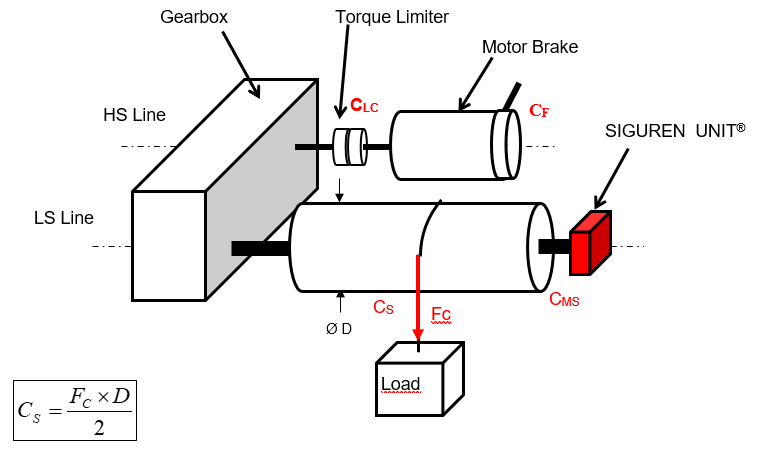

=================================
Selecting a MotoSuiveur Solution
=================================

.. include:: ../../_text-substitutions.rst

.. =========================================================================================================================

Selecting the right MotoSuiveur Unit
======================================

Arrest type selection
-----------------------

	MotoSuiveur type selection diagram

Arrest torque calculation
---------------------------

The main criterion is the arrest torque at full speed |Vmax|. 

The starting point to define this torque is the full load static torque at the drum (or at the MS wheel) |Cs|, without taking into account the efficiency.

	Hoist kinematic chain force analysis

The Passive Friction MotoSuiveur Unit is directly selected to ensure sufficient torque to stop the full load. 

.. math::

  C_{MS} ≥ 1.4C_S

The speed at the MotoSuiveur Unit wheel can be up to 100 RPM.

Examples
---------

Selecting the right MotoSuiveur control cabinet
===============================================

Selecting the right MotoSuiveur load recovery add-on
=======================================================

Selecting the right MotoSuiveur torque limiter add-on
=======================================================