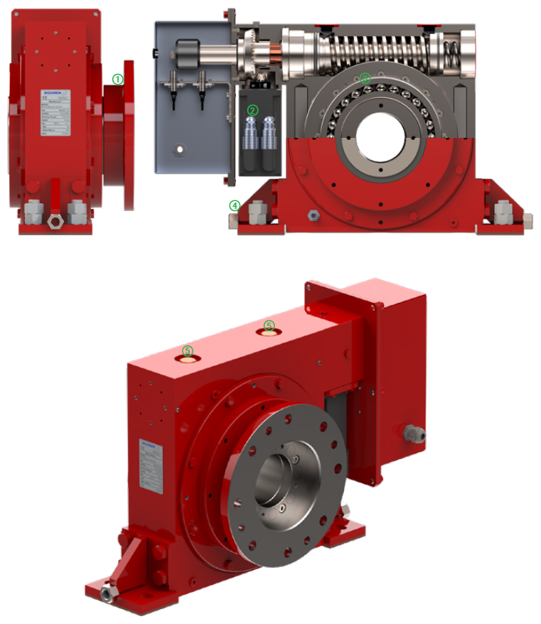
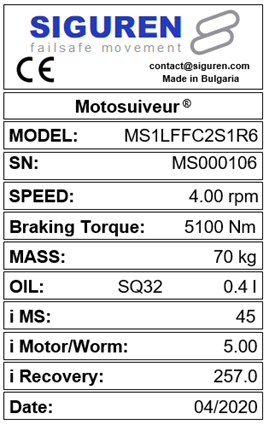
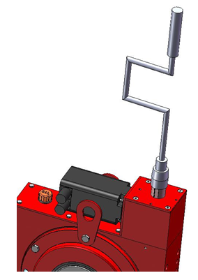
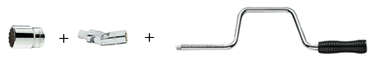

==================
MotoSuiveur Unit
==================

.. role:: mechpart
   :class: mechpart

.. note::
    Describes the MotoSuiveur unit. Describes what options users have for assembling an MotoSuiveur unit with their hoist, new or existing. 
    MotoSuiveur seat and flange/splines. Bearing/non-bearing. Arrest torque absorption.

Component description
======================

Components
-----------

    
    MotoSuiveur Unit components:

    1) Drum adapter flange, custom for every application
    2) Servo motor, with power and Resolver connectors
    3) Heavy-duty bearing, for drum bearing by MotoSuiveur Unit (optional)
    4) Mounting feet and positioning sockets
    5) Inspection and maintenance plug

Codification
------------

.. list-table:: Codification for Passive Friction MotoSuiveur Units
   :header-rows: 1
   :class: tight-table
   :width: 100 %
   :widths: 5, 45, 50

   * - Position
     - Parameter
     - (Value) Description
   * - *MS*
     - *MotoSuiveur*
     - MS
   * - **1**
     - **Size**
     - | (0) size 0
       | (1) size 1
       | (2) size 2
       | (3) size 3
       | (4) size 4
       | (5) size 5
       | (6) size 6
       | (7) size 7
   * - *L*
     - *Lifting Series*
     - L
   * - **2**
     - **Arrest type**
     - | (F) Passive friction
   * - **3**
     - **Recovery type**
     - | (R) Integrated Electrical Recovery Mechanism
       | (E) Electrical Recovery Tool Included
       | (M) Manual Recovery Tool Included
       | (X) Not Applicable
   * - **4**
     - **Mounting type**
     - | (P) Bearing with mounting plate
       | (F) Foot mounted bearing (only for passive friction)
       | (A) Shaft mounted with reaction arm on side
       | (S) Shaft mounted with reaction arm support
   * - **5**
     - **Rotation direction at lowering**
     - | (C) Clockwise
       | (A) Anti-clockwise
   * - **6**
     - **Reaction arm position**
     - | (1)..(12)
       | See xxx for details.
   * - **7**
     - **Driving type**
     - | (S) Splined shaft
       | (F) Flange (only for Bearing mounting type (P))
   * - **8**
     - **Servo motor position**
     - | (1)..(12)
       | See xxx for details.
   * - **9**
     - **Power supply voltage**
     - | (1) 230 VAC I+N 
       | (2) 400VAC III  
       | (3) 230-400VAC III+N
   * - **10**
     - **Integrated Recovery position**   
     - | (1)..(7)
       | See xxx for details.

.. note::
  size + type = model ?

.. note::

  | Example :
  | MS0  L  F  R  P  C  1  S  6  1  /  5  TS

MotoSuiveur Unit size
^^^^^^^^^^^^^^^^^^^^^^^
.. _MotoSuiveur Unit arrest torque table:
.. csv-table:: MotoSuiveur Unit arrest torque table
   :file: ../../_tables/ms-unit-torque.csv
   :delim: ;
   :header-rows: 1
   :widths: 10, 30, 30, 30
   :class: tight-table
   :align: center

Arrest type
^^^^^^^^^^^^

This document focuses on Passive Friction arrest type MotoSuiveur. 

See xxx for Damping arrest type.

Rotation direction at lowering
^^^^^^^^^^^^^^^^^^^^^^^^^^^^^^^^

Reaction arm position
^^^^^^^^^^^^^^^^^^^^^^^^

Driving type
^^^^^^^^^^^^^^^^^^

Servo motor position
^^^^^^^^^^^^^^^^^^^^^^

Power supply voltage
^^^^^^^^^^^^^^^^^^^^^^

Integrated Recovery position
^^^^^^^^^^^^^^^^^^^^^^^^^^^^^^^^

.. list-table:: 
   :widths: 5 95
   :header-rows: 1
  
   * - Step
     - Description
   * - **1**
     - 
   * - **2**
     - 

Nameplate
----------

    
    MotoSuiveur Unit nameplate

    1) the maximum rotating speed, 
    2) the corresponding braking torque,
    3) Mass,
    4) Oil quantity,
    5) -

.. important::
  The MotoSuiveur is designed to resist the dynamic solicitations of a defined application; so before any putting in operation, 
  make sure that the installation complies entirely with the application that the MotoSuiveur has been ordered for by checking the nameplate.

.. warning::
    The MotoSuiveur is factory set taking into account the speed, load and inertia of the equipment. 
    | Increasing the speed / inertia of the equipment on which the MotoSuiveur is installed is not allowed and may lead to serious damage. 

Dimensions
============

Foot mounted bearing
---------------------

.. figure:: ../../_img/ms-unit-06.png
    
    MotoSuiveur Unit Foot mounted bearing

.. _MotoSuiveur Unit Foot mounted bearing:
.. csv-table:: MotoSuiveur Unit Foot mounted bearing dimensions
   :file: ../../_tables/ms-foot-mounted-bearing-dimensions.csv
   :delim: ;
   :header-rows: 1
   :class: tight-table
   :align: center

Shaft mounted with reaction on side
------------------------------------

    
    MotoSuiveur Unit Shaft mounted with reaction on side

.. _MotoSuiveur Unit Shaft mounted with reaction on side:
.. csv-table:: MotoSuiveur Unit Shaft mounted with reaction on side dimensions
   :file: ../../_tables/ms-shaft-mounted-reaction-arm-dimensions.csv
   :delim: ;
   :header-rows: 1
   :class: tight-table
   :align: center

Interface with hoist
======================

Drum shaft with splines
------------------------

Driving flange
--------------

Manual command handle (wrench)
===============================

.. note::
	Source: :download:`User Manual-7.4.doc`

The manual operation devices allow the MotoSuiveur® to set-down the load in case of a breakdown (gravity lowering). 
The operating procedure is described in *chapter 5*.

    
    Manual command handle

For example, the manual command handle can be composed of a standard speed handle (square ¾ “) (1), a socket universal (2) and a socket (3).

    
    Manual command handle parts

.. important::
    It must be used by operators informed of procedures.

It is to be used only in case of gravity lowering with manual control from the MotoSuiveur®, for example in case of power failure of the electric supply of the MotoSuiveur®.

.. list-table:: Manual handle mounting instruction
   :widths: 5 95
   :header-rows: 1
   :class: instruction-table
  
   * - Step
     - Description
   * - **1**
     - **Remove the protection cover of the worm screw of the MotoSuiveur® and its fixation screws.**
   * - **2**
     - **Set up the handle.**
   * - **3**
     - **After use, put the cover back with the fixation screws.**
