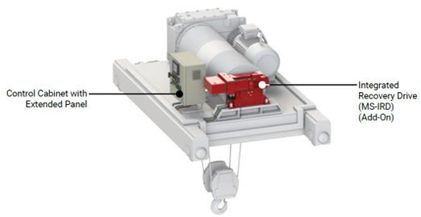
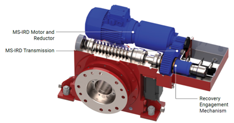
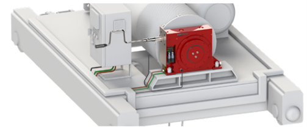
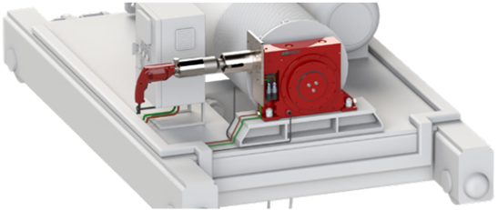
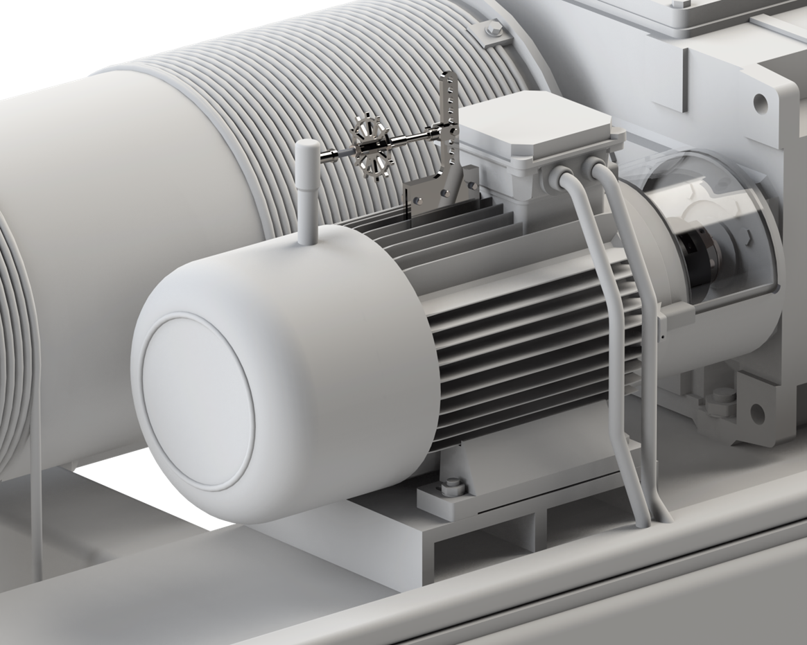

=================
Recovery add-ons
=================

In addition to Motosuiveur®'s main function of protecting the load on the main hoist from overspeed and load path damage, it also offers the possibility 
of load recovery in the event of crane failure

The recovery system serves to lower the suspended load on the crane hook to the ground or to a safe surface.

The load recovery system is an addition to the Motosuiveur® unit and is available in several varieties.

Integrated Recovery Drive 
=========================

For lifting applications where access to the hoist is impractical or hazardous, the ability to remotely control the load after a hoist failure is critical. 
In such a case the Integrated Recovery Drive (MS-IRD) add-on for MS Solutions. 
With MS-IRD, crane operators can remotely recover the load safely and rapidly even after a hoist failure, independently of the state of the hoists’ main drive.

Exemplary general appearance of MS system equipped with MS-IRD

MS-IRD consists of an independently powered and controlled AC motor, reductor, transmission and engagement mechanism. MS-IRD is integrated in MS unit.
Exemplary general appearance of MS unit equipped with MS-IRD is shown on figure below.

Exemplary general appearance of MS unit equipped with MS-IRD

Independent Load Recovery 
=========================

Handheld recovery tool (HRT) / Portable recovery tool (PRT)
=============================================================

When a power or mechanical failure occurs, the hoist kinematic chain is rendered inoperative. For hoists that have a single load path, 
crane operators have little choice: they need to override the brakes and proceed to a load-controlled lowering. 
This is a complex and perilous operation that can turn into an uncontrolled load drop if not executed expertly.
MS offers two independent load recovery systems – HRT and PRT. 

- *HRT is appropriate for MS0 and MS1.* 
- *PRT is appropriate up to MS4 size.*

				 
HRT

PRT

Brake release tool (BRT)
=========================

BRT is used to set the motor brake to the slippage limit to facilitate worm rotation during recovery.

BRT

.. note::
    SIGUREN TECHNOLOGIES STRONGLY ENCOURAGES USING MOTOSUIVEUR INDEPENDENT LOAD RECOVERY SYSTEMS ONLY IN POST-FAILURE LOAD RECOVERY SITUATIONS TO 
    BRING THE LOAD TO THE GROUND. RAPID CONSECUTIVE OR PROLONGED USE OF THIS FUNCTIONALITY AS A PRIMARY HOISTING MECHANISM SHOULD BE AVOIDED.