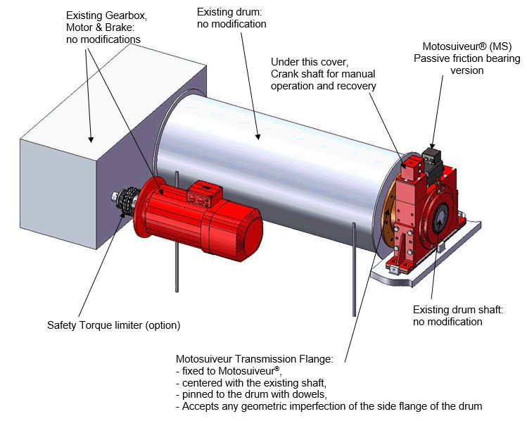
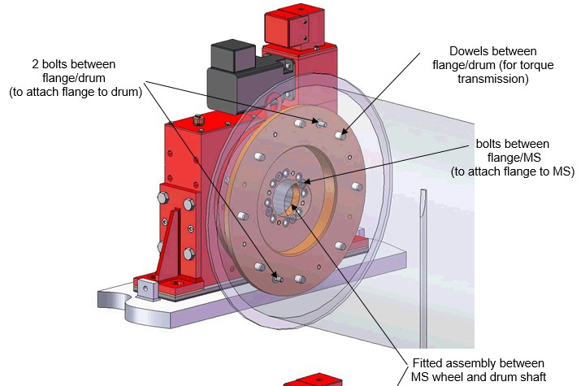
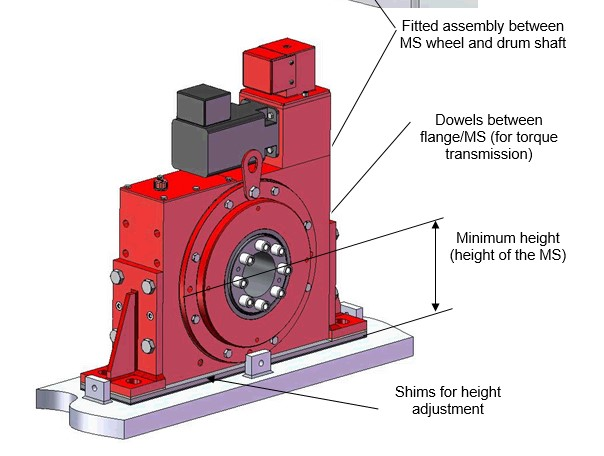
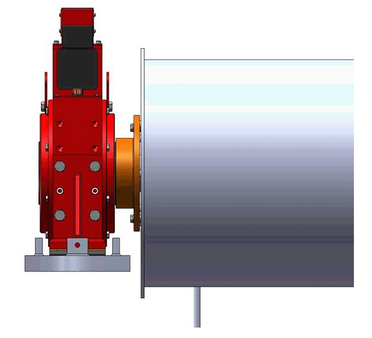

===============================================
Installation of MotoSuiveur on existing hoist
===============================================

.. note::
	Refers to electrical-interface and mechanical-interface. May be partially redundant with connect-ms-control-cabinet

.. note::
    Extracted from :download:`MS installation on existing hoist barrel.doc <../archives/MS-installation-on-existing-hoist-barrel.doc>` .

Benefits
===========

- Zero modification to existing barrels
- Compact design
- Low height of axis
- Easy deactivation (for maintenance, etc.) by removing the worm gear

Installation guidelines
========================

1. Prior to remove the existing plummer block, make one rotation and find by comparator the 2 points on the barrel side flange that are on the same axial plane on the diameter of the future pin and bolts diameter. These two points will receive the bolt holes,
2. Remove the existing plummer block,
3. Put the transmission flange on the barrel shaft (fitted assembly) and use the holes to counter-drill holes on the barrel side flange,
4. Mount the transmission flange on the MS wheel (bolts, pins),
5. Assemble the flanged MS to the side flange of the barrel. The washers create a gap which allows the MS to be strictly aligned with the barrel (shaft) axis. The MS wheel and flange are fitted to the existing barrel shaft so the MS is strictly concentric to the barrel.

.. _General view:

	General view

.. _Flange assembly:

	Flange assembly

.. _Seat assembly:

	Seat assembly

.. _Side view:

	Side view

Mechanical advantages of the new assembly
===========================================

- The vertical load is taken by the shaft, as before, but the transmission flange helps also,
- The bolts are just holding the parts together, practically no forces to transmit,
- In case of braking, all the torque is transmitted to the barrel via the pins,
- The transmission flange creates a redundant load path, so the « shaft break » scenario becomes highly improbable
