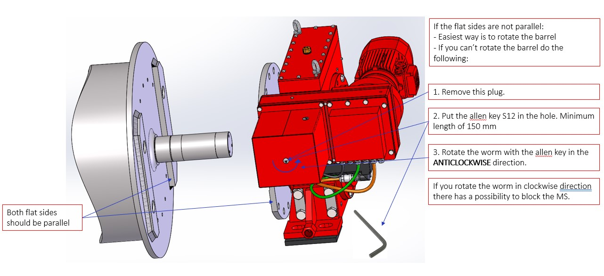
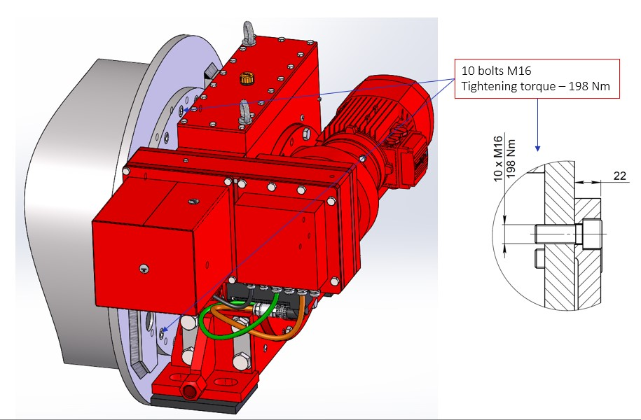
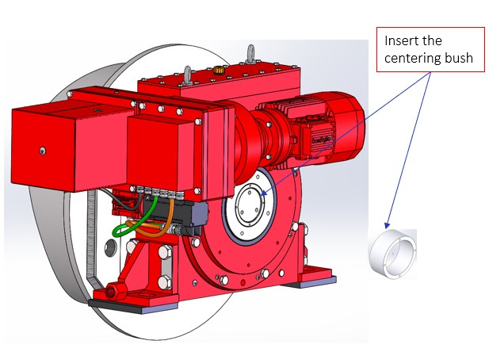
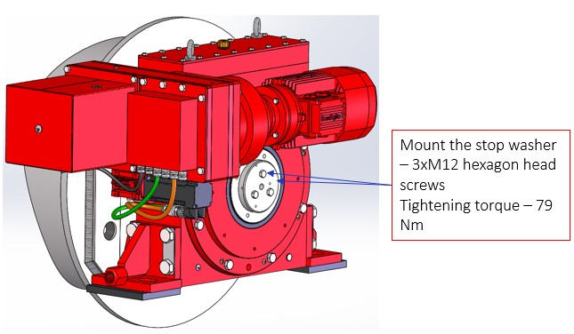

====================
Flange installation
====================

.. note::
    Extracted from :download:`Mounting procedure.pptx <../archives/Mounting-procedure.pptx>` .

Drum – MS assembly
===================

.. _Drum to MS:

	Drum to MS assembly

If the flat sides are not parallel, the easiest way is to rotate the barrel 

If you cannot rotate the barrel do the following:
Remove this plug.
Put the allen key S12 in the hole. Minimum length of 150 mm
Rotate the worm with the allen key in the ANTICLOCKWISE direction.

.. warning::
    If you rotate the worm in CLOCKWISE direction there is a possibility of blocking the MS. 
    If this happens, please consult :doc:`Unblocking the MotoSuiveur Unit <../troubleshooting-procedures/unblocking-ms>`

.. _Securing with bolts:

	Securing with bolts

Assemble the MS to the drum and secure it with the bolts M16. 
At this point, the hoist gearbox may also be assembled to the opposite end 
of the drum (depending on Demag drum replacement procedure). 

.. _Centering bush assembly:

	Centering bush assembly

.. _Stop washer assembly:

	Stop washer assembly