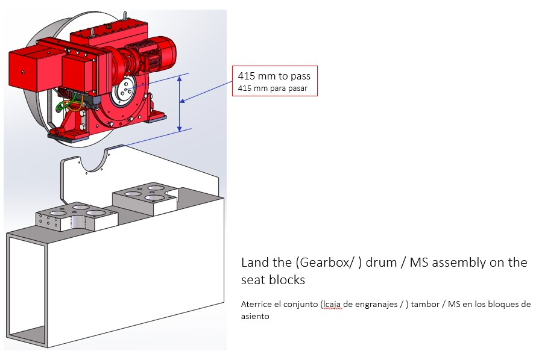
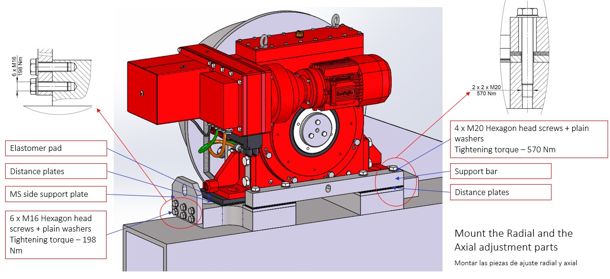
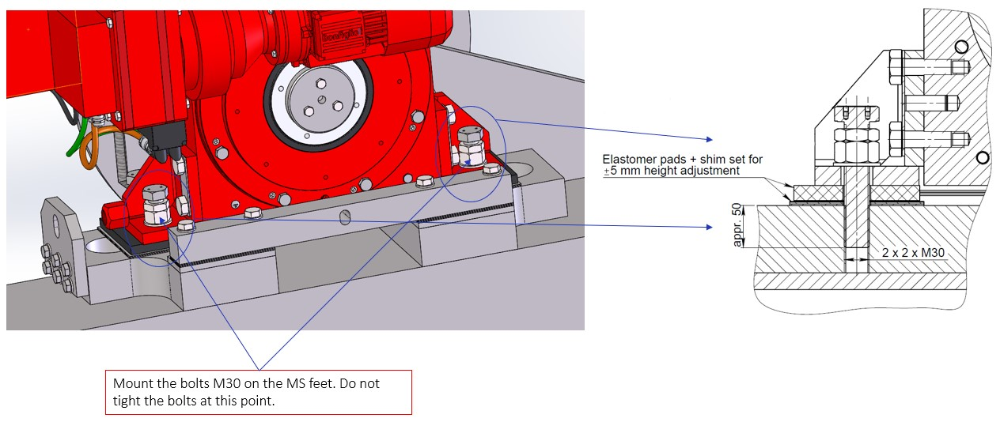
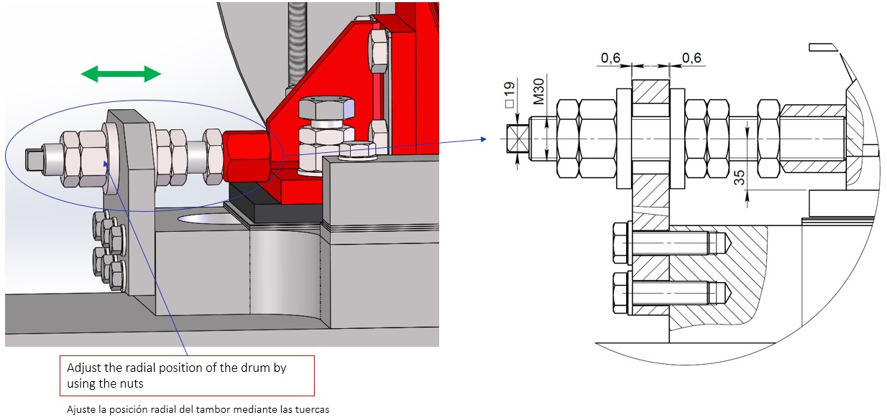
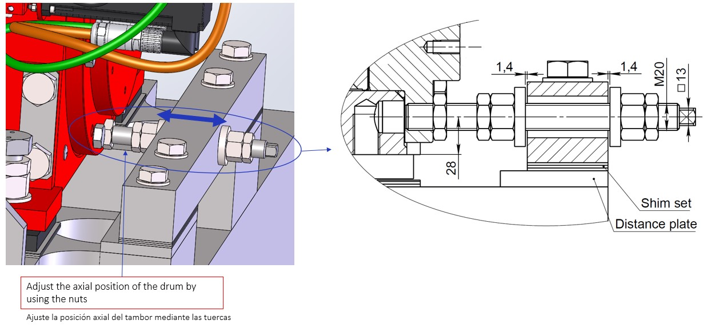
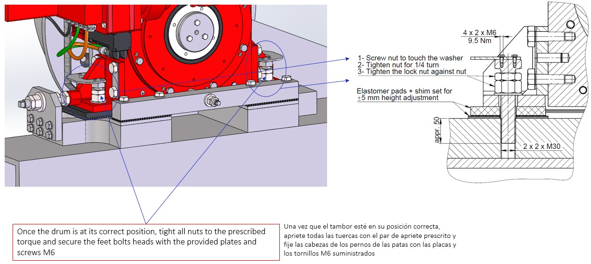

===================================
Positionning the MotoSuiveur Unit
===================================

.. note::
    Extracted from :download:`Mounting procedure.pptx <../archives/mounting-procedure.pptx>` .

Landing on trolley
===================

Land the (Gearbox/ ) drum / MS assembly on the seat blocks

.. _Landing on trolley:

	Landing on trolley

Radial and the axial adjustment parts
======================================

Mount the Radial and the Axial adjustment parts

.. _Radial and Axial adjustment parts:

	Radial and axial adjustment parts

Seat bolts
===========

Mount the bolts M30 on the MS feet. Do not tight the bolts at this point.

.. _Seat bolts:

	Seat bolts

Radial positionning
======================

.. _radial position:

	Radial position

Axial positionning
====================

.. _Axial position:

	Axial position

Tightening in position
========================

Once the drum is at its correct position, tight all nuts to the prescribed torque and 
secure the feet bolts heads with the provided plates and screws M6.

.. _Tightening in position:

	Tightening in position
