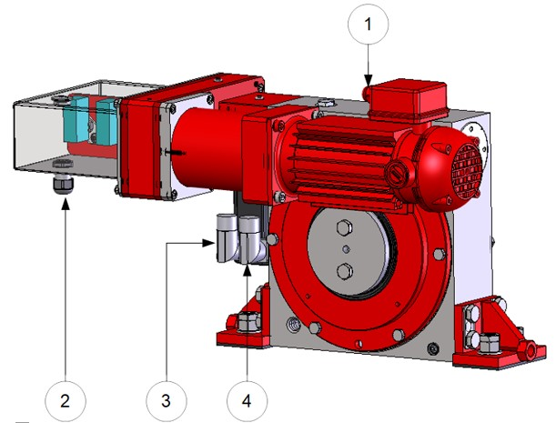

============================
Control cabinet connection
============================

.. note::
  How do I connect MS to my existing controls and power sources?

.. note::
    Extracted from :download:`Siguren MS manual.docx <../archives/siguren-ms-manual-ternium.docx>` .

After mechanical assembly of MS to hoist is done, electrical connection must be made between MS and control cabinet. 
:numref:`Electrical connections of MS unit` shows general view of typical MS unit electrical components that should 
be connected according specific for the project electrical circuit diagram.

.. _Electrical connections of MS unit:

	Electrical connections of MS unit

.. list-table:: Electrical connections of MS unit
   :widths: 25 75
   :header-rows: 1

   * - №
     - Description
   * - 1
     - C8 – Recovery motor connector
   * - 2
     - TSW – Position switches terminal
   * - 3
     - C6 – Power connector
   * - 4
     - C7 – Resolver connector

Electrical connection of the Motosuiveur
==========================================

.. note::
	Source: :download:`User Manual-7.4.doc`

The electrical box of the Motosuiveur® is delivered with cables already in place with the motor and encoder cables and their connectors.

See electrical diagram provided in *appendix 4*.
