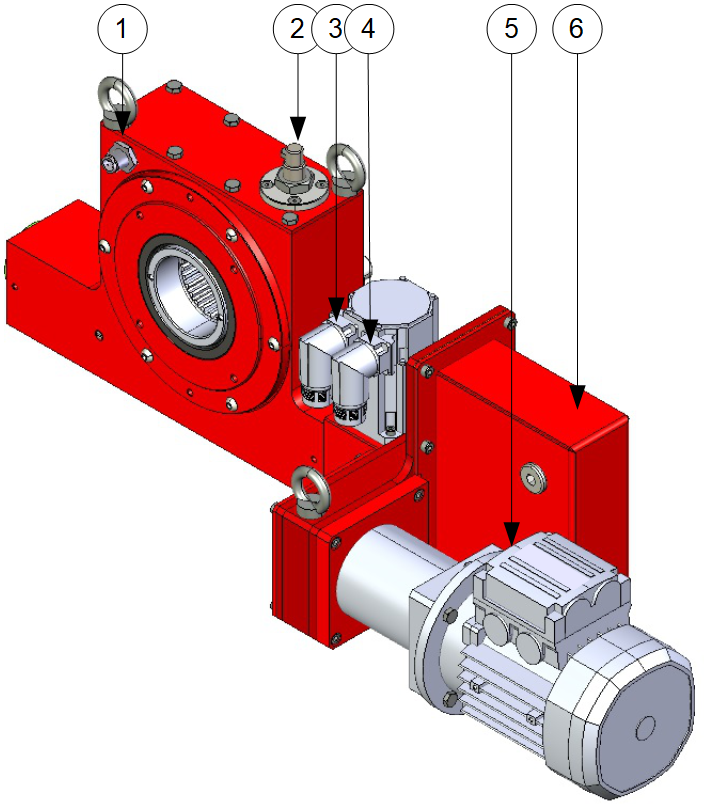
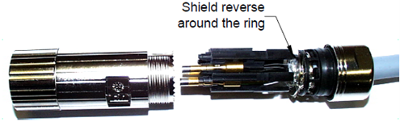
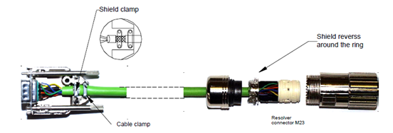
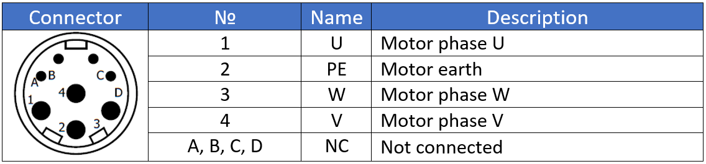
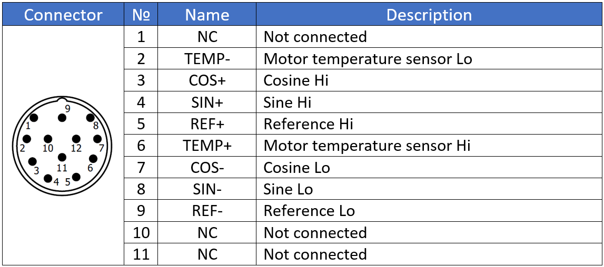
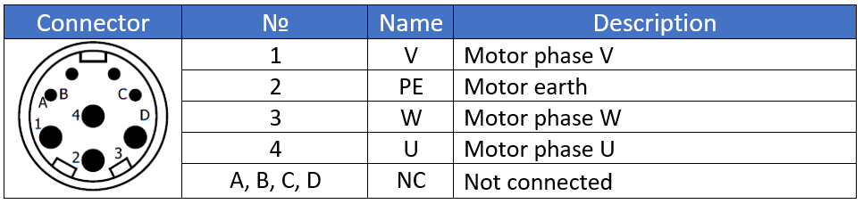
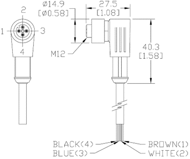
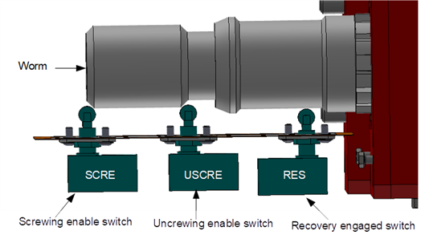

=====================================
Control cabinet connection to MS unit
=====================================

After mechanical assembly of MotoSuiveur system to hoist is done, electrical connection must be made between MS and control cabinet. 
Figure below shows general view of typical MotoSuiveur  electrical components that should 
be connected according specific for the project electrical circuit diagram.

.. note::
  All electrical connections are to be made according to electrical circuit diagram of the project!

Electrical connection of the MotoSuiveur panel
===============================================

.. _Electrical connections of MotoSuiveur panel:
.. figure:: ../../_img/generalViewConnectionsMS-MSCC.png
	:figwidth: 465 px
	:align: center

	Electrical connection of MotoSuiveur panel

.. csv-table:: MotoSuiveur System electrical components
   :file: ../../_tables/electrical-connection.csv
   :delim: ;
   :header-rows: 1
   :class: tight-table
   :align: left
   :widths: auto

Terminals **T1, T2, T4, T4, T6, T7** are mandatory.

Electrical connection of the MotoSuiveur unit
===============================================

Principle location of electrical components on MotoSuiveur unit are shown on figure below.

.. _Electrical connections of MotoSuiveur unit:

	Electrical connection of MotoSuiveur unit

.. csv-table:: MotoSuiveur unit electrical components
   :file: ../../_tables/ms-unit-electrical-connection.csv
   :delim: ;
   :header-rows: 1
   :class: tight-table
   :align: left
   :widths: auto

How to connect MS servo motor - C6 & C7
----------------------------------------

Connectors C6 and C7 should be made according following specification:

-	For C6 connector should be used screened cable, 4 core, 1.5 mm². Ground the shield of the feedback should be connected to GND.

.. _Connector C6:

	Connector C6

- For C7 connector screened cable with 4 twisted pairs, 0.25 mm² should be used. Ground the shield of the feedback should be connected to GND.

.. _Connector C7:

	Connector C7

Signal arrangement of connector on motor side for motor type S1. 

.. _Power connector type S1:

	Power connector type S1 (C6)

.. _Resolver connector type S1:

	Resolver connector type S1 (C7)

Signal arrangement of connector on motor side for motor type S2. 

.. _Power connector type S2:

	Power connector type S2 (C6)

.. _Resolver connector type S2:
.. figure:: ../../_img/Controls-installation/S2-resolver.PNG
	:figwidth: 465 px
	:align: center

	Resolver connector type S2 (C7)

How to connect oil and temperature sensors
------------------------------------------

Oil level sensor (S1) and Temperature sensor (S2) are standard 4 male pin M12 connector type PNP or NPN type. 
Figure below shows M12 connector specification and present information which type should be used. 

.. _M12 connector layout:

	M12 connector layout

.. _Oil and temperature:
.. figure:: ../../_img/Controls-installation/oil-sensors-connection.png
	:figwidth: 465 px
	:align: center

	Oil and temperature sensors connection

How to connect proximity sensors / limit switches
-------------------------------------------------

Position proximity sensors/switches are used for allowing or prohibits hoist movement. Position sensors/switches are using in active state output signal. 

The figure below shows an example of the installation of the limit switches. 
NC contacts are used for connection. Signal from switches is active when they are not pressed.

.. _Limit switches:

	Limit switches

In case of proxy position sensors are used, sensors are with NO output and are active when worm is in correct position. 

