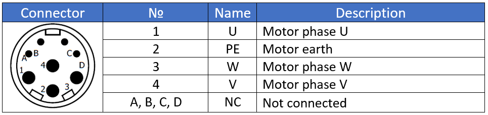
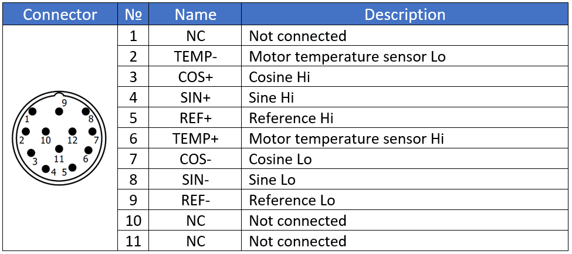
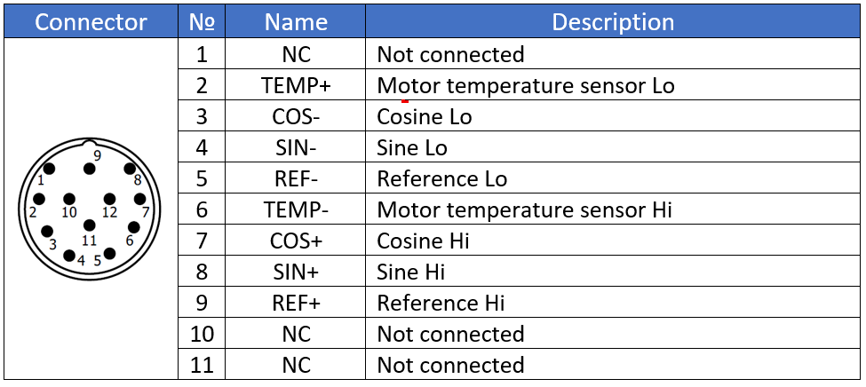

=====================================
Control cabinet connection to MS unit
=====================================

.. note::
  How do I connect MS to my existing controls and power sources?

.. note::
    Extracted from :download:`Siguren MS manual.docx <../archives/siguren-ms-manual-ternium.docx>` .

After mechanical assembly of MotoSuiveur system to hoist is done, electrical connection must be made between MS and control cabinet. 
Figure below shows general view of typical MotoSuiveur  electrical components that should 
be connected according specific for the project electrical circuit diagram.

.. note::
  All electrical connections are to be made according to electrical circuit diagram of the project!

Electrical connection of the MotoSuiveur panel
===============================================

.. _Electrical connections of MotoSuiveur panel:
.. figure:: ../../_img/generalViewConnectionsMS-MSCC.png
	:figwidth: 465 px
	:align: center

	Electrical connection of MotoSuiveur panel

.. csv-table:: MotoSuiveur System electrical components
   :file: ../../_tables/electrical-connection.csv
   :delim: ;
   :header-rows: 1
   :class: tight-table
   :align: left
   :widths: auto

Terminals **T1, T2, T4, T4, T6, T7** are mandatory.

Electrical connection of the MotoSuiveur unit
===============================================

Principle location of electrical components on MotoSuiveur unit are shown on figure below.

.. _Electrical connections of MotoSuiveur unit:
.. figure:: ../../_img/Controls-installation/MS-unit.png
	:figwidth: 465 px
	:align: center

	Electrical connection of MotoSuiveur unit

.. csv-table:: MotoSuiveur unit electrical components
   :file: ../../_tables/ms-unit-electrical-connection.csv
   :delim: ;
   :header-rows: 1
   :class: tight-table
   :align: left
   :widths: auto

How to connect MS servo motor - C6 & C7
----------------------------------------

Connectors C6 and C7 should be made according following specification:

-	For C6 connector should be used screened cable, 4 core, 1.5 mm². Ground the shield of the feedback should be connected to GND.

.. _Connector C6:

	Connector C6

- For C7 connector screened cable with 4 twisted pairs, 0.25 mm² should be used. Ground the shield of the feedback should be connected to GND.

.. _Connector C7:

	Connector C7

Signal arrangement of connector on motor side for motor type S1. 

.. _Power connector type S1:

	Power connector type S1 (C6)

.. _Resolver connector type S1:

	Resolver connector type S1 (C7)

Signal arrangement of connector on motor side for motor type S2. 

.. _Power connector type S1:

	Power connector type S2 (C6)

.. _Resolver connector type S1:

	Resolver connector type S2 (C7)

How to connect oil and temperature sensors
------------------------------------------