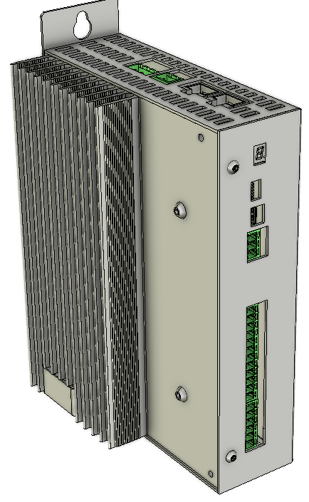

======================
MS Controller settings
======================

Each MotoSuiveur® system is fitted with a servo motor that adapts the rotation of the worm screw to the orders given to the hoist motor. 
The servo motor is controlled by a MS Controller that embeds a software especially developed Siguren Technologies.
MS Controller is connected directly to the servo motor through a dedicated cable that controls the servo motor and sends position data back to the controller.

.. _MS Controller:

	MS Controller

The MS controller is pre-programmed, set up and tested in conjunction with the entire MS system 
The settings and tests are made according to the predefined:

- the acceleration ramps
- the deceleration ramps
- nominal speed
- treshold overspeed

MS controller setup parameters (variables) can be changed after initial programming.
This can be done in 3 different ways:

- via laptop
- via MSHMI
- online session with Siguren Technologies team

.. important::
    The MS Controller variables can only be changed by authorized personnel.
