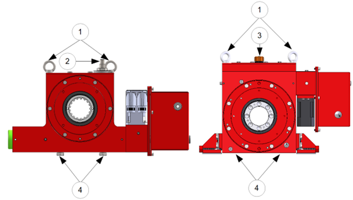

==========
Handling
==========

1.	All MS units are controlled after assembly, set and tested on bench. During those tests, the oil fill is adjusted.
2.	For hydraulic MS units, the damping chamber is bled and sealed. However, a certain quantity of air remains in the rest of the system. To prevent this air to penetrate inside the damping chamber during transportation, which can cause malfunction, the MS units must be carried with the damping chamber in specific position for hydraulic MS units.
3.	During transportation MS unit must be carried via transport rings (1), oil sensor (2) or breather cap (3) are oriented up and oil drain hole (4) down.

.. _MS transportation:

	Transportation of MotoSuiveur® Unit

.. warning::
    Never lift a MotoSuiveur® hanged by the motor.

