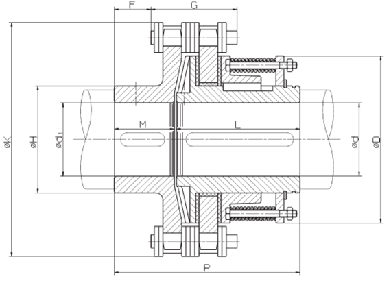
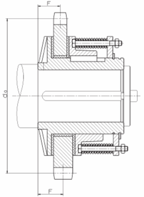

=================================
Assembly of the torque limiter 
=================================

.. note::
	Source: :download:`User Manual-7.4.doc`

.. important::
    Assembly must be done by qualified operators.

The torque limiter is delivered factory rated to the value necessary to the application. 
In case of doubt, check the application data on the assembly drawing.
The limiter assembly direction is defined on the layout.

The torque limiter coupling is made of:

    - The permanent spring limiter
    - The duplex coupling chain
    - The driving hub

    
    MS torque limiter

The cylinder of the limiter part contains helical springs which create the pressure force applied to the friction linings.

    
    MS torque limiter - Limiter part

The response curve of the helical springs allows to keep, without much fluctuation, the pressure force applied to the linings. 
Thus, **no matter their degree of wear**, the fluctuation of the pre-set torque is insignificant.
It is the number of springs which defines the rating torque.

.. warning::
    | The limiter being delivered rated for the application; the limiter part should never be dismantled. 
    | Never add nor withdraw a spring during normal functioning of the winch. 
    | Any maintenance operation should be done by SIGUREN or an authorized representative