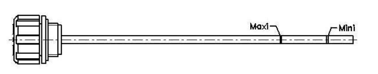
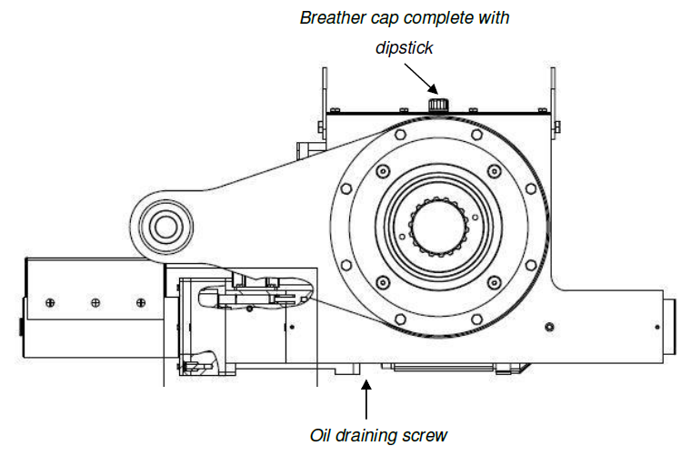

=============
Lubrication
=============

.. include:: ../../substitutions.rst

.. ========================================================================================

.. note::
    Based on :download:`Using the MS Recovery Capabilities <../archives/using-the-ms-recovery-capabilities-02.docx>`

All MotoSuiveur units, are checked after assembly, set and tested on a bench at Siguren. 
During these tests, the oil tank is filled, the level is adjusted and the hydraulic system is drained.

.. list-table:: MotoSuiveur Unit oil capacity
    :widths: 50 50
    :header-rows: 1

    * - Model
      - Oil capacity (L)
    * - MS3
      - 2
    * - MS6
      - 8.5

.. _Breather cap:

	
	Breather cap

.. list-table:: Oil level check instruction
   :width: 600 px
   :widths: 5 95
   :header-rows: 1
   :class: instruction-table
  
   * - Step
     - Description
   * - **1**
     - **After the torque arm is set-up, clean the upper side of the MotoSuiveur.**
   * - **2**
     - **Unscrew the** :numref:`Breather cap` **and check the oil level.**
   * - **3**
     - **Replace the breather cap and screw back tightly.**

.. warning::
    During this operation, make sure you do not introduce any foreign
    particles into the MotoSuiveur use only the SW15 oil. using oil other
    than specified can cause the unit to malfunction.

.. list-table:: Planned maintenance schedule, Lubrication
    :widths: 15 15 15 15 40
    :width: 600 px
    :header-rows: 1

    * - 
      - Maintenance interval
      - Worm rotation count on servo motor
      - Controller Display
      - Operation
    * - Oil level
      - Annually
      - -
      - -
      - -
    * - Oil
      - 10 years
      - 450E+6
      - |image047|
      - Replace

Oil change
------------

:ref:`Oil holes` shows the locations of holes for oil changing and filling.

.. _Oil holes:

	
	Oil holes

Whilst completing maintenance and during the oil change procedure care must be taken not to introduce
any particles inside the MotoSuiveur as this will cause the unit to malfunction.

.. warning::
    Only use siguren SW15 or SQ32 oil. The use of any other oil may lead to a serious malfunction.

Drain of the Hydraulic System
------------------------------

After each operation of the MotoSuiveur an auto diagnostic programme is run to check that there is no air within the damping chamber. 

If air is detected, the damping chamber must be drained. This operation must be carried out by a qualified operator.

.. list-table:: Hydraulic system draining instruction
   :width: 600 px
   :widths: 5 95
   :header-rows: 1
   :class: instruction-table
  
   * - Step
     - Description
   * - **1**
     - | **Make sure:**
       |   - **the hoist is empty**
       |   - **the oil level is sufficient**
   * - **2**
     - | **Make a movement down at slow speed until the movement stops.** 
       | The torque limiter is slipping.
   * - **3**
     - | **Make a movement up at slow speed until the movement stops.**
       | The torque limiter is slipping.
   * - **4**
     - | **Repeat steps 2 and 3 seven times.**
       | The torque limiter is slipping.
   * - **5**
     - | **Power on the MotoSuiveur.**
       | An automatic auto diagnostic is launched.
   * - **6**
     - | **If the auto diagnostic ends with a fault, repeat the procedure.**

