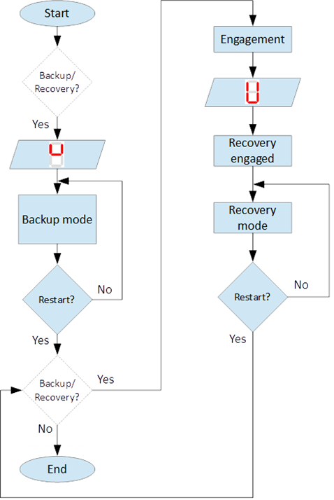

=================================
Back-up/Recovery operation mode
=================================

.. include:: ../substitutions.rst

Backup/Recovery operation mode functions are intended for *unusual* situations during MS operation. 

.. "function" vs "mode" vs "operation mode"

Controls and indicators of this function are located on the :doc:`control panel` – figure 3, items 4, 5, 10, 11.

:numref:`Principle of Backup/Recovery operation` shows the principle of Backup/Recovery operation mode. 

.. _Principle of Backup/Recovery operation :

	Principle of Backup/Recovery operation 

Backup/Recovery decision figures located in figures 15 and 20 with dotted outline, 
represent the places where request for these operation modes are checked. 

Switching **ON** the Recovery/Backup mode is performed through :guilabel:`🔑 Backup/Recovery OFF/ON key` – figure 2, item 4. 
After switching Backup/Recovery mode **ON**, Backup mode start operating. 

|image058| :guilabel:`indication for backup mode` is displayed on 7–segment display and :guilabel:`🟢 Recovery mode lamp` is **ON**.
 
Backup function ignore all settings related with following operation and allows movement of hoist with hoist limited speed.

Back-up operation mode
=========================

In Backup operating mode, control is performed through commands for lifting and lowering of the hoist. 
In cases where the hoist control chain is damaged, control can be performed manually directly on control terminals 
located in MS :doc:`control cabinet` via a wire bridge. 

An example is shown on :numref:`Example for manual operation in backup mode`. 

.. important::
    In Back-up mode no **ON signal** is required to perform movement of MS. 

.. _Example for manual operation in backup mode :
.. figure:: img/backup-mode-01.png
	:align: center

	Example for manual operation in backup mode 

Recovery operation mode
=========================

Recovery mode is second part of Backup/Recovery operation. 

.. undue opposition between "mode" and "operation" ?

This mode starts operating the way shown on :numref:`Principle of Backup/Recovery operation`.

After **MS RESET**, MS checks for active Backup/Recovery mode request (:guilabel:`🔑 Backup/Recovery operational key` is **ON**). 
If request is active 7–segment display shows symbol for Recovery mode  and **ENGAGEMENT** start. 
Engagement function is used to engage recovery mechanism to the worm via recovery nut – figure 1, item 7.

Completion of **ENGAGEMENT** is indicated by :guilabel:`🟢 Recovery engaged indication lamp`. 
If lamp is **OFF** after first engagement, **MS RESET** is needed. **MS RESET** will activate **ENGAGEMENT** again.

Controlling of Recovery is with :guilabel:`🔑 Backup/Recovery Down/Up 3–position key` located on the control panel. 
Also Recovery can be controlled remotely if that is provided by the :doc:`electrical circuit diagram`.

After **ENGAGEMENT** is complete and :guilabel:`🟢 Recovery engagement lamp` is **ON**, brake of main hoist motor should be released. 
Otherwise motor brake will prohibit movements. Brake should remain open until recovery operation done.

For disengagement, load should be on safe place, main hoist motor brake should be closed. 
Command for lowering should be given to MS until both lamps for Upward enable and Downward enable becomes on.

.. warning::
    Recovery function is mainly designed for safety lowering of the load. 
    Function allows very short lifting of the load only in case if it is absolutely necessary!

.. warning::
    Before activating Backup/Recovery operation mode from local controls (figure 3, item 4), 
    please make sure that operation mode is not activated remotely. 
    
The verification consists of the following steps:

- Recovery mode lamp and Recovery engaged lamp are off,
- Backup/Recovery control key is in position “0” (OFF),
- On 7–segment display symbols |image058| or |image041| are not displayed.