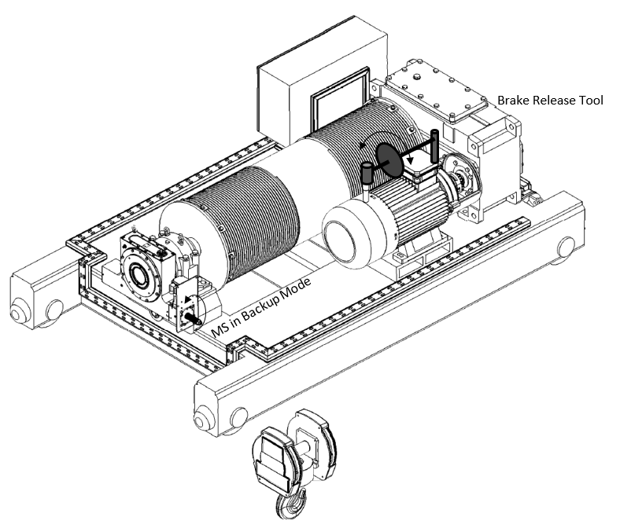
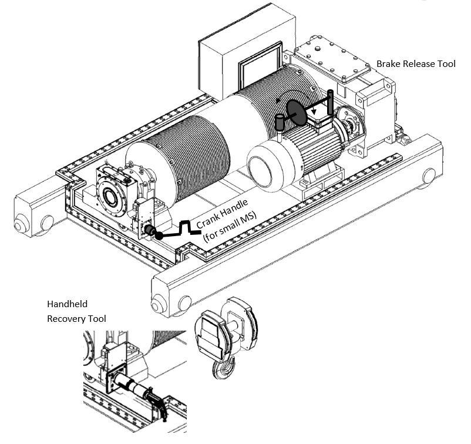

============================
Load recovery operation
============================

.. role:: mechpart
   :class: mechpart

.. note::
    Based on :download:`Using the MS Recovery Capabilities <../archives/using-the-ms-recovery-capabilities-02.docx>`

.. container:: twocol

    .. container:: leftside

        text on left column

		.. figure:: img/stepLowering.png
		:scale: 75 %
		:align: center

    .. container:: rightside

        text on right column

		

The MS will never allow a load drop. It will arrest the hoist drum whenever the hoist brake is unable to do so. 
However, the MS can be used as a gearbox to lower and even raise the load. 

.. note::
	The MS is irreversible – meaning that load drop is impossible even when the MS alone is used for recovering the load. 
	This allows the user to use the weight of the load without risking a load drop.

Three main methods can be used (and combined) to recover the load, depending on how the hoist brake 
and the MotoSuiveur Unit can be accessed and used in the emergency situation that requires the recovery:

- :ref:`Forced MS recovery`
- :ref:`MS followed gravity lowering`
- :ref:`MS assisted gravity lowering`

Forced MS recovery
===================

With the hoist brake open and the MotoSuiveur Unit holding the load, rotate the MS :mechpart:`worm shaft` with considerable torque. 
In this situation the MotoSuiveur Unit moves the load.
This way, a very high amount of torque must be applied on the MS shaft (approximately 1/8 of the barrel torque).

Using the following hardware:

- :doc:`Portable Recovery Tool` for sizes MS4 - MS7, or
- :doc:`Handheld Recovery Tool` for sizes MS0 - MS3

For MS with :doc:`Integrated Remote Recovery` the hardware is integrated and is remotely operated.

Instructions
-------------

-	Open the hoist brake
-	Rotate the :mechpart:`worm shaft` with the following torque to lower the SWL (maximum values)

.. csv-table:: Forced MS Recovery method max torques
   :file: tables/forcedRecoveryTorque.csv
   :header-rows: 1
   :class: tight-table

.. important::
	Indicative barrel speed: 0.1 - 0.3 rpm

MS followed gravity lowering
=============================

Step lowering
--------------

.. note::
	This method can be used only with Hydraulic Damping MS.

.. "method" vs "procedure" vs ...

- Pulse the hoist brake (manually or electrically) to lower the load a few centimeters. The MS :mechpart:`worm shaft` will shift toward the damping chamber. The electrical or brake lever pulse must be short enough to not allow the worm to reach the :mechpart:`elastomer` at the bottom of the damping chamber. 
- Then it is possible to return the :mechpart:`worm shaft` to its “centered” position by hand. 
- Repeat this until the load reaches the floor.

This way, very low torque applied on the MS shaft will be needed (approximately 1/5000 of the barrel torque). 
Using handwheel / crank handle or standard ratchet handle.

The MS can automatically follow if switched to Backup Mode. 
This negates the need of manual operation at the :mechpart:`worm shaft`. 
In case of power outage, the MS can be UPS/battery operated.
Furthermore, the MS can control the brake opening / closing, thus making the gravity load recovery automated.

Instructions
+++++++++++++++

.. _Hydraulic Damping MS step lowering picture:
.. figure:: img/stepLowering.png
	:scale: 75 %
	:align: center
	
	Hydraulic Damping MS step lowering

-	Pulse the hoist brake to achieve less than 30 degrees barrel rotation by gravity
-	Rotate the :mechpart:`worm shaft` by hand few rotations to centralize it
-	Repeat

.. important::
	Indicative mean barrel speed: 0.5 rpm

Backup Mode gravity lowering
------------------------------

- Switch the MS to :doc:`backup-recovery-mode`,
- Order lowering. 
- Progressively release the motor brake using the provided :mechpart:`Brake Release Tool`, until the load starts to rotate the barrel. 
- Use the Brake Release Tool to regulate and maintain the speed below the specified safe speed. A :guilabel:`🔊 buzzer` will sound when the safe speed is close.

The MS will arrest the barrel if:

-	lowering order is removed or
-	overspeed is reached

After such arrest, the worm shaft can be returned to its “centered” position by using a standard wrench.

In case of power outage, the MS can be UPS/battery operated.

Instructions
++++++++++++++

.. _Backup Mode gravity lowering picture :

	
	Backup Mode gravity lowering

- Switch the MS to Backup Mode and 
- order lowering
- Progressively untighten the motor brake, using the :mechpart:`Brake Release Tool`, until the load starts to rotate the barrel. 
- Use the Brake Release Tool to regulate and maintain the speed below the specified safe speed. A :guilabel:`🔊 buzzer` will sound when the safe speed is close.

.. important::
	Indicative barrel speed: 2 - 5 rpm

MS assisted gravity lowering
=============================

- Apply moderate torque to the MS :mechpart:`worm shaft`. 
- Progressively release the motor brake, using the provided Brake Release Tool, until the load starts to rotate the barrel. 
- The barrel stops when no torque is applied to the MS :mechpart:`worm shaft`.

In this scenario, only moderate torque is to be applied to the MS :mechpart:`worm shaft` (approximately 1/250 of the barrel torque).

Using the following hardware:
- Handheld Recovery Tool for MS sizes above MS4,
- Handwheel / crank handle or standard ratchet handle for sizes MS0 – MS3

Instructions
+++++++++++++

.. _MS assisted gravity lowering picture: 

	
	MS assisted gravity lowering

- Apply moderate torque to the MS :mechpart:`worm shaft`, using the appropriate method,
- Progressively release the motor brake, using the provided Brake Release Tool, until the load starts to rotate the barrel (as long as moderate torque is applied to the MS shaft),
- Rotate the MS :mechpart:`worm shaft` to lower the load,
- Use the Brake Release Tool to maintain the torque to be applied to on the worm shaft inside the specified limits.

.. csv-table:: MS assisted gravity lowering max torques
   :file: tables/MSassistedGravityLowering.csv
   :header-rows: 1
   :class: tight-table

