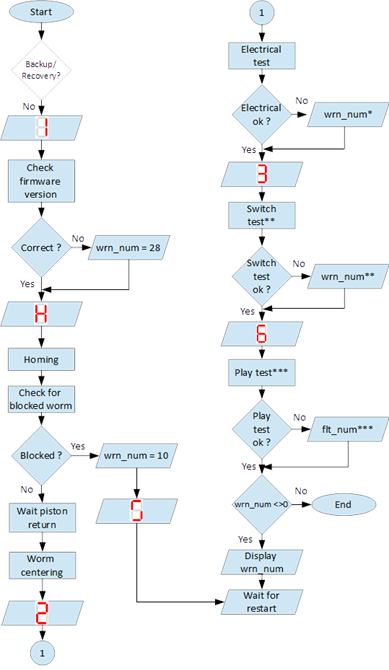
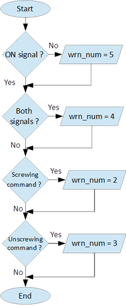

======================
MotoSuiveur self-test
======================

.. include:: ../substitutions.rst

After :doc:`internal-test` finishes, Self-test operation mode (further called self - test) starts. On figure 15 a) symbols indicated self-test steps on MS controller 7 - segment display are shown. On figure 15 b) is shown sequence of self-test steps.

.. _Self-test steps symbols:
.. csv-table:: Self-test steps symbols
   :file: tables/SelfTestStepsSymbols.csv
   :header-rows: 1
   :class: tight-table
   :width: 100
..   :widths: 1, 5

"*" steps are applicable only for hydraulic MS.

.. raw::
	

	

.. _Sequence of self-test steps:

	Sequence of self-test steps 

Fields with *, ** and *** are related with Table 2 in section 7.2

Electrical test
=================

Test checks for active signals on inputs of the MS controller before self-test begin.

:numref:`Steps of Electrical test` shows the steps of the electrical test. 

.. _Steps of Electrical test:

	Steps of Electrical test 

.. warning::
 	In case of repetitive faults, please contact SIGUREN technologies at support@siguren.com!

Switch test
============

Switch test check connection between MS controller and ``SCRE`` / ``USCRE`` switches (figure 2, items 4, 5), centered position and functionality of switches. 

:numref:`Steps of Switch test` shows the steps of the switch test. 

.. _Steps of Switch test:
.. figure:: img/stepsSwitchTest.png
	:scale: 100 %
	:align: center

	Steps of Switch test 

In Table 2 located in appendix are shown steps for visual check of Switch test. 
Visual check of Switch test is necessary only if faults appear during the test repeatedly.

.. important::
 	In case of repeatedly `wrn_num` occurs, please check:
	
    	- connection between MS control cabinet and ``SCRE/USCRE`` switches;
    	- functionality of ``SCRE`` and ``USCRE`` switches;
    	- signals on inputs of MS controller and operational relays ``RSESw`` and ``RUESw`` located in MS control cabinet

Play test
===========

Play test measures play between worm and worm wheel. 

:numref:`Play test steps` shows the steps of Play test.

.. _Play test steps:
.. figure:: img/playTestSteps.png
	:scale: 100 %
	:align: center

	Play test steps

.. warning::
 	In case of repetitive faults, please contact SIGUREN Technologies on address support@siguren.com!