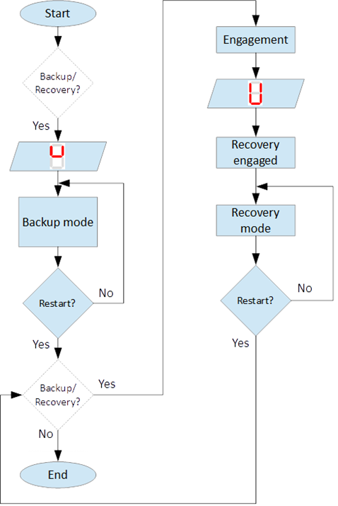

=================================
Back-up/Recovery operation mode
=================================

.. include:: ../substitutions.rst

Backup/Recovery operation mode functions are intended to unusual situations during MS operating. 

.. "function" vs "mode" vs "operation mode"

Controls and indicators of this functions are located on control panel front door – figure 3, items 4, 5, 10, 11.

:numref:`Principle of Backup/Recovery operation` shows the principle of Backup/Recovery operation mode. 

.. _Principle of Backup/Recovery operation :

	Principle of Backup/Recovery operation 

Backup/Recovery decision figures located in figures 15 and 20 with dotted outline, 
represent the places where request for these operation modes are checked. 

Switching on Recovery/Backup mode is performed through Backup/Recovery OFF/ON key – figure 2, item 4. 
After switching Backup/Recovery mode on, Backup mode start operating. 
:guilabel:`|image058| test` is displayed on 7–segment display as an indication for backup mode and :guilabel:`🟢 Recovery mode lamp` is ON. 
Backup function ignore all settings related with following operation and allows movement of hoist with hoist limited speed.

Back-up operation mode
=========================

In Backup operating mode, control is performed trough commands for lifting and lowering of the hoist. 
In case of hoist control chain is damaged, control can be performed manually directly 
on control terminals located in MS control cabinet via a wire bridge. 

An example is shown on :numref:`Example for manual operation in backup mode`. 

.. note::
    In Backup mode no ``ON signal`` is required to perform movement of MS. 

.. _Example for manual operation in backup mode :
.. figure:: img/backup-mode-01.png
	:align: center

	Example for manual operation in backup mode 

Recovery operation mode
=========================

Recovery mode is second part of Backup/Recovery operation. 

.. undue opposition between "mode" and "operation"

This mode start operates the way shown on :numref:`Principle of Backup/Recovery operation`.

After reset, MS checks for active Backup/Recovery mode request (Backup/Recovery operational key is ON). 
If request is active 7–segment display shows symbol for Recovery mode   and engagement start. 
Engagement function is used to engage recovery mechanism to the worm via recovery nut – figure 1, item 7.

Completion of engagement is indicated by Recovery engaged indication lamp (figure 3, point 10). 
If lamp is off after first engagement, reset is needed. Reset will activate engagement again.

Controlling of Recovery is with 3–position key Backup/Recovery Down/Up located on front door of control cabinet – figure 3 item 5. 
Also Recovery can be controller remotely if that is provided by electrical circuit diagram.

After engagement is complete and Recovery engagement lamp is on, brake of main hoist motor should be released. 
Otherwise motor brake will prohibit movements. Brake should remain open until recovery operation done.

For disengagement, load should be on safe place, main hoist motor brake should be closed. 
Command for lowering should be given to MS until both lamps for Upward enable and Downward enable becomes on.

.. warning::
    Recovery function is mainly designed for safety lowering of the load. 
    Function allows very short lifting of the load only in case if it is absolutely necessary!

.. warning::
    Before activating Backup/Recovery operation mode from local controls (figure 3, item 4), 
    please make sure that operation mode is not activated remotely. 
    
The verification consists of the following steps:

- Recovery mode lamp and Recovery engaged lamp are off,
- Backup/Recovery control key is in position “0” (OFF),
- On 7–segment display symbols |image058| or |image041| are not displayed.