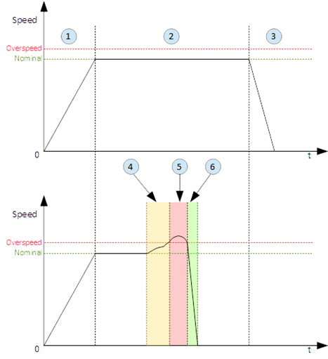
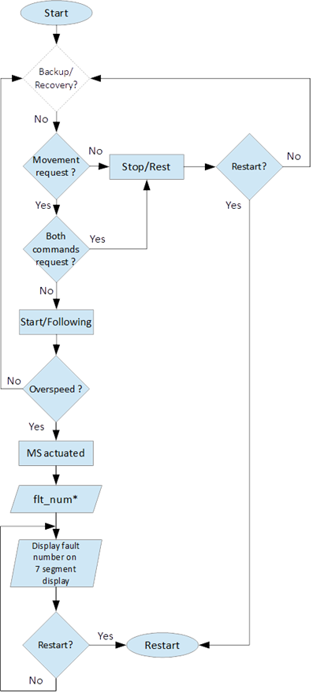
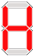
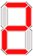
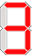
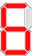
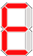
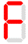
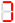

=========================
Following operation mode
=========================

Following operation mode starts after successful passed of self–test. 
The function of this operation mode is intended for follow movements of the hoist and to monitor 
for exceeding the rated speed (nominal speed) with defined positive tolerance. 
The speed, which is considered high is called Overspeed. By design MS will not allow Overspeed. 
Typically Overspeed is equal to:
Overspeed = Nominal speed + 10%

:numref:`Main principle of following operation mode and overspeed detection` presents the main principle of Following operation mode and overspeed detection. 

.. _Main principle of following operation mode and overspeed detection :

	Main principle of following operation mode and overspeed detection 

The steps of following operation mode are presented on :numref:`Steps of Following operation mode`.

.. _Steps of Following operation mode:

	Steps of Following operation mode 

:numref:`Symbols displayed on 7-segment display on MS controller` shows the symbols displayed on 7–segment display during following operation mode.

.. _Symbols displayed on 7-segment display on MS controller:
.. csv-table:: Symbols displayed on 7-segment display on MS controller
   :file: tables/following-mode-digits.csv
   :header-rows: 1
   :width: 100

.. ------------- Substitution definitions for 7-segments digits -------------------

.. |image009| image:: ../img/digits/image009.png 

.. |image013| image:: ../img/digits/image013.png 

.. |image023| image:: ../img/digits/image023.png 

.. |image027| image:: ../img/digits/image027.png 
.. |image029| image:: ../img/digits/image029.png

.. |image041| image:: ../img/digits/image041.png 
.. --------------------------------