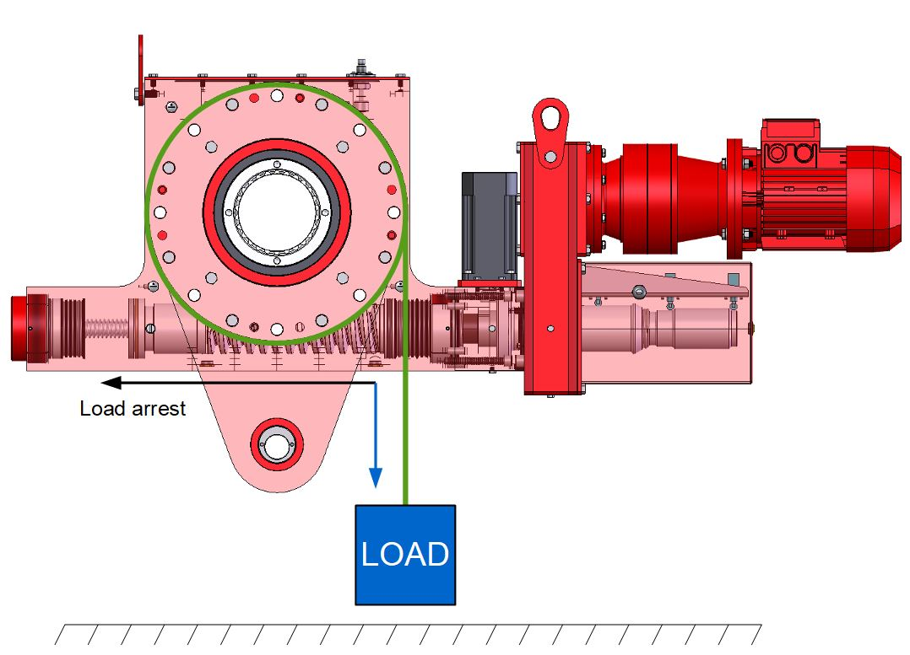
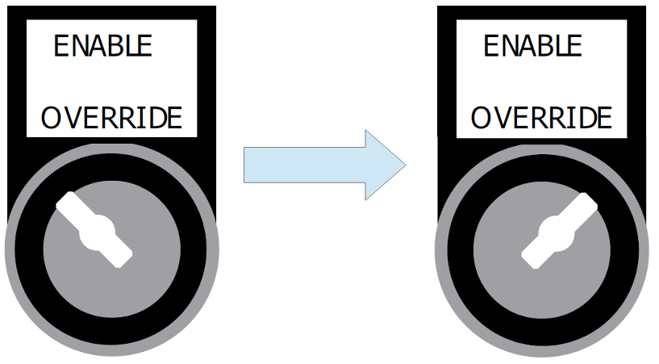

============
Load arrest
============

The MotoSuiveur Unit is a failsafe **mechanical** hoist arrester. 
MotoSuiveur Unit protects against failures in hoist drive trains that would otherwise lead to dropped loads or overloads.
The reasons for MotoSuiveur system load arrest can be various such as:

- electrical or mechanical failure of the hoist motor brake;
- electrical or mechanical failure of the hoist motor;
- mechanical failure of the hoist reducer;
- electrical failure of the hoist control or the MC system;
- other reason.

.. _MS load arrest:

	MotoSuiveur Unit load arrest

.. important::             
    In case of load arrest action is required. Operator (authorized personnel) should identify reason for load arrest. Possible the presence of an Fault.

============
Re-engaging
============

It is possible to have load arrest with and without the presence of fault.
In both case of load arrest Unscrewing enable switch is actuated. :guilabel:`🟢 Downward Enable` light indicator is **off**.

Re-engaging from load arrest without presence of fault
------------------------------------------------------

To perform Re-engaging in this case is required:

1. Cause of the load arrest has been identified and eliminated.
2. Hoist is healthy.
3. Enable signal to MotoSuiveur system from hoist is on.
4. :guilabel:`🟢 Hoist Enabled` signal from MotoSuiveur system to hoist is on*.
5. Short upward movement is necessary (from hoist control) until :guilabel:`🟢 Downward Enable` light swiches on.
6. Both light indicators :guilabel:`🟢 Downward Enable` and :guilabel:`🟢 Upward Enable` are on.
7. MotoSuiveur system is ready to follow.

\*\ If :guilabel:`🟢 Hoist Enabled` signal is not active, :guilabel:`🔑 Enable Override` should be used to force signal.
Forced signal should be used **only** for movement performing.

.. _Enable ovverride:

	Enable override

.. note::             
     In case :guilabel:`🟢 Hoist Enabled` is not present after re-engagement a :doc:`Reset <../../operation/regular/system-reset>` of the MS system is required

Re-engaging from load arrest with presence of fault
------------------------------------------------------

To perform Re-engaging in this case is required:

1. Cause for load arrest is identified and resolved.
2. Hoist is healthy 
3. Switching on :guilabel:`🔑 Enable Override` on MotoSuiveur system control cabinet.
4. Short upward movement is necessary (from hoist control) until :guilabel:`🟢 Downward Enable` light swiches on.
5. Both light indicators :guilabel:`🟢 Downward Enable` and :guilabel:`🟢 Upward Enable` are on.
6. :doc:`Reset <../../operation/regular/system-reset>` of the MotoSuiveur system is required.

.. note::             
     In case of repetitive load arrest, please contact SIguren Technologies.
