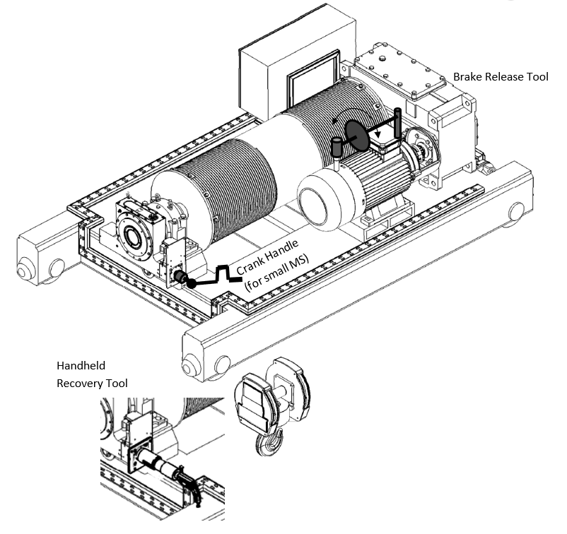

============================
Load recovery operation
============================

.. include:: ../img/substitutions.rst

.. ====================================================================================================================

.. role:: mechpart
   :class: mechpart

Using the MS recovery capabilities
===================================

.. note::
    Source :download:`Using the MS Recovery Capabilities <../archives/using-the-ms-recovery-capabilities-02.docx>`

.. list-table:: List tables can have captions like this one.
    :widths: 10 5 10 50
    :header-rows: 1
    :stub-columns: 1

    * - List table
      - Header 1
      - Header 2
      - Header 3 long. Lorem ipsum dolor sit amet, consectetur adipiscing elit. Nam sit amet mauris arcu.
    * - Stub Row 1
      - Row 1
      - |image041|
      - Column 3 long. Lorem ipsum dolor sit amet, consectetur adipiscing elit. Nam sit amet mauris arcu.
    * - Stub Row 2
      - Row 2
      - Column 2
      - Column 3 long. Lorem ipsum dolor sit amet, consectetur adipiscing elit. Nam sit amet mauris arcu.
    * - Stub Row 3
      - Row 3
      - Column 2
      - Column 3 long. Lorem ipsum dolor sit amet, consectetur adipiscing elit. Nam sit amet mauris arcu.

The MS will never allow a load drop. It will arrest the hoist drum whenever the hoist brake is unable to do so. 
However, the MS can be used as a gearbox to lower and even raise the load. 

.. note::
	The MS is irreversible – meaning that load drop is impossible even when the MS alone is used for recovering the load. 
	This allows the user to use the weight of the load without risking a load drop.

Three main methods can be used (and combined) to recover the load, depending on how the hoist brake 
and the MotoSuiveur Unit can be accessed and used in the emergency situation that requires the recovery:

- :ref:`Forced MS recovery`
- :ref:`MS followed gravity lowering`
- :ref:`MS assisted gravity lowering`

Forced MS recovery
-------------------

With the hoist brake open and the MotoSuiveur Unit holding the load, rotate the MS :mechpart:`worm shaft` with considerable torque. 
In this situation the MotoSuiveur Unit moves the load.
This way, a very high amount of torque must be applied on the MS shaft (approximately 1/8 of the barrel torque).

Using the following hardware:

- :doc:`Portable Recovery Tool` for sizes MS4 - MS7, or
- :doc:`Handheld Recovery Tool` for sizes MS0 - MS3

For MS with :doc:`Integrated Remote Recovery` the hardware is integrated and is remotely operated.

Instructions
^^^^^^^^^^^^^^

-	Open the hoist brake
-	Rotate the :mechpart:`worm shaft` with the following torque to lower the SWL (maximum values)

.. csv-table:: Forced MS Recovery method max torques
   :file: tables/forcedRecoveryTorque.csv
   :header-rows: 1
   :class: tight-table

.. important::
	Indicative barrel speed: 0.1 - 0.3 rpm

MS followed gravity lowering
-------------------------------

Step lowering
^^^^^^^^^^^^^^^^

.. note::
	This method can be used only with Hydraulic Damping MS.

.. "method" vs "procedure" vs ...

- Pulse the hoist brake (manually or electrically) to lower the load a few centimeters. The MS :mechpart:`worm shaft` will shift toward the damping chamber. The electrical or brake lever pulse must be short enough to not allow the worm to reach the :mechpart:`elastomer` at the bottom of the damping chamber. 
- Then it is possible to return the :mechpart:`worm shaft` to its “centered” position by hand. 
- Repeat this until the load reaches the floor.

This way, very low torque applied on the MS shaft will be needed (approximately 1/5000 of the barrel torque). 
Using handwheel / crank handle or standard ratchet handle.

The MS can automatically follow if switched to Backup Mode. 
This negates the need of manual operation at the :mechpart:`worm shaft`. 
In case of power outage, the MS can be UPS/battery operated.
Furthermore, the MS can control the brake opening / closing, thus making the gravity load recovery automated.

Instructions
+++++++++++++++

.. _Hydraulic Damping MS step lowering picture:
.. figure:: img/stepLowering.png
	:scale: 75 %
	:align: center
	
	Hydraulic Damping MS step lowering

-	Pulse the hoist brake to achieve less than 30 degrees barrel rotation by gravity
-	Rotate the :mechpart:`worm shaft` by hand few rotations to centralize it
-	Repeat

.. important::
	Indicative mean barrel speed: 0.5 rpm

Backup Mode gravity lowering
^^^^^^^^^^^^^^^^^^^^^^^^^^^^^^

- Switch the MS to :doc:`backup-recovery-mode`,
- Order lowering. 
- Progressively release the motor brake using the provided :mechpart:`Brake Release Tool`, until the load starts to rotate the barrel. 
- Use the Brake Release Tool to regulate and maintain the speed below the specified safe speed. A :guilabel:`🔊 buzzer` will sound when the safe speed is close.

The MS will arrest the barrel if:

-	lowering order is removed or
-	overspeed is reached

After such arrest, the worm shaft can be returned to its “centered” position by using a standard wrench.

In case of power outage, the MS can be UPS/battery operated.

Instructions
++++++++++++++

.. _Backup Mode gravity lowering picture :
.. figure:: img/backupGravityLowering.png
	:scale: 75 %
	:align: center
	
	Backup Mode gravity lowering

- Switch the MS to Backup Mode and 
- order lowering
- Progressively untighten the motor brake, using the :mechpart:`Brake Release Tool`, until the load starts to rotate the barrel. 
- Use the Brake Release Tool to regulate and maintain the speed below the specified safe speed. A :guilabel:`🔊 buzzer` will sound when the safe speed is close.

.. important::
	Indicative barrel speed: 2 - 5 rpm

MS assisted gravity lowering
--------------------------------

- Apply moderate torque to the MS :mechpart:`worm shaft`. 
- Progressively release the motor brake, using the provided Brake Release Tool, until the load starts to rotate the barrel. 
- The barrel stops when no torque is applied to the MS :mechpart:`worm shaft`.

In this scenario, only moderate torque is to be applied to the MS :mechpart:`worm shaft` (approximately 1/250 of the barrel torque).

Using the following hardware:
- Handheld Recovery Tool for MS sizes above MS4,
- Handwheel / crank handle or standard ratchet handle for sizes MS0 – MS3

Instructions
^^^^^^^^^^^^^^

.. _MS assisted gravity lowering picture: 

	
	MS assisted gravity lowering

- Apply moderate torque to the MS :mechpart:`worm shaft`, using the appropriate method,
- Progressively release the motor brake, using the provided Brake Release Tool, until the load starts to rotate the barrel (as long as moderate torque is applied to the MS shaft),
- Rotate the MS :mechpart:`worm shaft` to lower the load,
- Use the Brake Release Tool to maintain the torque to be applied to on the worm shaft inside the specified limits.

.. csv-table:: MS assisted gravity lowering max torques
   :file: tables/MSassistedGravityLowering.csv
   :header-rows: 1
   :class: tight-table

Recovery Procedure
=======================

.. note::
	Source is :doc:`49104-15-001 Operation  Maintenance Manual Issue D (1).pdf`

The MotoSuiveur unit is a proprietary system for protection of the main hoist load from over-speed and
load path failures, and for recovery of the load in the event of a failure. The MotoSuiveur unit is supplied
with a proprietary control panel from the equipment manufacturers. The crane hardwired controls are
interfaced to this panel to control the MotoSuiveur in normal operation.

A separate operator panel, the MS remote panel, is provided, located adjacent the crane operator panel,
which houses the MotoSuiveur recovery controls and MotoSuiveur HMI. In the event of a protection
system trip, caused by main hoist over-height or main hoist over-load, the crane operator will require the
use of the recovery procedure.

Prior to any recovery operations commencing, the cause of the fault should be identified. The following
procedure below explains the recovery procedure process.

.. list-table:: 
   :widths: 5 95
   :header-rows: 1
   :class: instruction-table
  
   * - Step
     - Description
   * - **1**
     - **Isolate the MotoSuiveur Panel using the isolator.**
   * - **2**
     - **Plug the 230v recovery plug into the front of the left hand door.**
   * - **3**
     - **Using the isolator enable the 230v on the panel.**
   * - **4**
     - **Wait for the HMI to fully complete its start-up procedure.**
   * - **5**
     - **Depress the blue** :guilabel:`Recovery Reset Button` **to reset the recovery VSD.**
   * - **6**
     - | **Switch on the recovery mode to start the recovery nut engagement process.** 
       | The engagement will cycle the recovery motor forward approx. 10s then reverse approx. 1 s. 
       | This will cycle until the engagement is completed.
   * - **7**
     - On completion of the engagement process the :guilabel:`🟢 Recovery Nut Engage Lamp` will be illuminated.
   * - **8**
     - | **Open the hoist brake to lower the load.** 
       | If the weight of the load is insufficient to make the hoist lower by gravity then the pushing down function must be used.
   * - **9**
     - **Using the recovery direction switch make a small (5 second) movement in the raise direction to ensure the teeth of the recovery nut is fully engaged.**
   * - **10**
     - | **Complete a recovery lower movement to lower the load and maintain the switch in the lower position until the :guilabel:`Inner Switch Lamp` has switched off.** 
       | MS Worm Screw has moved into the normal position.
   * - **11**
     - | **Complete a recovery raise movement to disengage the recovery nut.** 
       | Indicated by the changing state of the :guilabel:`Recovery Nut Engaged Lamp` to **NOT** illuminated.
   * - **12**
     - | **Once the nut is disengaged the** :guilabel:`Recovery Raised Switch` **can be released to the central position.** 
       | The recovery drive will begin to run on the release of the switch to the central position. This is normal.
   * - **13**
     - **Switch the recovery mode to the Off position using the :guilabel:`switch`.** 
   * - **14**
     - **Switch the isolator to the central Off position and wait for 2 minutes.** 
   * - **15**
     - **Remove the 230v recovery plug from the front of the panel door.** 
   * - **16**
     - **Using the isolator move this into the normal positon by applying 400v to the panel.**
   * - **17**
     - As soon as the panel is energised the drive will initiate a self-test and start the HMI software. 
   * - **18**
     - The self-test will complete and the :guilabel:`🟢 Enable Lamp` will be illuminated.

.. important::
  | Recovery Limitations:
  | **Downward direction**: Full SWL and locked service brake only. Service brake should be opened during recovery.
  | **Upward direction**: Limited to 3.5t hook block only without load applied and brake operable. Upward movement with SWL and Hoist brake closed is not permitted.

Using of the recovery system 
==============================

.. note::
	Source: :download:`User Manual-7.4.doc`

The purpose of the recovery system is to lower the load on a safe place if a component of the overall lifting equipment is damaged or unavailable.

.. important::
  The system has to be used only by trained and authorized workers.
  The procedures must be correctly followed to avoid damaging the equipment.

The following table shows the procedure to follow in each case of failure.

.. _Recovery procedures table :
.. list-table:: 
   :widths: 25 25 25 25
   :header-rows: 1

   * - Failed component/Type of failure
     - Operation without load
     - Operation with load
     - Remarks/restrictions
   * - Hoist motor failure
     - Procedure n°6-2
     - Procedure n°6-3
     - -
   * - Brake locked closed
     - Procedure n°6-2
     - Procedure n°6-2
     - Raising movement forbidden with load
   * - Brake locked open
     - Procedure n°6-2
     - Procedure n°6-1
     - -
   * - Motosuiveur® motor failure
     - Procedure n°6-4
     - Procedure n°6-3
     - -

If the reason of the failure is not diagnosed proceed in the following order:

- Procedure n°6-1 : Recovery after load arrest - Operation from the hardware buttons 
- Then Procedure n°6-2 : Recovery after load arrest - Operation from the Proface touchscreen
- Then Procedure n°6-3 : Recovery operation with pre-engagement with the load
- Then Procedure n°6-4 : Recovery operation with pre-engagement with the hoist motor

Procedure n°6-1 : Recovery after load arrest - Operation from the hardware buttons 
------------------------------------------------------------------------------------

.. illustrations are missing in the source document. 

This procedure has to be followed after a load drop. 

The MotoSuiveur Unit carries the load.

.. list-table:: Procedure n°6-1 : Recovery after load arrest - Operation from the hardware buttons 
   :widths: 5 95
   :header-rows: 1
   :class: instruction-table
   
   * - Step
     - Description
   * - **1**
     - **On the Main control panel, select “Recovery mode” on the “Normal mode” to “Recovery mode” selection button.** 
        
       When selecting “Recovery mode”, the Proface touch screen turns automatically to the “Engagement screen” (see Recovery procedure with the Proface for more details).
   * - **2**
     - **Engaging the clutch(es) of the recovery motor(s).**
       
       The engagement procedure is done automatically by the Siguren control panel logics. 
       
       If the “ Clutch engaged” light is already on, jump to next step.
       
       Otherwise, on the Siguren control panel, press and release the :guilabel:`“Engagement” push button`.
       On the Proface touch screen, the blinking :guilabel:`orange light` indicates that the Motosuiveur® is proceeding with the engagement.
       On installations with 2 recovery motors, the engagement procedure is performed one after the other. Any modification on these settings requires level 4 password.
       
       The duration of the engagement cycle is set in the “recovery settings” menu by the manufacturer. It is typically set between 1 to 3 minutes per recovery motor.
       
       The clutch(es) of the recovery motor(s) is/are engaged when the “Recovery available” light of the Siguren control panel switches on.
       
       On the Proface, the engagement light turns to permanent green. A button appears on the right handside bottom to allow the visualization of the recovery operation screen.
   * - **3**
     - **The engagement process fails**
       If the engagement process fails, it could be for one of the following reasons:
      
       - At least one controller of the recovery motor(s) is not working,
       - Recovery motors power is not turned on,
       - The engagement procedure is stopped by time out 
    
       Issue with recovery motors
 
       **Make sure the recovery controllers are running properly.**
       **Make sure the recovery motors are powered on.**
     
       Engagement process time-out
 
       If the engagement is not completed before the cycle timeout, the “engagement” light on the control panel does not turn on, the :guilabel:`engagement status light` turns to permanent red.
       The engagement failure may come from a short setting of the engagement cycle timeout delay. If the engagement procedure fails due to timeout, it is possible to repeat the procedure again from STEP 2.
       After many failed trials, verify that the recovery motor(s) operate(s) correctly.
       
       See “potential reasons for an engagement failure” paragraph next page.    
   * - **4**
     - **Recovery hoisting down operations**
       It is possible to perform recovery operations if and only if the recovery motor(s) is/are engaged.
       **On the Siguren control panel, turn the selection button to “Recovery down” to lower the load on the floor (or on a safe area).**
       
       It is possible to hoist the load up if necessary. But avoid hoisting the maximum load up with the recovery facility during more than 1 minute.
       Also make sure that the service brake is open during this movement. If it is not the case, it is mandatory to lower the load. 
       If this condition is not respected, the equipment could be damaged.
       
       **When the load touches the floor, release the** :guilabel:`“recovery down” selection button` of the Siguren control panel.
       Remove the load from the hook.
       On the Siguren control panel, select “Recovery up”. This action disengages the clutch(es). “Recovery available” light should turn off. 
       In the recovery control box, press the push button “Recovery up” to disengage the nut. Check that the “Nut engaged” lamp switches off and the “Nut disengaged” lamp switches on.

.. note::
  At the end of this procedure the Motosuiveur® screw is locked in the elastomers in the lift side. 
  With the main hoisting motor, make a 1 second movement at low speed in the down direction to unlock the screw.

.. important::
  The power supply of the equipment must be cut before any maintenance operation.
  Do not power up the equipment until the failed component has been fixed or changed.

.. warning::
  The recovery feature is designed to be used as an exceptional hoisting solution.
  Lengthy and/or repetitive use of the recovery facility can cause excessive wear of the Motosuiveur®.

Procedure n°6-2 : Recovery after load arrest - Operation from the Proface touchscreen
---------------------------------------------------------------------------------------

The recovery operations can be done either from the Siguren control panel with physical buttons or from the Proface touchscreen.

Operating from the Proface can be the prefered choice when the Siguren control panel is not easily accessible and that the 
Proface touchscreen is installed on the remote control box.

.. list-table:: Procedure n°6-2 : Recovery after load arrest - Operation from the Proface touchscreen
   :widths: 5 95
   :header-rows: 1
   :class: instruction-table
  
   * - Step
     - Description
   * - **1**
     - **Selecting “recovery mode”**
       The recovery mode can be either selected from the Main hoisting cabinet by selecting “Recovery Mode” 
       on the selection button or from the Proface touch screen.

       - You need to know the password for level 3 authorization to proceed with recovery operations
       - On the touchscreen, from the main screen, select “Menu” at the right hand-side bottom of the Main operation screen.
       - Select “Operating modes” in this menu.
       - A keypad screen appears to propose you to enter “the level 3” password.
       - Enter the correct PIN and press enter to get access to the “Operating modes” screen.
       - Select the mode by clicking the Recovery switch button.
       - On installations with 2 recovery motors make sure that the “Max position difference” number is correct. This value is expressed into the servo-motor position coding units. It is normally preset by the manufacturer. However, it may vary according installations (diameter of the drum(s) etc.). Once modified this parameter is saved.
       - Proceed with engagement by pressing the arrow button.
       - On installations with 2 recovery motors, the position difference between both Motosuiveurs is automatically reset to compute the difference from this value.
       - The screen switches to the engagement procedure screen.
       - Press the “Recovery engagement” yellow button to start the engagement cycle.
       - On installations with 2 recovery motors, engagement processes recovery motors engagement one after the other. The red bar turns half green half red when the first recovery motor is engaged and totally green when both are engaged.
       - On the Proface touch screen, the blinking orange light indicates that the Motosuiveur® is proceeding with the engagement.
       - Engagement procedure request the Motosuiveur servo-motor to put the screen into the unscrew mechanical stop and at the same time the recovery motor does little screw and unscrew movements at low torque to let the clutch flywheel mesh with the clutch wheel.
       - The duration of the engagement cycle is set in the “recovery” settings menu by the manufacturer. It is typically set between 1 to 3 minutes per recovery motor.
       - On installations with 2 recovery motors, the engagement is done one after the other. The second recovery motor starts is engagement process when the first one is engaged.
       - The clutch(es) of the recovery motor(s) is/are engaged when the “Engagement status” light turns to permanent green. In parallel the “ Recovery available” light of the Siguren control panel switches on. 
       - A button appears on the right handside bottom to allow the visualization of the recovery operation screen.
   * - **2**
     - **The engagement procedure fails**
       
       There are a few reasons why the engagement procedure could fail:
       
       -	At least one controller of the recovery motor(s) is not working,
       -	Recovery motors power is not turned on,
       -	 The engagement procedure is stopped by time out 
       
       **Issue with recovery motors**
       
       Make sure the recovery controllers are running properly.
       Make sure the recovery motors are powered on.
       
       **Engagement process time-out**
       
       - If the engagement is not completed before the cycle timeout, the “engagement” light on the control panel does not turn on, the engagement status light turns to permanent red.
       - The engagement failure may come from a short setting of the engagement cycle timeout delay. If the engagement procedure fails due to timeout, it is possible to repeat the procedure again from STEP 2.
       - After many failed trials, verify that the recovery motor(s) operate(s) correctly.
       - See “potential reasons for an engagement failure” paragraph next page.

   * - **3**
     - **Recovery hoisting up/down operations**

       The engagement performed from the Proface touch screen can be followed by hoisting up/ hoisting down operation performed from the Siguren control panel. We describe here operation made from the Proface touch screen.
       
       - It is possible to perform recovery operations if and only if the recovery motor(s) is/are engaged.
       - One the recovery is available, the access to the hoisting operation screen is done by pressing the “To hoisting operation” rightward arrow on the right hand-side bottom.
       - The screen displays the status of the engagement switch (ISN), the status of the VAR that controls the recovery motors.
       - Up and down hoisting operations are down with up and down buttons...
       - All load hoisting up operations under recovery should not exceed 1mn and wait for the recovery motor to cool down during 10 mn.
       - Some installations, in particular those with two Motosuiveurs, have an oversized recovery capablity. In that case hoisting up operations may have no time limit. Verify your installation capabilities
       - On installations with 2 recovery motors, it is possible to run recovery motors independently or in sync(center buttons). 
         The default operation mode is moving both recovery in sync. Operating them separatly should be restricted to especial scenarios. 
         The logics verifies that the position of each Motosuiveur® and compares them. 
         The position difference cannot exceed the maximum defined in the “Recovery settings” or in the “Operating mode” screen when selected on “Recovery" (figure 24) and it is protected by the logics. 
         A physical position difference exists if and only if the hoisting shaft is broken, e.g. if it is composed of two parts connected by a gear and that gear is broken.
       - If the position difference exceeds the limit, the logics blocks the movement of each recovery motor in the 
         direction that would increase the difference whether the order is done independently or in sync.  
         This limitation persists until the position difference is back to 0 (figures 39 and 40).
       - When the load touches the floor, the hook stops lowering for about 30s.
         Continue pressing the “Recovery down” button until the hook start to lower again, the free the hook.
       - Remove the load from the hook.
       - In the recovery control box, press the push button “Recovery up” to disengage the nut. Check that the “Recovery engaged” light switches off and the “Recovery disengaged” light switches on.
       
       Note: At the end of this procedure the Motosuiveur® worm is locked in the elastomers in the lift side. With the main motor, make a 1 second movement at low speed in the down direction to unlock the screw.

.. rubric:: Potential reasons for a recovery engagement failure
  
Recovery clutch engagement may fail if:

-	the engagement sensor is not working properly (blocked in upper position). The engagement could be effective while the indication is wrong.
-	when the worm does not pre-engage due to a potential servo-motor/servo-motor drive issue (this failure may be indicated by the position sensor still on but not always.
-	The recovery motor or its drive are faulty.
-	A mechanical problem occurred on the recovery clutch.

.. note:: 
  At the end of this procedure the Motosuiveur® worm is locked in the elastomers in the lift side. 
  With the main motor, make a 1 second movement at low speed in the down direction to unlock the screw

.. important::
  It’s important to cut the power supply of the equipment before any maintenance operation.
  Do not power up the equipment until the failed component has been fixed or changed.

.. warning::
  Lengthy and/or repetitive use of the recovery facility can cause excessive wear of the Motosuiveur®.

Procedure n°6-3 : Recovery operation with pre-engagement with the load
------------------------------------------------------------------------

This procedure has to be followed in the case which the hoist is loaded or/and the Motosuiveur® is failed. 
The service brake has to be operable.

.. important::
  It is required that the load is enough distant to the floor to accept a load slip equal to the maximum braking distance of the Motosuiveur®.
  To refer to the Motosuiveur® calculation note to have the maximum braking distance.

.. list-table:: Procedure n°6-3 : Recovery operation with pre-engagement with the load
   :widths: 5 95
   :header-rows: 1
   :class: instruction-table
  
   * - Step
     - Description
   * - **1**
     - Switch off the supply of the Motosuiveur® cabinet or all the circuit breaker inside.
   * - **2**
     - In the recovery control box, switch from “Normal mode” to “Recovery mode”.
   * - **3**
     - 3.	In the recovery control box, press the “Brake opening” until the load stops.
       
       Be careful, at this step the load will slip from a height equal to the braking distance of the Motosuiveur®.
   * - **4**
     - In the recovery control box, press the “Nut engagement” push button until the “Nut engaged” lamp switches on.
   * - **5**
     - In the recovery control box, press the push button “Recovery down” to lower the load on the floor (or on a safe area).

       It is possible to raise the load if necessary. But avoid raising the maximum load with the recovery facility during more than 1 minute.
       Also take care that the service brake is open during this movement. If it is not the case, it is mandatory to lower the load. 
       If this condition is not respected, the equipment should be damaged.

   * - **6**
     - When the load hits the floor, the hook stops lowering for about 30s.
       Continue pressing the “Recovery down” button until the hook start to lower again, then free the hook.

   * - **7**
     - Remove the load from the hook.
   * - **8**
     - In the recovery control box, press the push button “Recovery up” to disengage the nut. 
       Check that the “Nut engaged” lamp switches off and the “Nut disengaged” lamp switches on.

.. note::
  At the end of this procedure the Motosuiveur® screw is locked in the elastomers in the lift side. 
  With the main motor, make a 1 second movement at low speed in the down direction to unlock the screw.

.. important::
  It is important to cut the power supply of the equipment before any maintenance operation.
  Do not power up the equipment until the failed component has been fixed or changed.

.. warning::
  Lengthy and/or repetitive use of the recovery facility can cause excessive wear of the Motosuiveur®.

Procedure n°6-4 : Recovery operation with pre-engagement with the hoist motor
--------------------------------------------------------------------------------

This procedure has to be followed in the case which the hoist is not loaded and the Motosuiveur® is failed.

.. list-table:: Procedure n°6-4 : Recovery operation with pre-engagement with the hoist motor
   :widths: 5 95
   :header-rows: 1
   :class: instruction-table
  
   * - Step
     - Description
   * - **1**
     - Switch off the supply of the Motosuiveur® cabinet or all the circuit breaker inside.
   * - **2**
     - Make a lowering movement with the main motor drive until the load stops.
       Because the Motosuiveur® cabinet is shut down, the Motosuiveur® authorization is off. 
       It is possible that this information has to be override by the main controls. 
       Anyway, the drum has to be rotated in order to push the screw in the damping chamber (lowering side).
       
       Be careful to stop the command while the hook stops in order to not wear and/or overheat the torque limiter.

   * - **3**
     - In the recovery control box, switch from “Normal mode” to “Recovery mode”.
   * - **4**
     - In the recovery control box, press the “Nut engagement” push button until the “Nut engaged” lamp switches on.
   * - **5**
     - In the recovery control box, press the push button “Recovery down” to lower the load on the floor (or on a safe area).
       
       It’s possible to raise the load if necessary. 
       But avoid raising the maximum load with the recovery facility during more than 1 minute.
       Also take care that the service brake is open during this movement. 
       If it is not the case, it is mandatory to lower the load. 
       If this condition is not respected, the equipment should be damaged.

   * - **6**
     - When the load hits the floor, the hook stops lowering for about 30s.
       Continue pressing the “Recovery down” button until the hook start to lower again, the free the hook.

   * - **7**
     - Remove the load from the hook.
   * - **8**
     - In the recovery control box, press the push button “Recovery up” to disengage the nut. 
       Check that the “Nut engaged” lamp switches off and the “Nut disengaged” lamp switches on.

.. note::
  At the end of this procedure the Motosuiveur® screw is locked in the elastomers in the lift side. 
  With the main motor, make a 1 second movement at low speed in the down direction to unlock the screw.

.. important::
  Do not switch power supply of the equipment off before any maintenance operation.
  Do not power the equipment on until the failed component has been fixed or changed.

.. warning::
  Lengthy and/or repetitive use of the recovery facility can cause excessive wear of the Motosuiveur.