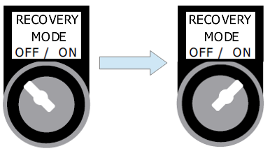

==========================================
Automatic recovery engagement procedure
==========================================

.. include:: ../../_img/_image-substitutions.rst

.. important::
   Automatic recovery engagement is applicable to MotoSuiveur® System equipped with Integrated Recovery Drive (MS-IRD).

.. important::
   Automatic recovery engagement is applicable when the MotoSuiveur® System and MS-IRD are healthy. 

Automatic recovery engagement for MotoSuiveur® System with **MSCL** MS Controllers
---------------------------------------------------------------------------------

To perform Automatic recovery engagement follow the sequence:

1. Electrical power of MotoSuiveur® System and MS-IRD is **on**.
2. Switch :guilabel:`🔑 Recovery Mode Off | On` to position **ON**.

The :guilabel:`🟠 Recovery Mode` indicator light illuminate.
MS Controller 7-segment display indicates recovery mode - |image041|.

.. _Activate MS recovery:

	Activating recovery mode

.. _Recovery mode light:

	Recovery mode light indicator

3. MotoSuiveur® System starts engaging. 

.. note::
   Engaging can be defined like knocking sound.

4. Engaging continues until :guilabel:`🟢Recovery engaged` light indicator is illuminated.

.. _Recovery engaged IMDL:

	Recovery engaged

5. Autiomatic recovery engagement is complete

.. important::
    If :guilabel:`🟢Recovery engaged` indicator does not illuminate after **30 seconds** a Reset of the MotoSuiveur® system is required.
    After Reset, MotoSuiveur® system repeats steps **3 and 4 automatically**. 

Automatic recovery engagement for MotoSuiveur® System with **MSCD** MS Controllers
---------------------------------------------------------------------------------

To perform Automatic recovery engagement follow the sequence:

1. Electrical power of MotoSuiveur® System and MS-IRD is **on**.
2. Switch :guilabel:`🔑 Backup/Recovery Mode Off | On` to position **ON**.

The :guilabel:`🟠 Backup/Recovery Mode` indicator light illuminate.
MS Controller 7-segment display indicates **Backup mode** - |image058|.

.. _Activate MS backup/recovery:

	Activating Backlup/Recovery mode

.. _Backup/Recovery mode light:

	Backup/Recovery mode light indicator

3. Restart of MotoSuiveur® System.

.. _Recovery mode light:

	Reset of MotoSuiveur® System

.. note::
   During reset :guilabel:`🔑 Backup/Recovery Mode Off | On` is on position **ON**

4. MotoSuiveur® System starts engaging. 

.. note::
   Engaging can be defined like knocking sound.

5. Engaging continues until :guilabel:`🟢Recovery engaged` light indicator is illuminated.

.. _Recovery engaged SMD:

	Recovery engaged

6. Autiomatic recovery engagement is complete

.. important::
    If :guilabel:`🟢Recovery engaged` indicator does not illuminate after **30 seconds** a Reset of the MotoSuiveur® system is required.
    After Reset, MotoSuiveur® system repeats steps **3 and 4 automatically**. 

