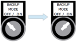
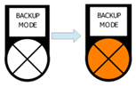
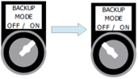
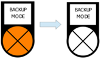

=======================================
Activating/Deactivating Backup mode
=======================================

.. include:: /_img/_image-substitutions.rst

Backup mode is available is intended to allow hoist movements in some special situations. 
<<<<<<< HEAD
This :guilabel:`🔑 BACKUP MODE OFF / ON` allows the user to lower or raise the load with the MotoSuiveur® Unit ensuring no braking occurs. It does
this via the MotoSuiveur® Unit servo motor following the hoist movement whilst maintaining the normal position for the worm.

The hoist crane and MotoSuiveur® System are controlled in the same way as in Follow mode - from the hoist control panel. 
The MotoSuiveur® System can also be equipped with a switch that duplicates the signals from the hoist - :guilabel:`BACKUP MODE DOWN/UP`.

When Backup mode is activated:

- The MotoSuiveur® Unit motor speed is physically limited 
- All MotoSuiveur® System logic faults (overspeed, etc.) are inhibited.
- "Hoist Enabled" signal is forced.
- MotoSuiveur® Unit limit switches are inhibited.
=======
This :guilabel:`🔑 Backup Mode Off/On` allows the user to lower or raise the load with the MS Unit ensuring no braking occurs. It does
this via the MS Unit servo motor following the hoist movement whilst maintaining the normal position for the worm.

The hoist crane and MotoSuiveur® System are controlled in the same way as in Follow mode - from the hoist control panel. 
The MotoSuiveur® System can also be equipped with a switch that duplicates the signals from the hoist - :guilabel:`Backup mode Down/Up`.

When Backup mode is activated:
- The MS Unit motor speed is physically limited 
- All MotoSuiveur® System logic faults (over speed etc) are inhibited.
- "Hoist Enabled" signal is forced.
- MS Unit limit switches are inhibited.
- The MS Unit motor speed is physically limited to 110% during normal operation.
>>>>>>> 0.1.2_peter
- Hoist enable signals are ignored.

Activating Backup Mode
^^^^^^^^^^^^^^^^^^^^^^

1. Activate Backup mode by turning the :guilabel:`🔑 BACKUP MODE OFF / ON` \*\ or :guilabel:`BACKUP/RECOVERY MODE OFF / ON` \**\ switch to the **ON** position.

<<<<<<< HEAD

=======
1. Activate Backup mode by turning the :guilabel:`Backup Mode Off | On` \*\ or :guilabel:`Backup/Recovery Mode Off | On` \**\ switch to the **On** position.

.. _Switch on Backup mode:
.. figure:: /_img/backup/switch-on-backup.png
	:figwidth: 100 %
	:class: instructionimg
>>>>>>> 0.1.2_peter

	Switching on Backup Mode

.. note::
	\*\ For MotoSuiveur® Systems equipped with **MSCL** MS Controller

	\**\ For MotoSuiveur® Systems equipped with **MSCD** MS Controller

2. The :guilabel:`Backup mode` enable indicator illuminates. A symbol |image058| for activated Backup mode is displayed on the 7-segment indicator of the MS controller.

<<<<<<< HEAD

	Backup Mode light illunminates
	
3. MotoSuiveur® System is in **Backup mode**.
=======
.. _Switch on Backup mode light:
.. figure:: /_img/backup/backup-light-on.png
	:figwidth: 100 %
	:class: instructionimg

	Backup Mode light illunminates
	
3. MotoSuiveur® System is in Backup mode.
>>>>>>> 0.1.2_peter
4. Starting movements by hoist control.
   

Deactivating Backup Mode
^^^^^^^^^^^^^^^^^^^^^^^^^^^

1. Deactivate Backup mode by turning the :guilabel:`🔑 BACKUP MODE OFF / ON` switch to the **OFF** position.

<<<<<<< HEAD

=======
.. _Switch off Backup mode:
.. figure:: /_img/backup/switch-off-backup.png
	:figwidth: 100 %
	:class: instructionimg
>>>>>>> 0.1.2_peter

	Switching off Backup Mode

2. :guilabel:`BACKUP MODE` indicator is not illuminated. On the 7-segment indicator of MS controller the symbol |image058| remain active and **BACKUP MODE OPERATION IS STILL ACTIVE!**.

<<<<<<< HEAD

	Backup Mode light off

3. :doc:`Reset <../../operation/regular/system-reset>` of the MotoSuiveur® System is required. After Reset Backup mode is **deactivated**.
=======
.. _Switch off Backup mode light:
.. figure:: /_img/backup/backup-light-off.png
	:figwidth: 100 %
	:class: instructionimg

	Backup Mode light off

3. :doc:`Reset </operation/regular/system-reset>` of the MotoSuiveur® System is required. After Reset Backup mode is deactivated.
>>>>>>> 0.1.2_peter

