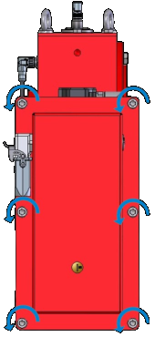
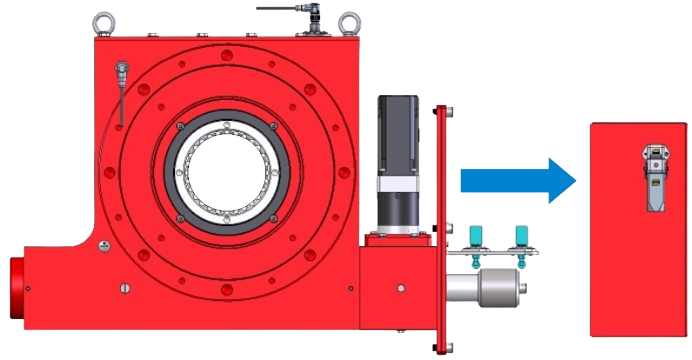
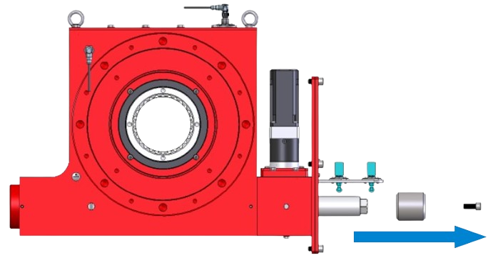
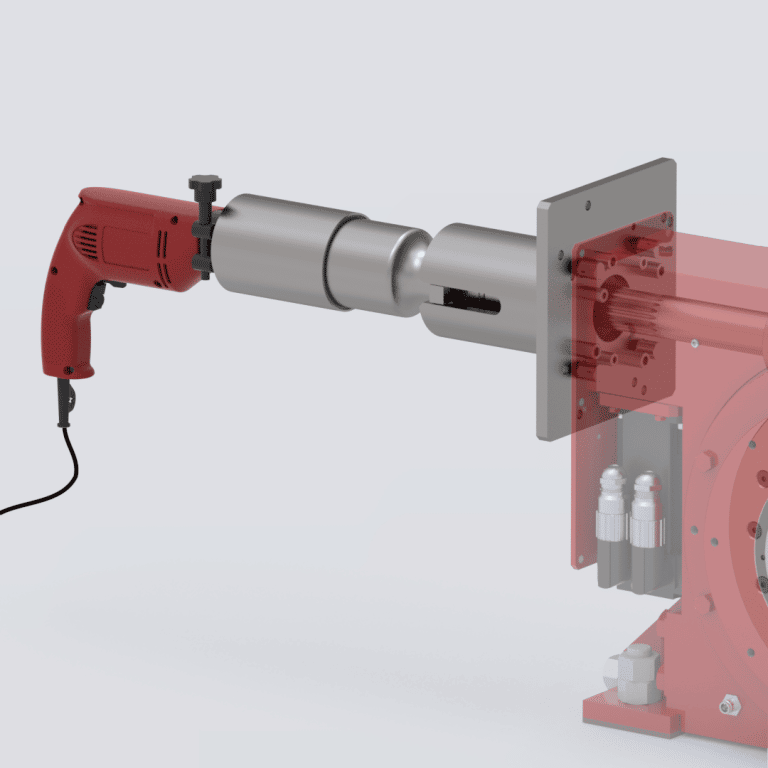

=====================================
Recovery by forced lowering procedure
=====================================

.. include:: ../img/substitutions.rst

.. =====================================================================================================================

This procedure has to be done in case of the main kinematic chain is not available (gearbox or transmission shaft breakage).

.. note::
  | To carry out this procedure, you must provide a mechanism to drive the MS worm. 
  | This mechanism should produce a high enough torque to move the load (taking into account the weight of the load and the various specific frictions due to this type of recovery). 
  | For example, we can use a motor and a reducer adapted.
  | Only one operator is needed for this procedure.

.. warning::
  This procedure has to be done as a last resort. 
  The other back-up procedures have to be prioritised because, in the forced lowering, the worm and the wheel are worn quickly.

Tools that are needed for this type of recovery load are as follows:

- `Handheld Recovery Tool (MS-HRT)  <https://www.siguren.com/product/handheld-recovery-tool-hrt#menu>`_ - for MotoSuiveur Systems size MS0 - MS4 
- `Portable Recovery Tool (MS-PRT)  <https://www.siguren.com/product/ms-prt#menu>`_ - for MotoSuiveur Systems size MS5 - MS7

Instruction
^^^^^^^^^^^

1. Switch off power of the MotoSuiveur System control cabinet.
2. Dismantle the worm cover of the MotoSuiveur Unit .

.. _Dismantle the worm cover remove bolts: 

	Remove cover bolts

.. _Dismantle the worm cover of the MS: 

	Dismantle the worm cover

3. Remove worm switch cam

.. _Remove cam bolt: 
.. figure:: ../../_img/Backup/bolt-removebg-preview.png
	:figwidth: 600 px
	:align: center

	Remove worm switc cam bolt

.. _Remove cam: 

	Remove worm switch cam

4. Install the required tool for the corresponding size

.. _Handheld Recovery Tool: 

	Installation of Handheld Recovery Tool (MS-HRT)

5. Start lowering
6. As soon as the load is safe (on the ground or an adapted structure), inspect the MotoSuiveur (worm and wheel) and the hoist.