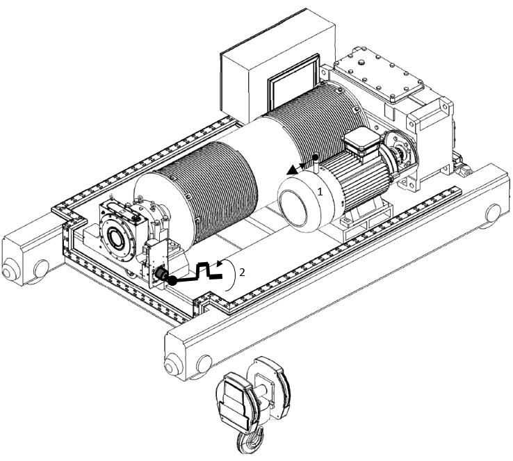
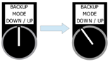
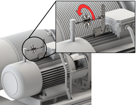
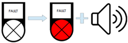

===========================================================
Backup mode by manual action of the service brake procedure
===========================================================

.. include:: ../../_img/_image-substitutions.rst

.. role:: mechpart
   :class: mechpart

.. ====================================================================================================================

MotoSuiveur followed gravity lowering
-------------------------------------

Step lowering
^^^^^^^^^^^^^^^^

.. note::
	This method can be used **only with Hydraulic Damping MotoSuiveur Unit**.

This lowering method is based on pulse opening the hoist brake (manually or electrically) to lower the load a few centimeters per single open. 
The MotoSuiveur Unit :mechpart:`worm shaft` will shift toward the damping chamber each time the brake is opened. 
The electrical or brake lever pulse must be short enough to not allow the worm to reach the MotoSuiveur Unit :mechpart:`elastomer` at the bottom of the damping chamber. 
Then it is possible to return the :mechpart:`worm shaft` to its “centered” position by hand using Handheld recovery tool. 
Repeat this until the load reaches the floor.

This way, very low torque applied on the MotoSuiveur Unit :mechpart:`worm shaft` will be needed (approximately 1/5000 of the barrel torque). 
Using handwheel / crank handle or standard ratchet handle.

The MotoSuiveur Unit can automatically follow if switched to Backup Mode. 
This negates the need of manual operation at the :mechpart:`worm shaft`. 
In case of power outage, the MotoSuiveur can be UPS/battery operated.
Furthermore, the MotoSuiveur system can control the brake opening / closing, thus making the gravity load recovery automated.

Instructions
+++++++++++++++

1. Pulse the hoist brake to achieve less than 30 degrees barrel rotation by gravity.
2. Rotate the :mechpart:`worm shaft` by hand **in anticlockwise direction** few rotations to centralize it between limit switches.
3. Repeat steps 1 and 2 until load is safely lowered.

.. _Hydraulic Damping MS step lowering:

	
	Hydraulic Damping MS step lowering

.. important::
	Indicative mean barrel speed: 0.5 rpm

Backup Mode gravity lowering
^^^^^^^^^^^^^^^^^^^^^^^^^^^^^^

Backup mode gravity lowering is methos for semi-automated lowering. Manual opening of hoist motorbrake and automatically following of MotoSuiveur system.
Backup mode allows following with limited speed and no fault detection.

Instructions
++++++++++++

1. Switch on the MotoSuiveur System to :doc:`Backup Mode <../../recovery/backup-procedure>`.

.. _Switching on Backup Mode:
.. figure:: ../../_img/Backup/switch-on-backup.png
	:figwidth: 600 px
	:align: center
	
	Switch on Backup Mode

2. Order lowering by switch :guilabel:`Backup mode Down/Up` to position **Down**. 

.. _Switching on Backup Mode Down:

	
	Order lowering

3. Progressively release the motor brake using the provided :mechpart:`Brake Release Tool`, until the load starts to rotate the barrel.

.. _Opening hoist main brake:

	
	Opening hoist main brake

3. Use the Brake Release Tool to regulate and maintain the speed below the specified safe speed. A :guilabel:`🔊 buzzer` will sound when the safe speed is close.

.. _Buzzer on:

	
	Specified limit speed reached

.. _Backup gravity lowering:
.. figure:: ../../_img/Peter/backupGravityLowering.png
	:figwidth: 600 px
	:align: center
	
	Backup gravity lowering

.. note::
  The MotoSuiveur system will arrest the barrel if:

  -	lowering order is removed or,
  -	overspeed is reached

.. note::
  After such arrest, the worm shaft can be returned to its “centered” position by using a tool (handheld).

.. important::
  In case of power outage, the MS can be UPS/battery operated.

.. important::
	Indicative barrel speed: 2 - 5 rpm

Assisted gravity lowering
----------------------------

In this type of lowering, only moderate torque is to be applied to the MS :mechpart:`worm shaft` (approximately 1/250 of the barrel torque).

Using the following hardware:
- Handheld Recovery Tool for MS sizes above MS4,
- Handwheel / crank handle or standard ratchet handle for sizes MS0 – MS3

Instructions
^^^^^^^^^^^^^^

1. Apply moderate torque to the MS :mechpart:`worm shaft`, using the appropriate method,
2. Progressively release the motor brake, using the provided Brake Release Tool, until the load starts to rotate the barrel (as long as moderate torque is applied to the MS shaft),
3. Rotate the MS :mechpart:`worm shaft` to lower the load,
4. Use the Brake Release Tool to maintain the torque to be applied to on the worm shaft inside the specified limits.

.. _MS assisted gravity lowering picture: 
.. figure:: ../../Peter/MSassistedGravityLowering.png
	:figwidth: 600 px
	:align: center

.. csv-table:: MS assisted gravity lowering max torques
   :file: ../../_tables/MSassistedGravityLowering.csv
   :header-rows: 1
   :class: tight-table