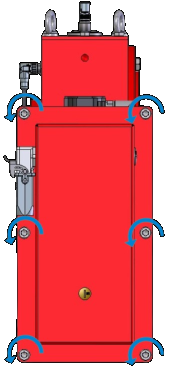
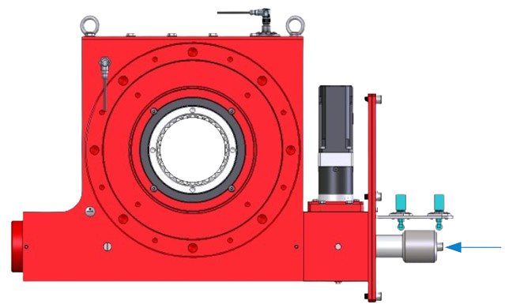
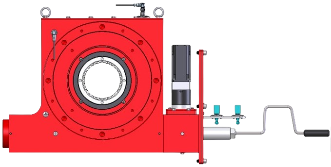
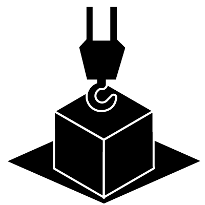

======================================================
Manual service brake and MotoSuiveur backup procedure
======================================================

.. include:: ../../_img/_image-substitutions.rst

.. role:: mechpart
   :class: mechpart

.. ====================================================================================================================

.. important::
  This procedure has to be followed in case of one MotoSuiveur Unit servo motor is defective.

The load lowering movement is controlled manually by operator, through the handle at the MotoSuiveur shaft.
Second operator is required to control main hoist brake. 

.. note::
  | MotoSuiveur system power should be switched off in control cabinet.
  | Each of the two operators can stop the operation: the first operator by closing the service brake, the second operator by stopping the rotation of MotoSuiveur Unit.
  | During this procedure, the lowering is controlled by the operator on the service brake. The other operator follows the movement and can always stop it.

Instructions
^^^^^^^^^^^^^^

.. note::
  | MotoSuiveur

1. Switch off power of MotoSuiveur system control cabinet (The MotoSuiveurs should be driven manually).
2. Dismantle the worm cover of the MotoSuiveur Unit .

.. _Dismantle the worm cover remove bolts: 

	Remove cover bolts

.. _Dismantle the worm cover of the MS: 
.. figure:: ../../_img/Backup/remove-cover-removebg-preview.png
	:figwidth: 400 px
	:align: center

	Dismantle the worm cover

3. Remove worm switch cam

.. _Remove cam bolt: 

	Remove worm switc cam bolt

.. _Remove cam: 
.. figure:: ../../_img/Backup/disassembly-switch-cam-removebg-preview.png
	:figwidth: 400 px
	:align: center

	Remove worm switch cam

4. Assembly manual handle

.. _Manual handle assembly: 
.. figure:: ../../_img/Peter/ms-unit-04.png
	:figwidth: 400 px
	:align: center

	Assembly of manual handle

5. Mount the manual handle on the MotoSuiveur Unit :mechpart:`worm shaft`.

.. _Mount the manual handle on the MS: 

	Mount the manual handle on :mechpart:`worm shaft`

6. The operator n°1 opens the service brake step by step (to allow the lowering of the load by gravity without exceeding a certain speed, in which case the MS blocks). 
  Meanwhile, the other operator n°2 should follow the movement by rotating the handle.

.. _Lowering: 
.. figure:: ../../_img/Peter/stepLowering.png
	:figwidth: 400 px
	:align: center

	Lowering

7. Lowering continues until the load is safely positioned.

.. _Load safe: 

	Safe positioned load

