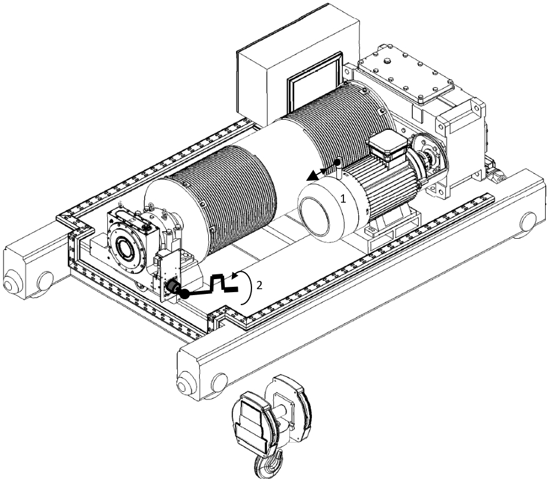
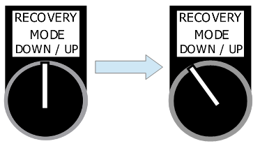
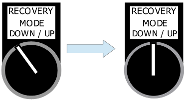
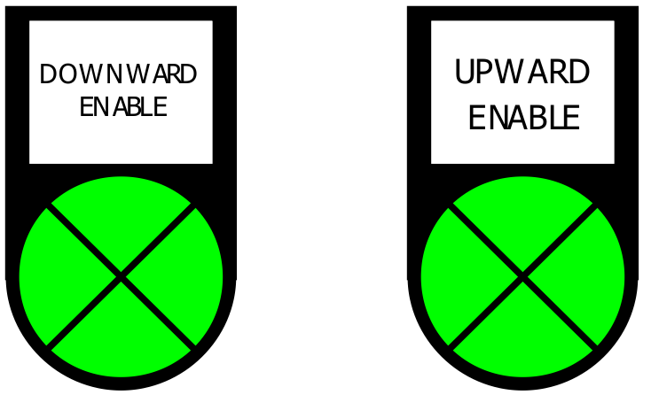
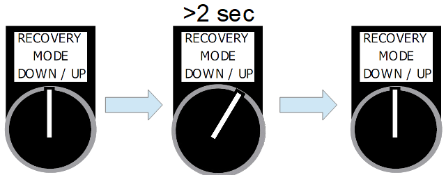
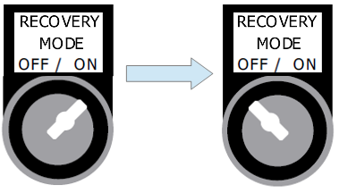

========================
Load recovery operations
========================

.. include:: ../../_img/_image-substitutions.rst

.. ====================================================================================================================

.. role:: mechpart
   :class: mechpart

Using the MotoSuiveur system recovery capabilities
==================================================

The MotoSuiveur Unit will never allow a load drop. It will arrest the hoist drum whenever the hoist brake is unable to do so. 
However, the MotoSuiveur Unit can be used as a gearbox to lower and even raise the load. 

.. note::
	The MotoSuiveur Unit is irreversible – meaning that load drop is impossible even when the MotoSuiveur Unit alone is used for recovering the load. 
	This allows the user to use the weight of the load without risking a load drop.

Three main methods can be used (and combined) to recover the load, depending on how the hoist brake 
and the MotoSuiveur Unit can be accessed and used in the emergency situation that requires the recovery:

- :ref:`Forced MS recovery`
- :ref:`MS followed gravity lowering`
- :ref:`MS assisted gravity lowering`

Forced MotoSuiveur recovery
---------------------------

With the hoist brake open and the MotoSuiveur Unit holding the load, rotate the MS :mechpart:`worm shaft` with considerable torque. 
In this situation the MotoSuiveur Unit moves the load.
This way, a very high amount of torque must be applied on the MS shaft (approximately 1/8 of the barrel torque).

Using the following hardware:

- :doc:`Portable Recovery Tool <../../ms-solution/rec-addons.rst>` for sizes MS4 - MS7, or
- :doc:`Handheld Recovery Tool <../../ms-solution/rec-addons.rst>` for sizes MS0 - MS3

For MS with :doc:`Integrated Remote Recovery` the hardware is integrated and is remotely operated.

Instructions
^^^^^^^^^^^^

1. Open the hoist brake
2. Rotate the :mechpart:`worm shaft` **only in anticlockwise direction** with the **following torque** to lower the SWL. 
3. Maximum values shown in :numref:`Forced MS Recovery method max torques`.

.. _Forced MS recovery:

	Forced recovery

.. _Forced MS Recovery method max torques:
.. csv-table:: Forced MS Recovery method max torques
   :file: ../../_tables/forcedRecoveryTorque.csv
   :delim: ,
   :header-rows: 1
   :widths: auto
   :class: tight-table
   :align: center

.. important::
	Indicative barrel speed: 0.1 - 0.3 rpm

Integrated Recovery System 
==========================

When deciding a recovery with MotoSuiveur Integrated Recovery System is required to be undertaken an assessment should be made to establish where the fault has occurred. 
MotoSuiveur Integrated Recovery System can only be used if the hoist is mechanical drive chain is not blocked by a mechanical means such as 
hoist gearbox failure or main hoist (service) brake failure.  
In the event the failure does permit the recovery the procedure describes the process to be undertaken to complete the 
recovery utilising the integrated MotoSuiveur recovery system.

Whilst undertaking the recovery process and in all cases the main motor hoist service brake is required to be operable and correctly functioning. 
Тhis will then be required to be opened (automatically or manually) for the entire duration of the recovery starting from when the Integrated Recovery System is engaged.

The purpose of the Integrated Recovery System is to provide an independent means of enabling the raising or lowering the load in the event of a failure of the main hoisting mechanism.
This means of hoisting is achieved and initiated from the MotoSuiveur System control cabinet with physical switches. 

.. important::
	Prior to any recovery operations commencing, the cause of the fault should be identified.

Instructions
^^^^^^^^^^^^^

1. Activating Recovery mode 
   
Activate Recovery mode by following steps in :doc:`Automatic recovery engagement procedure <../../operation/recovery/automatic-recovery-engagement>`

2. Recovery lowering

After successful engagement, the recovery procedure can begin. To start lowering following actions are:

2.1 Open hoist maun brake.

2.2 Turning the :guilabel:`Recovery Mode Down/Up`` switch to position **Down** .

2.3 Lowering continues until the load has reached a safe location for detached from the hoist.

.. _Recovery down:

	Turning switch to position Down

3. Complete recovery lowering

When safe location is reached and load is detouched, the :guilabel:`Recovery Mode Down/Up` switch should be turned to the neutral position.
Hoist main (service) brake has to **close**.

.. _Recovery neutral position:

	Turning switch to neutral position

4. Recentering worm shaft

After detaching load, worm shaft recentering between limit switches is required. 
Centering is performed:

4.1 With hoist main brake closed downward movement with Integrated Recovey System is required.

.. _Recovery down movement:

	Turning switch to position Down for recentering

4.2 Movement continues until :guilabel:`🟢 Upward Enabled` and :guilabel:`🟢 Downward Enabled` indicator lights are both iluminated.

.. _Down movement:

	Recentering of worm shaft

5. Exit form Recovery mode

5.1 Worm shaft is located between limit switches.

5.2 Short **upward** movement with Recovery System is required for disengaging Recovery Mechanism from worm shaft.

Switch :guilabel:`Recovery Mode Down/Up` to position **UP** for 2 - 5 seconds. After that switch to **neutral position**.

.. _Short upward movement:

	Short upward movement

5.3 Turnin :guilabel:`🔑 Recovery Mode Off | On` switch to the position **OFF** 

.. _Recovery mode off:

	Switch off Recovery mode

5.4 Reset MotoSuiveur System

.. _Reset MS System:
.. figure:: ../../_img/Recovery/reset.png
	:figwidth: 200 px
	:align: center

	Reset MotoSuiveur System

.. note::
	`Integrated Load Recovery video  <https://www.youtube.com/watch?v=3iZUa1VCCgs&t=228s&ab_channel=SIGURENtechnologies>`_
