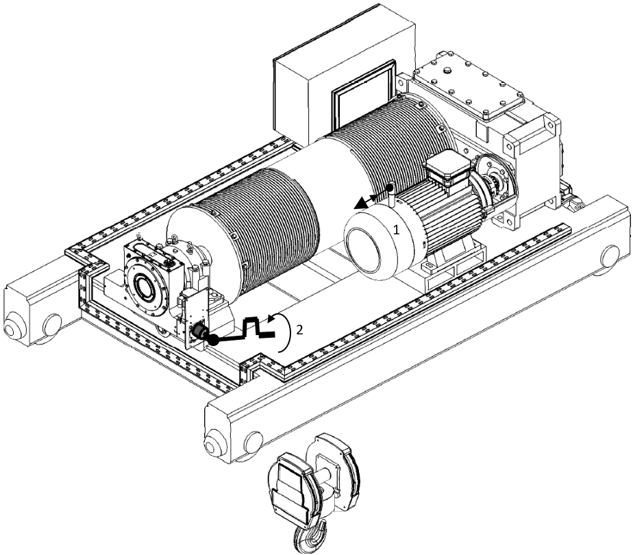

==================
Recovery Overview
==================

.. find better title, like Recovery options that users can resort to...

.. include:: ../../_img/_image-substitutions.rst

.. role:: mechpart
   :class: mechpart

The MotoSuiveur® Unit will never allow a load drop. It will arrest the hoist drum whenever the hoist brake is unable to do so. 
However, the MotoSuiveur® Unit can be used as a gearbox to lower and even raise the load. 

.. note::
	The MotoSuiveur® Unit is irreversible – meaning that load drop is impossible even when the MotoSuiveur® Unit alone is used for recovering the load. 
	This allows the user to use the weight of the load without risking a load drop.

Three main methods can be used (and combined) to recover the load, depending on how the hoist brake 
and the MotoSuiveur® Unit can be accessed and used in the emergency situation that requires the recovery:

- :ref:`Forced MS recovery`
- :ref:`MS followed gravity lowering`
- :ref:`MS assisted gravity lowering`

Forced MotoSuiveur® Recovery
----------------------------

With the hoist brake open and the MotoSuiveur® Unit holding the load, rotate the MS worm shaft with considerable torque. 
In this situation the MotoSuiveur® Unit moves the load.
This way, a very high amount of torque must be applied on the MS shaft (approximately 1/8 of the barrel torque).

Using the following hardware:

- :doc:`Portable Recovery Tool <../../ms-solution/rec-addons.rst>` for sizes MS4 - MS7, or
- :doc:`Handheld Recovery Tool <../../ms-solution/rec-addons.rst>` for sizes MS0 - MS3

For MS with :doc:`Integrated Remote Recovery` the hardware is integrated and is remotely operated.

Instructions
  1. Open the hoist brake
  2. Rotate the worm shaft **only in anticlockwise direction** with the **following torque** to lower the SWL. 
  3. Maximum values shown in :numref:`Forced MS Recovery method max torques`.

.. _Forced MS recovery:

	Forced recovery

.. _Forced MS Recovery method max torques:
.. csv-table:: Forced MS Recovery method max torques
   :file: ../../_tables/forcedRecoveryTorque.csv
   :delim: ,
   :header-rows: 1
   :widths: auto
   :class: tight-table

.. important::
	Indicative barrel speed: 0.1 - 0.3 rpm