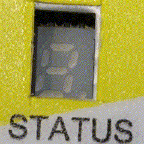

==========================
Controller internal check
==========================

.. include:: ../../_img/_image-substitutions.rst

After initial power up or after reset is performed, MS Controller start internal check.
All steps and actions from initialization are displayed on integrated 7 segment display.
Internal initialization sequences is as follows:

1. Initial initialization check
2. MS Controller OS version
3. Fieldbus addres

Initial initialization check
----------------------------

1. |start| - start of internal check
2. |driver| - communication initialization
3. |communication| - communication initialization OK
4. |init-app-done| - initialization of loaded software OK
5. |init-done| - initialization done

MS Controller OS version
----------------------------

Currently MS controllers are operating with OS version 1.4.2.
On picture below is shown sequence for OS version 1.4.2 displaying.

1. |1| 
2. |none|. 
3. |4| 
4. |none|. 
5. |2|

Fieldbus addres
----------------------------

Last step in internal initialization is field bus address displayng.
Fieldbus addres is configurated by nodID dip switches located on MS Controller front side.

On sequence below ish shown example for nodID address 01:

1. |image049|
2. |image059|
3. |none|
4. |1| 

Video with presented example is shown bwlow:

