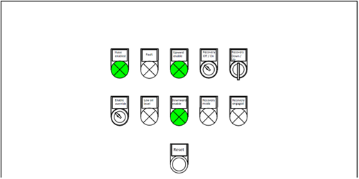
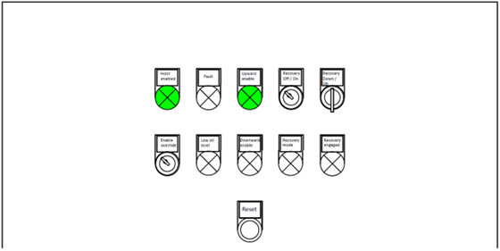
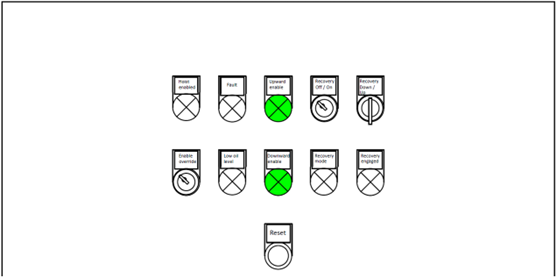
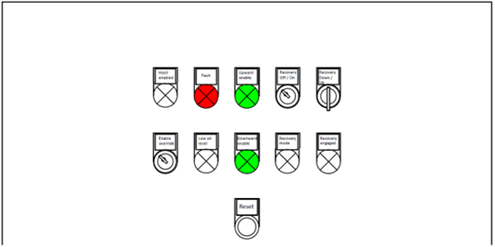

==============
Following mode
==============

.. tags:: following, overspeed

.. include:: ../../_img/_image-substitutions.rst

Following operation mode is the main operating mode of the MotoSuiveur system.
Following operation mode starts after successful passed of self–test. 
The function of Following mode is intended for follow movements of the hoist/crane and to monitor 
for exceeding the :term:`rated speed` with defined positive tolerance. 
The speed, which is considered high is called :term:`overspeed`. 

It is separated into Rest and Follow states. 
At Rest, MotoSuiveur system is waiting for a movement request.  
When a movement request is received, MotoSuiveur system starts following.
Rest and Following states are displayed on `MS Controller 7-segment display`_ and :doc:`MSHMI <../../equipment/control-interface/ms-hmi>` "Main Screen" field "MS system status:".

.. important::             
    By design MotoSuiveur system **will not allow** overspeed. 

Following operation mode principle
====================================

After successful passed of self–test MotoSuiveur system is in Rest.
In Rest, after a successful self-test and the presence of an enable signal from the crane, 
the following indicators are active - Hoist enabled, Upward enabled and Downward enabled.

.. _Active indicators in following state:

   Active indicators in following state

The following process is started after pressing the buttons to operate the hoist up or down. 
If a limit switch prohibiting upward movement is activated during movement, the Upward enable indicator becomes inactive - :numref:`Upward movement prohibited`. 
In this state, no upward movement of the crane is allowed, and a short downward movement is required until the MS worm is cantered :numref:`Active indicators in following state`.

.. _Upward movement prohibited:

   Upward movement prohibited

Accordingly, if the limit switch prohibiting downward movement is activated during movement, the Downward enabled indicator becomes inactive – :numref:`Downward movement prohibited`. 
In this state, no downward movement of the crane is allowed, and a short upward movement is required until the MS worm is cantered – :numref:`Active indicators in following state`.

.. _Downward movement prohibited:

   Downward movement prohibited

If the enable signal from the hoist to MotoSuiveur system loss, the Hoist enabled indicator becomes inactive. 
In this case MotoSuiveur system does not follow the hoist on a motion request. 
Accordingly, MotoSuiveur system does not provide an Enable signal to hoist.

.. _No enable signal from hoist:

   No enable signal from hoist

The states described above do not put the MS in a fault state. 
Fault states can occur for a variety of reasons (overspeed detection, unwanted movement detection, loss of power supply etc.). 
When the hoist is requested to move, the MC starts to follow in the direction it is needed. 
During following, the MC checks for exceeding the maximum permissible hoist speed. 
When the MotoSuiveur system detects that the defined speed is exceeded, it trips, Fault indicator became active, 
Hoist enabled indicator became inactive and prevents the hoist from moving. 
Downward enable and Upward enable are ignored in fault state.
Fault message is displayed on MS Controller 7-segmend display and MSHMI.

.. _MS Fault state:

   
   MotoSuiveur system fault state
   
After MS enters a fault state, an operator response is required to identify the reason for the fault. 
Once the cause of the failure has been identified and resolved, a restart of the MS system is required. 
After a successful self-test following a :doc:`..\..\operation\regular\system-reset` of MS system, it enters in following mode.

Figure :numref:`Main principle of following operation mode and overspeed detection` 
present the main principle of Following operation mode (upper part) and Overspeed detection (lower part). 
MotoSuiveur system follows hoist/crane movement until overspeed is detected.
When overspeed is detected, MotoSuiveur system trips and mechanicaly lockes hoist/crane
to prevent load drop.

.. _Main principle of following operation mode and overspeed detection:
.. figure:: ../../_img/Peter/following-01.png
   :align: center
   :figwidth: 600 px

   Main principle of following operation mode and overspeed detection

.. _Following mode stages:
.. csv-table:: Following mode stages
   :file: ../../_tables/following-mode-stages.csv
   :delim: ;
   :header-rows: 0
   :widths: auto
   :class: tight-table
   :align: left

MS Controller display
=====================

.. _MS Controller 7-segment display:

:numref:`Symbols displayed on 7-segment display on MS controller` shows the 
symbols displayed on 7–segment display during Following operation mode in Rest.
During Rest differend messages can be displayed on 7-segment display.
They are active only during Rest.

.. _Symbols displayed on 7-segment display on MS controller:
.. csv-table:: Rest
   :file: ../../_tables/following-mode-digits-rest.csv
   :delim: ;
   :header-rows: 1
   :widths: auto
   :class: tight-table
   :align: center

:numref:`Symbols displayed on 7-segment display on MS controller during movement` shows the 
symbols displayed on 7–segment display during following operation mode during movement.

.. _Symbols displayed on 7-segment display on MS controller during movement:
.. csv-table:: Movement
   :file: ../../_tables/following-mode-digits-movement.csv
   :header-rows: 1
   :delim: ;
   :widths: auto
   :class: tight-table
   :align: center

MSHMI status messages
=====================

On MSHMI "Main Screen" status of MotoSuiveur system is displayed.
In table below status messages are listed.

.. _Status messages:
.. csv-table:: Status messages
   :file: ../../_tables/mshmi-status-messages.csv
   :header-rows: 1
   :delim: ;
   :widths: auto
   :class: tight-table
   :align: center