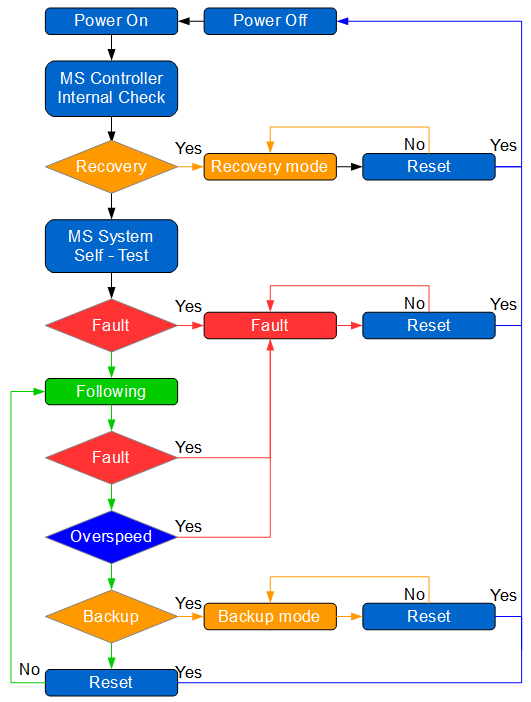

================
Operation modes
================

.. _General view of the sequence of MS operation:

   General view of the sequence of MotoSuiveur operation

Operation sequence of MotoSuiveur system as follows:

1. Initial powering on
2. MS controller internal check
3. Checking for activated Recovery mode
4. MotoSuiveur system electrical and mechanical self-test
5. Check for successfully passed self-test
6. MotoSuiveur system enter in Following mode
7. During following mode MotoSuiveur system checks for hoist overspeed or faults
8. If Backup mode is activated, MotoSuiveur system enter in Backup mode
9. If Reset is performed by pressing Reset button, control voltage of MotoSuiveur system is off. After Reset button is released operation sequence start from point 1

Links to all steps from sequence

:doc:`MS Controller internal check<../../operation/regular/controller-internal-check>`

:doc:`../../equipment/control-interface/control-cabinet`

:doc:`../../equipment/control-interface/control-cabinet`

:doc:`../../equipment/control-interface/control-cabinet`

:doc:`../../equipment/control-interface/control-cabinet`

:doc:`../../equipment/control-interface/control-cabinet`