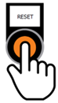

======
Reset
======

If the MotoSuiveur® system need to be reset, this is done by the :guilabel:`🔘 Reset` button. 
RESET button must be pressed and held for >1 second for a MotoSuiveur® system reset to be performed.
After reset MotoSuiveur® system starts as :doc:`MotoSuiveur® operating algorithm <../../operation/regular/operation-modes>`.

.. _Reset button:

	MotoSuiveur® system reset