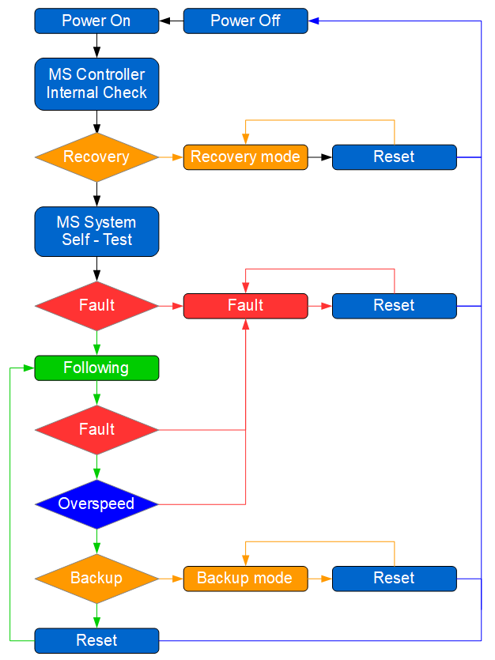

============================
Sphinx Tools Demo Page (Dev)
============================

References
===========

Circled numbers list
----------------------

Screen elements
    ① :guilabel:`English` button
        Change screen language to English
    ② :guilabel:`Español` button
        Change screen language to Spanish
    ③ :guilabel:`Back` button
        Back to Menu screen
    ④ :guilabel:`Français` button
        Change screen language to French

Heading 1
=========

Content

Local toc
----------

.. contents::
  :local:
  :depth: 3

.. NOT WORKING. local toc needs to be at the top (?)

Heading 2
---------

➔ test➔ test➔ test➔ test➔ test➔ test

:menuselection:`Preferences --> Keymap --> 3D View --> Curve --> 3D View Tool: Edit Curve, Curve Pen`

:menuselection:`test --> test`

   :Mode:      Edit Mode
   :Menu:      :menuselection:`Select --> Checker Deselect`

This tool applies an alternating selected/deselected checker pattern.
This only works if you already have more than one control point selected.

tags
----

.. contents::
  :local:
  :depth: 3

.. tags:: tag1, tag2

.. seealso::

  seealso content

hoverxref
-----------

:hoverxref:`example-ref` 

figure
-------

.. figure:: /_img/backup/backup-down-up-control-off.png
	:figwidth: 100 %
	:class: instructionimg

	General view

.. list-table:: 
   :widths: 5 95
   :header-rows: 1
   :class: instruction-table
  
   * - Step
     - Description
   * - **1**
     - 
   * - **2**
     - 

The :mechpart:`worm wheel` is single-helix.

I have footnoted a first item [#f1]_ and second item [#f2]_.
This also references the second item [#f2]_.

.. rubric:: Footnotes
.. [#f1] My first footnote.
.. [#f2] My second footnote.

.. note:: 
	kafkaesque!

.. list-table:: --
   :widths: 5 95
   :header-rows: 1
   :class: instruction-table
  
   * - Step
     - Description
   * - **1**
     - Switch off the supply of the MotoSuiveur® cabinet or all the circuit breaker inside.
   * - **2**
     - 

.. list-table::
  :widths: 30 10 30
  :header-rows: 1
  
  * - Number
    - Image
    - Description
  * - 1
    - 
    - Prior to removing the existing plummer block, make one rotation and find by comparator the 2 points on the barrel side flange that are on the same axial plane on the diameter of the future pin and bolts diameter. These two points will receive the bolt holes.
  * - 2
    - 
    - Remove the existing plummer block.
  * - 3
    - 
    - Put the transmission flange on the barrel shaft (fitted assembly) and use the holes to counter-drill holes on the barrel side flange.
  * - 4
    - 
    - Mount the transmission flange on the MS wheel (bolts, pins).
  * - 5
    - 
    - Assemble the flanged MS to the side flange of the barrel. The washers create a gap which allows the MS to be strictly aligned with the barrel (shaft) axis. The MS wheel and flange are fitted to the existing barrel shaft so the MS is strictly concentric to the barrel.

+-----+------+-----+-----+------+-----+
| sd  | fsd  | fs  | df  | fsd  |     |
+=====+======+=====+=====+======+=====+
| dfs | d    | s   | fsd | fsd  |     |
+-----+------+-----+-----+------+-----+
| dfs | d    | f   | sd  | sd   | df  |
+-----+------+-----+-----+------+-----+
| s   | sd   | f         | d    |     |
+-----+------+           +------+-----+
| d   | d    |           | d    |     |
+-----+------+-----+-----+------+-----+
|     | dd   | d   |     |      |     |
+-----+------+-----+-----+------+-----+
|     | d    |     |     | d    |     |
+-----+------+-----+-----+------+-----+

.. rubric:: "rubric" directive

The "rubric" directive inserts a "rubric" element into the document tree. A rubric is like an informal heading that doesn't correspond to the document's structure.

+--------------------------+----------------------------+
| **Navigation to screen** | Main screen ➔ Menu screen  |
+--------------------------+----------------------------+

Some text that requires a footnote [#f1]_ .

Raw
------

.. raw:: html

   

Some other thext.

Circled numbers
----------------

⓪ 
① ② ③ ④ ⑤ ⑥ ⑦ ⑧ ⑨ ⑩ 
⑪ ⑫ ⑬ ⑭ ⑮ ⑯ ⑰ ⑱ ⑲ ⑳ 
㉑ ㉒ ㉓ ㉔ ㉕ ㉖ ㉗ ㉘ ㉙ ㉚ 
㉛ ㉜ ㉝ ㉞ ㉟ ㊱ ㊲ ㊳ ㊴ ㊵ 
㊶ ㊷ ㊸ ㊹ ㊺ ㊻ ㊼ ㊽ ㊾ ㊿

.. figure:: /_img/backup/backup-mode-off-on.PNG
    :target: https://siguren-documentation.readthedocs.io/en/0.1.1/99-test.html

    figure comment

.. figure:: /_img/backup/backup-down-up-control-off.png
    :figwidth: 100 %
    :class: instructionimg

    End of lowering

:doc:`/operation/regular/index`
  An introduction to Blender's window system, widgets and tools.

Heading 2
^^^^^^^^^^

Curve PReset
   :Custom:
      You can choose how the strength of the falloff is determined from the center of the brush
      to the borders by manually manipulating the control points within the curve widget.
      There are also a couple of pReset custom curves displayed at the bottom of the curve widget
      that can be used on their own or as a starting point for tweaking.

      .. list-table:: Custom PReset types.

         * - .. figure:: _img/regular-operation/MS-block-diagram-color_1.PNG

                Smooth.

           - .. figure:: _img/regular-operation/MS-block-diagram-color_1.PNG

                Sphere.

           - .. figure:: _img/regular-operation/MS-block-diagram-color_1.PNG

                Root.

         * - .. figure:: _img/regular-operation/MS-block-diagram-color_1.PNG

                Sharp.

           - .. figure:: _img/regular-operation/MS-block-diagram-color_1.PNG

                Linear.

           - .. figure:: _img/regular-operation/MS-block-diagram-color_1.PNG

                Constant.

The following standard selection operations are supported:

- :kbd:`Reset` -- Single faces
- :kbd:`Shift-Alt-LMB` -- Select more or remove them from the selection.
- :kbd:`A` -- All faces, :kbd:`A A` to deselect.
- :kbd:`B` -- Box selection.
- :kbd:`C` -- Circle select with brush.
- :kbd:`Ctrl-I` -- Invert selection.
- :kbd:`L` -- Pick linked (under the mouse cursor).
- :kbd:`Ctrl-L` -- Select linked.
- :kbd:`Ctrl-NumpadPlus` -- Extend Selection
- :kbd:`Ctrl-NumpadMinus` -- Shrink Selection

   Vertex Selection masking.

.. the following is from "Dimitar-test.rst"

.. card:: 
    :width: auto
    :img-top: _img/archives/MSwarningNumber10.png
    :link: https://siguren-documentation.readthedocs.io/en/0.1.1/equipment/ms-solution/ms-unit.html

    MotoSuiveour Unit

grid-item-cards
---------------

.. grid:: 3
    :gutter: 4
    
    .. grid-item-card::
        :width: auto
        :img-top: _img/index/control-cabinet.jpg
        :link: /ms-solution/ms-unit

        MS Unit
 
        

    .. grid-item-card::
        :width: auto
        :img-top: _img/index/ms-unit.jpg
        :link: /diagnostics/controller-errors.rst

        MS Controller Faults and Warnings

Container instead of grid-item
------------------------------

Inspired by Blender Docs

.. container:: toc-cards

      .. container:: card

         .. figure:: _img/index/ms-unit.jpg
            :target: ms-solution/ms-uni.html

         :doc:`equipment/ms-solution/ms-unit`
            An introduction to Blender's window system, widgets and tools.

      .. container:: card

         .. figure:: _img/index/control-cabinet.jpg
            :target: diagnostics/controller-errors.html

         :doc:`troubleshooting/diagnostics/controller-errors`
            Overview of the interface and functionality of all editors.
