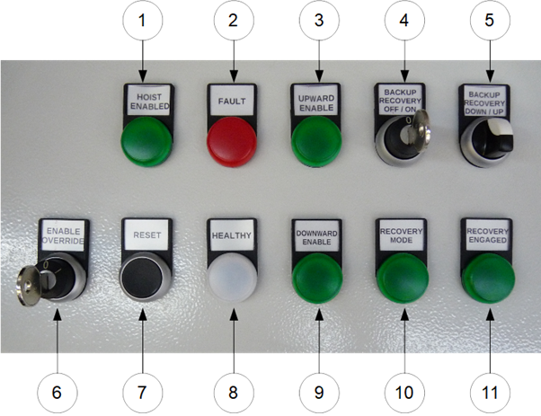
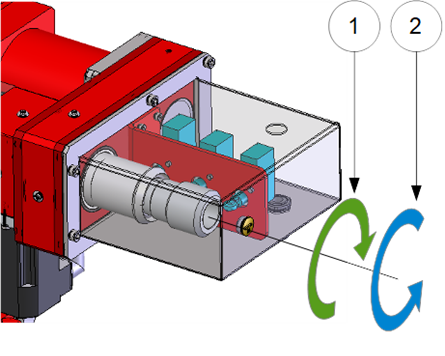

==============
Control panel
==============

.. include:: ../substitutions.rst

.. note::
	the control panel can be on the door of the control cabinet, but can also be located in the operator's cabin for example.

Component description
======================

Indication lamps and controls
------------------------------

Indication lamps and local controls are shown on figure 3. They are located on front door of control cabinet. 

Indication lamps indicate:
	- MS status - figure 3, items 2, 8;
	- allowed movement direction of hoist - figure 3, items 1, 3, 9;
	- recovery mode status - figure 3, items 10, 11.
  
Local controls are used for:
	- reset of MS - figure 3, item 7;
	- overrides MS enable signal (override ON signal) - figure 3, item 6;
	- enable and control MS Backup/ Recovery mode - figure 3 items 4, 5, 10, 11.

.. _General view of MotoSuiveur control panel:

	General view of MotoSuiveur control panel

.. _Control panel legend:
.. csv-table:: Control panel legend
   :file: tables/control-panel-legend.csv
   :delim: ;
   :header-rows: 1
   :widths: 10, 30, 20, 40
   :class: tight-table
   :align: center

:numref:`Control signals between hoist and MS` shows schematically the control signals between hoist and MS. 
 
.. _Control signals between hoist and MS:
.. figure:: ../img/controlSignals.png
	:align: center

	Control signals between hoist and MS

.. warning::
 	Local control commands can be duplicated with remotes!
	Please, check electrical circuit diagram!

Hoist enabled
^^^^^^^^^^^^^^

:guilabel:`🟢 Hoist enabled lamp` indicate that the MS authorizes hoist movements. (figure 5).

Hoist enabled signal will be **ON** only in case if **ON** signal from hoist is **ON**.

Hoist enabled signal will be **ON** when :doc:`../operating-instructions/self-test` procedure passes successfully and **ON** signal is available.
Then :guilabel:`🟢 Hoist enabled lamp` and :guilabel:`⚪ Healthy lamp` are **ON**. 
The signals are indicating ``system ready`` (``MS ready``).

Fault 
^^^^^^

:guilabel:`🔴 Fault lamp` (figure 3, item 2) indicates three different types of faults:

	- MS controller internal errors, described in section 7.1;
	- MS faults (further called flt_num), described in section 7.2;
	- MS warnings (further called wrn_num), described in section 7.2;

MS :term:`controller` internal errors are related to MS controller internal hardware, firmware, and MS motor. 
This type of errors are with highest priority. 
If MS controller internal fault appear further operation is prohibited.
	
.. note::	
 	:guilabel:`🔴 Fault lamp` is **ON** during MS self-test.

.. warning:: 
	The system displays only last MS warning (``wrn_num``) or MS fault (``flt_num``) occurred.

Faults and warnings are displayed on MS 7-segment controller. The display indicates all types of MS warnings/faults and MS controller internal errors. 
Indication is a combination of letters and numbers.
MS controller internal faults are indicated with blinked combination of |image035|, number and finish with symbol |image039|.

MS faults are displayed with combination of |image036| and number. 
MS warnings are displayed with combination of |image035| and number. 

.. rubric:: Displaying messages on MS controller 7 - segment display

On :numref:`MS controller internal error E01` is shown example for internal MS controller fault. 
On :numref:`MS warning number 10 (wrn_num = 10)` is shown example for MS warning.

.. _MS controller internal error E01:
.. figure:: ../img/MScontrollerInternalErrorE01.png
	:align: center

	MS controller internal error E01 

.. _MS warning number 10 (wrn_num = 10):
.. figure:: ../img/MSwarningNumber10.png
	:align: center

	MS warning number 10 (wrn_num = 10) 

.. note::		
 	After ``MS reset``, all types of faults are cleared. Before ``MS reset``, fault should be resolved.

Upward enable/Downward enable 
^^^^^^^^^^^^^^^^^^^^^^^^^^^^^

:guilabel:`🟢 Upward enable lamp` / :guilabel:`🟢 Downwardenable lamp` are indicators for authorized direction of hoist movement. 
If one of the two directions is forbidden to move, it is necessary to move the hoist 
in the opposite direction in order to reset the system mechanically.

Movements upward and downward of hoist are correspond to screwing and unscrewing 
movement of MS worm. Movement directions of worm are corresponding to directions 
of clock. Direction screwing is clockwise, unscrewing direction is anticlockwise, 
viewed from cam part of the screw shaft as is shown 
on :numref:`MS Worm rotating directions`.
 
.. _MS Worm rotating directions:

	MS Worm rotating directions 

.. line-block::
	1 - Screwing direction
	2 - Unscrewing direction

.. warning::
 	After MS reset or manual centering of the worm and MS restart, 
	no movement is performed or faults appears, please contact SIGUREN 
	technologies on address support@siguren.com

Backup/Recovery Off/On; Backup/Recovery Down/Up
^^^^^^^^^^^^^^^^^^^^^^^^^^^^^^^^^^^^^^^^^^^^^^^^^^

Backup function allows the load to be lowered down, by using minimal functionalities when MS is in Following operation mode. 
Backup function ignore all settings related with nominal following operation mode and allows movement of the hoist with limited speed.

Recovery function is used when the main hoisting chain is faulty (for example damagedbrake of the hoist motor). 
Recovery system allows lowering load safely to the ground.

Enable Override
^^^^^^^^^^^^^^^^

Enable override can be used if it is necessary to override Hoist enabled. This allows 
small movements for MS mechanically reset.

Lamp states
-------------

Combination of active (ON) and inactive (OFF) signal lams gives current status of MS. 
In Appendix Table 1 signal combinations are presented and described.

Selection guidelines
======================