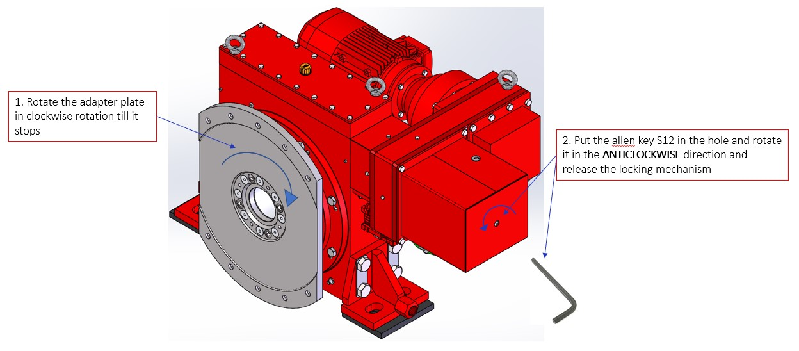

=================================
Unblocking the MotoSuiveur Unit
=================================

.. note::
    Extracted from :download:`Mounting procedure.pptx <../archives/Mounting-procedure.pptx>` .

What does it mean for the MotoSuiveur Unit to be 'blocked'?

1) Rotate the adapter plate in clockwise rotation till it stops 
2) Put the allen key S12 in the hole and rotate it in the ANTICLOCKWISE direction and release the locking mechanism

.. _Unblocking the MS:

	Unblocking the MS