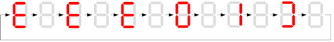

============================
Controller errors
============================

.. include:: ../../_img/_image-substitutions.rst

Any faults that occur during MS operation are displayed on the HMI screen (**if installed**) and on the 7-segment display of the MS Controller. 
Each fault is characterized by a number and a description. Faults are divided into two groups - system faults and MotoSuiveur System faults. 

System faults are those that are related to the electrical performance of the MS Controller. MotoSuiveur System faults are related to operating of the MotoSuiveur unit.

Faults and warnings displayed on MS 7 – segment controller indicates all types of MotoSuiveur System warnings/faults and MS controller internal errors. 
Indication is a combination of letters and numbers. 

MS controller internal faults are indicated with blinked combination of |image035|, number and finish with symbol |image039|.

.. _MS Controller internal fault:

	MS Controller internal error displaying

MotoSuiveur System faults are displayed with combination of |image036| and number. MS warnings are displayed with combination of |image035| and number. 

.. _MotoSuiveur System E10:
.. figure:: ../../_img/Peter/MSwarningNumber10.png
	:figwidth: 600 px
	:align: center

	MotoSuiveur System E10

In table below MS Controller internal errors are described.

.. _MS controller internal errors:
.. csv-table:: MS Controller internal errors
    :file: ../../_tables/ms-controller-internal-errors.csv
    :header-rows: 1
    :class: tight-table
    :delim: ;
    :widths: auto
    :align: left

In table below MotoSuiveur System warnings and faults are described.

.. _MS faults and warnings:
.. csv-table:: MotoSuiveur System warnings and faults
    :file: ../../_tables/ms-faults-and-warnings.csv
    :header-rows: 1
    :class: tight-table
    :delim: ;
    :widths: auto
    :align: left

.. warning::
 	In case of repetitive faults, please contact SIGUREN technologies at support@siguren.com!