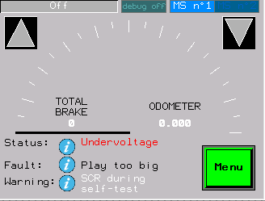
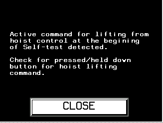

============================
HMI-guided troubleshooting
============================

.. include:: ../../_img/_image-substitutions.rst

.. note:: 
    MSHMI supports screen guided troubleshooting since version **1-3-5**.

MSHMI support on screen guides for troubleshooting when MS Controller fault or MotoSuiveur Sytem warning or fault appears.
When a fault occurs, an information button |info-button| appears on the main screen next to the corresponding fault field - :numref:`Fault information`.

.. _Fault information:

	Fault information

When tapping the information button, a new screen opens with guidance on how to remedy the fault.
Example for Motosuiveur System E02 is shown on picture below - :numref:`MS fault E02`.

.. _MS fault E02:

	MotoSuiveur System E02